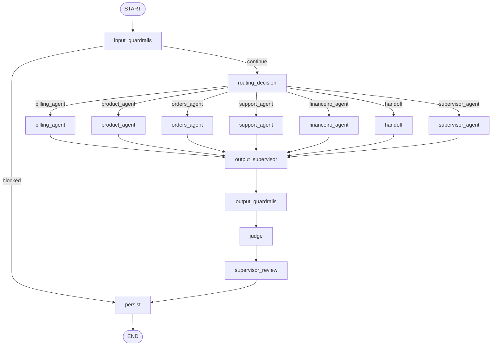
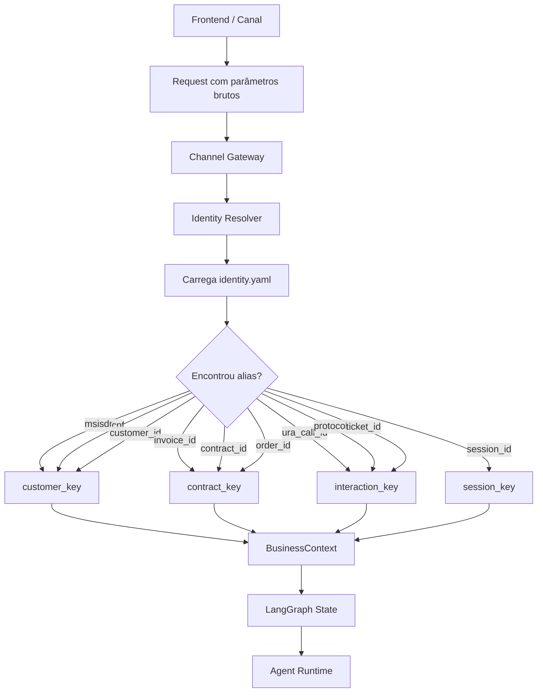
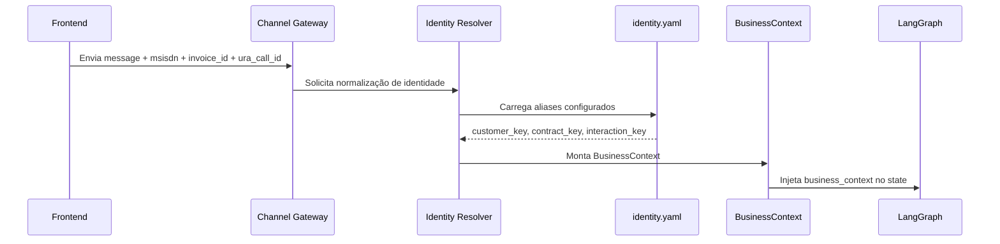
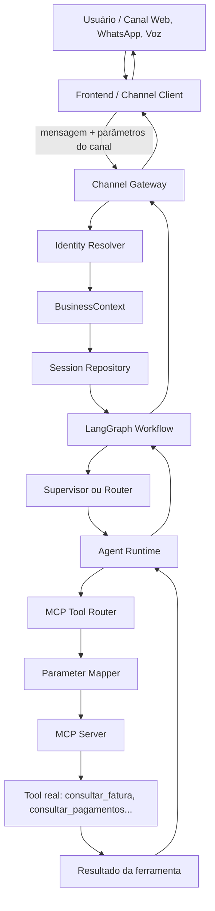
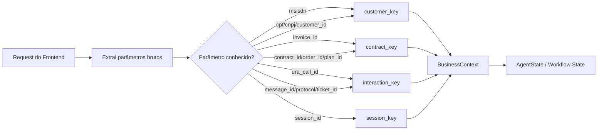
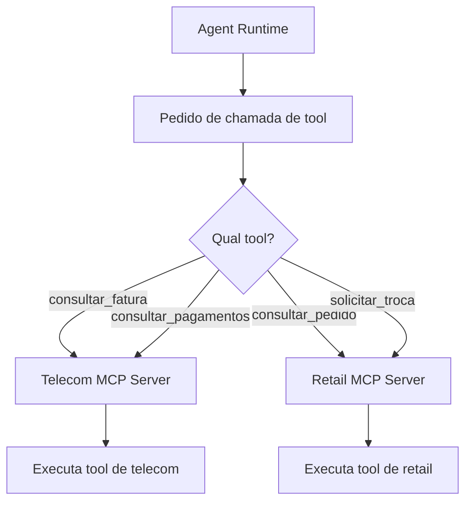
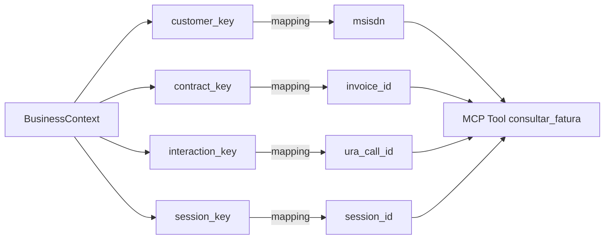
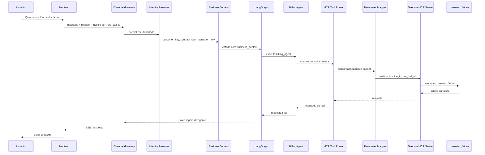

# Tutorial — Implementing an Agent using `agent_template_backend`

This tutorial teaches you how to implement a new agent from `agent_template_backend`, using the framework as the corporate execution engine.

The central idea is simple:

```text
Framework = motor reutilizável
Agente = regra de negócio específica
MCP Server = fronteira padronizada com sistemas externos
Config YAML = comportamento alterável sem recompilar código
IC/NOC/GRL = rastreabilidade de negócio, operação e governança
```


The goal is for each new agent to implement only its domain logic — prompts, business rules, tools, schemas, and specific nodes — without recreating engines that already belong to the framework.

---

## 1. Architecture overview

The template separates what is generic from what is specific.

```text
agent_template_backend/
├── app/
│   ├── main.py                    # API FastAPI, gateway, sessão, SSE e entrada do workflow
│   ├── state.py                   # Contrato de estado compartilhado do LangGraph
│   ├── workflows/
│   │   └── agent_graph.py          # Workflow corporativo com router, guardrails, agentes, judges e persistência
│   ├── agents/
│   │   ├── runtime.py              # Recursos comuns para agentes: MCP, RAG, cache, IC, LLM
│   │   ├── billing_agent.py        # Exemplo de agente de faturas
│   │   ├── product_agent.py        # Exemplo de agente de produtos
│   │   ├── orders_agent.py         # Exemplo de agente de pedidos
│   │   └── support_agent.py        # Exemplo de agente de suporte
│   └── examples/                  # Exemplos de IC, NOC, GRL, MCP e observer
├── config/
│   ├── agents.yaml                # Registro dos agentes disponíveis
│   ├── routing.yaml               # Intents, keywords, fallback e decisão de rota
│   ├── tools.yaml                 # Catálogo das ferramentas disponíveis para o backend
│   ├── mcp_servers.yaml           # Endpoints MCP locais
│   ├── mcp_servers.docker.yaml    # Endpoints MCP em Docker Compose
│   ├── mcp_parameter_mapping.yaml # Mapeamento entre chaves canônicas e parâmetros das tools
│   ├── identity.yaml              # Resolução de identidade de negócio
│   ├── guardrails.yaml            # Guardrails globais
│   ├── judges.yaml                # Judges globais
│   ├── prompt_policy.yaml         # Política global de prompt
│   └── agents/<agent_id>/         # Configurações isoladas por agente
├── data/
│   └── agent_framework.db         # Banco local de exemplo, quando aplicável
├── Dockerfile
├── requirements.txt
└── .env                           # Configuração local
```

### 1.1. What belongs to the framework

The framework should concentrate the reusable engines:

- LangGraph and workflow assembly.
- Checkpoint.
- Memory.
- Session repository.
- Channel gateway.
- Enterprise Router.
- Supervisor.
- Guardrails.
- Output Supervisor.
- Judges.
- Langfuse/OpenTelemetry Telemetry.
- Analytics IC/NOC/GRL.
- MCP Tool Router.
- Cache.
- Generic RAG.

### 1.2. What belongs to the agent

The agent should focus only on domain customizations:

- Specific prompts.
- Business rules.
- Own schemas.
- Specific tools.
- Clients from external systems, preferably encapsulated behind MCP.
- Parameter mapping.
- Specialized nodes, if any.
- Journey business ICs.

When a rule only makes sense for one domain, it belongs to the agent. When a capability is to be used by multiple agents, it belongs to the framework.

---

## 2. Template execution flow

The main flow starts at `app/main.py`, at the endpoint`/gateway/message`.

```text
Canal / Frontend / API
  ↓
POST /gateway/message
  ↓
ChannelGateway.normalize()
  ↓
IdentityResolver
  ↓
SessionRepository
  ↓
MemoryRepository
  ↓
AgentWorkflow.ainvoke()
  ↓
LangGraph
  ↓
Input Guardrails
  ↓
Enterprise Router ou Supervisor
  ↓
Agente especializado
  ↓
MCP Tool Router / RAG / Cache / LLM
  ↓
Output Supervisor
  ↓
Output Guardrails
  ↓
Judges
  ↓
Supervisor Review
  ↓
Persistência / Checkpoint / Memória
  ↓
Resposta
```

The `AgentWorkflow`, in `app/workflows/agent_graph.py`, usually already contains corporate nodes such as:

```text
input_guardrails
routing_decision
billing_agent
product_agent
orders_agent
support_agent
handoff
supervisor_agent
output_supervisor
output_guardrails
judge
supervisor_review
persist
```

To create a new agent, you usually change:

```text
app/agents/<novo_agente>.py
app/workflows/agent_graph.py
app/state.py, se precisar de campos novos
config/agents.yaml
config/routing.yaml
config/tools.yaml
config/mcp_servers.yaml
config/mcp_parameter_mapping.yaml
config/identity.yaml
config/agents/<agent_id>/prompt_policy.yaml
config/agents/<agent_id>/guardrails.yaml
config/agents/<agent_id>/judges.yaml
.env
```

---

## 3. Prerequisites

### 3.1. Local requirements

- Python 3.12 or 3.13.
- `pip` or `uv`.
- `Agent_framework` project available in the same workspace, if the template uses local installation.
- MCP servers, if the agent uses tools.
- Redis, Oracle Autonomous Database, MongoDB and Langfuse are optional depending on the configuration.

Recommended structure:

```text
workspace/
├── agent_framework/
└── agent_template_backend/
```

### 3.2. Local installation

Inside the `agent_template_backend` directory:

```bash
python -m venv .venv
source .venv/bin/activate
pip install -r requirements.txt
```

If the `agent_framework` is in local development:

```bash
pip install -e ../agent_framework
```

In Windows PowerShell:

```powershell
python -m venv .venv
.\.venv\Scripts\Activate.ps1
pip install -r requirements.txt
pip install -e ..\agent_framework
```

---

## 4. `.env` configuration

The `.env` defines which engines will be activated. It's not just a properties file: it changes the agent's behavior at runtime.

Secure example for local development:

```env
APP_NAME=ai-agent-template
APP_ENV=local
LOG_LEVEL=INFO
API_HOST=0.0.0.0
API_PORT=8000
CORS_ORIGINS=http://localhost:5173,http://127.0.0.1:5173

LLM_PROVIDER=mock
LLM_TEMPERATURE=0.2
LLM_MAX_TOKENS=2048
LLM_TIMEOUT_SECONDS=120

SESSION_REPOSITORY_PROVIDER=memory
MEMORY_REPOSITORY_PROVIDER=memory
CHECKPOINT_REPOSITORY_PROVIDER=memory
USAGE_REPOSITORY_PROVIDER=memory

ENABLE_REDIS_CACHE=false
REDIS_URL=redis://localhost:6379/0
CACHE_TTL_SECONDS=300

VECTOR_STORE_PROVIDER=memory
GRAPH_STORE_PROVIDER=memory
RAG_TOP_K=5
EMBEDDING_PROVIDER=mock

ENABLE_LANGFUSE=false
LANGFUSE_HOST=http://localhost:3005
ENABLE_OTEL=false
OTEL_SERVICE_NAME=ai-agent-template

ENABLE_ANALYTICS=false
ANALYTICS_PROVIDERS=noop
ENABLE_OCI_STREAMING=false
OCI_STREAM_ENDPOINT=
OCI_STREAM_OCID=
OCI_STREAM_PARTITION_KEY=agent-events

ENABLE_INPUT_GUARDRAILS=true
ENABLE_OUTPUT_GUARDRAILS=true
ENABLE_OUTPUT_SUPERVISOR=true
ENABLE_JUDGES=true
ENABLE_SUPERVISOR=true
ENABLE_PARALLEL_GUARDRAILS=true
GUARDRAILS_FAIL_FAST=true
OUTPUT_SUPERVISOR_MAX_RETRIES=3
GUARDRAILS_CONFIG_PATH=./config/guardrails.yaml
JUDGES_CONFIG_PATH=./config/judges.yaml
PROMPT_POLICY_PATH=./config/prompt_policy.yaml

ROUTING_CONFIG_PATH=./config/routing.yaml
ROUTING_MODE=router
ENABLE_LLM_ROUTER=false

ENABLE_MCP_TOOLS=true
MCP_SERVERS_CONFIG_PATH=./config/mcp_servers.yaml
TOOLS_CONFIG_PATH=./config/tools.yaml
MCP_PARAMETER_MAPPING_PATH=./config/mcp_parameter_mapping.yaml
MCP_TOOL_TIMEOUT_SECONDS=30

IDENTITY_CONFIG_PATH=./config/identity.yaml
```

### 4.1. How to think about `.env`

Before testing a new agent, answer:

```text
O LLM será mock ou real?
A memória será local ou banco?
O checkpoint precisa sobreviver a restart?
As tools MCP serão chamadas de verdade ou simuladas?
O roteamento será por regra/intent ou supervisor?
Guardrails, judges e supervisor devem bloquear, revisar ou só observar?
Langfuse/OTEL/Streaming serão usados neste ambiente?
```

For a first test, use `LLM_PROVIDER=mock`, `in-memory` persistence, and mock/local MCP. Then move on to real LLM, database, Langfuse, and real services.

To use Oracle Autonomous Database, adjust:

```env
SESSION_REPOSITORY_PROVIDER=autonomous
MEMORY_REPOSITORY_PROVIDER=autonomous
CHECKPOINT_REPOSITORY_PROVIDER=autonomous
USAGE_REPOSITORY_PROVIDER=autonomous

ADB_USER=<usuario>
ADB_PASSWORD=<senha>
ADB_DSN=<dsn>
ADB_WALLET_LOCATION=<caminho-wallet>
ADB_WALLET_PASSWORD=<senha-wallet>
ADB_TABLE_PREFIX=AGENTFW
```

To use Langfuse:

```env
ENABLE_LANGFUSE=true
LANGFUSE_PUBLIC_KEY=<public-key>
LANGFUSE_SECRET_KEY=<secret-key>
LANGFUSE_HOST=http://localhost:3005
```


---

## 5. Creating a new agent

In this example, we will create an agent called `finance_agent` for generic financial service.

### 5.1. Before the code: what is an agent in this framework?

An agent is a domain class that receives the `state` from LangGraph, interprets the intent chosen by the router or supervisor, collects evidence, calls tools/RAG/LLM when necessary, and returns a decision for the workflow to continue.

It should not decide on its own everything that the framework already decides. For example:

```text
O agente não cria sessão.
O agente não abre SSE.
O agente não compila LangGraph.
O agente não cria checkpoint.
O agente não executa guardrails globais.
O agente não chama sistema externo diretamente quando existe MCP Tool Router.
```

The agent must answer questions such as:

```text
Qual problema de negócio estou resolvendo?
Quais dados preciso para responder com segurança?
Quais tools podem fornecer esses dados?
Quais regras de domínio impedem ou autorizam uma ação?
Qual resposta deve ser devolvida ao usuário?
Quais eventos IC preciso emitir para auditoria da jornada?
```

### 5.2. Responsibilities of the `app/agents/financeiro_agent.py file`

This file must contain the specific logic of the financial agent. It must:

1. Receive the `state`.
2. Separate `context`, `session`, `business_context`, and `tool_arguments`.
3. Issue start IC using `AgentRuntimeMixin`.
4. Collect context from MCP tools, if any, using the framework's MCP Tool Router.
5. Collect RAG context, if any, using the framework's generic RAG.
6. Set up a domain prompt.
7. Call the LLM through the common runtime, with cache and telemetry.
8. Assemble a standardized response.
9. Issue completion IC.
10. Return data to the workflow.


### 5.2.1. Understanding `state`, `context`, `session`, `business_context` and `tool_arguments`

Before copying the agent code, the developer needs to understand **where the data comes from**. In a corporate agent, the most common mistake is to take any field directly from the `state` without knowing if that data came from the channel, the gateway, the identity resolver, the router, or the user.

The `state` is the complete envelope of the LangGraph execution. Within it, there is usually a `context`, which is the context normalized by the framework.

Within `context`, if the project uses **Agent Gateway / Global Supervisor**, it is common to also have a `session` block:

```python
ctx = state.get("context") or {}
session = ctx.get("session") or {}
```

The role of each block is different:

```text
state
  Estado completo do workflow atual. Carrega texto, intent, route, resposta parcial,
  resultados MCP, dados de guardrail, checkpoint e outros campos técnicos.

context
  Contexto normalizado da mensagem atual. Normalmente vem do Channel Gateway,
  Identity Resolver e Agent Gateway.

session
  Dados da sessão e do canal. Ajuda a saber quem está conversando, por qual canal,
  em qual tenant, qual sessão global está ativa e qual backend/agente está atendendo.

business_context
  Dados de negócio já normalizados. Exemplo: customer_key, contract_key,
  interaction_key, session_key, protocol_id, invoice_id, order_id.

tool_arguments
  Parâmetros explícitos já preparados para tools/MCP. Quando existe, deve ter
  prioridade sobre inferências feitas pelo agente.
```

The recommended order of trust is:

```text
1. tool_arguments explícitos
2. business_context resolvido pelo framework
3. context normalizado
4. session e session.metadata, quando vierem do Agent Gateway
5. state direto
6. texto original do usuário, apenas para extração complementar
```

This order avoids two problems:

```text
Problema 1: ignorar dados já resolvidos pelo Gateway/Identity Resolver.
Problema 2: sobrescrever um parâmetro canônico com um valor bruto e menos confiável.
```

Practical example: if the `business_context.customer_key` has already been resolved by the framework, the agent should not prefer a generic `session user_id` just because it exists. The `user_id` identifies the user in the channel; the `customer_key` identifies the customer in the business.

Even if a simple agent does not use `session` directly, there is a difference between **technical session** and **business context**.

### 5.2.2. Understanding the `AgentRuntimeMixin` class in `runtime.py`

Before writing a new agent, the developer needs to understand why almost all examples inherit from:

```python
from app.agents.runtime import AgentRuntimeMixin
```

`AgentRuntimeMixin` is an operational convenience layer for the agent. It is not the agent, it is not the workflow, and it does not contain a business rule. It exists to prevent each agent from having to re-implement the same technical capabilities in a different way.

In simple terms:

```text
AgentRuntimeMixin = caixa de ferramentas padronizada do agente
FinanceiroAgent  = regra de negócio que usa essa caixa de ferramentas
AgentWorkflow    = motor LangGraph que chama o agente
Framework        = infraestrutura corporativa completa
```

Without `AgentRuntimeMixin`, each developer would tend to write their own code for:

```text
emitir IC/NOC/GRL
chamar MCP Tool Router
chamar RAG
montar cache de LLM
chamar LLM
montar chave de cache
tratar ausência de observer, cache, RAG ou tools
```

This would generate inconsistent agents. One agent would issue IC one way, another would call MCP directly, another would ignore cache, another would break when the observer was disabled. The mixin avoids this problem.

#### 5.2.2.1. What `AgentRuntimeMixin` offers

In the template, `AgentRuntimeMixin` concentrates utility methods such as:

| Method | What it's for | When the agent uses it |
|---|---|---|
| `_emit_ic()` | Emits business/audit event | start, end, business decision, collected context |
| `_emit_noc()` | Emits operational event | technical error, timeout, fallback, unavailability |
| `_emit_grl()` | Issues custom governance event | domain rule blocked or sanitized something |
| `_retrieve_rag_context()` | Queries the framework's generic RAG | agent needs document context |
| `_collect_mcp_context()` | Calls the MCP tools declared in `state.mcp_tools` | agent needs to consult external systems |
| `_cache_get()` | Reads generic cache | advanced use, usually indirect |
| `_cache_set()` | Writes generic cache | advanced use, usually indirect |
| `_llm_cache_key()` | Creates a stable LLM cache key | normally used internally |
| `_invoke_llm_cached()` | Calls the LLM with cache and telemetry | agent needs to generate response with LLM |

The developer should think like this:

```text
Eu escrevo a regra de negócio no run().
Quando precisar de infraestrutura, chamo um helper do AgentRuntimeMixin.
```

#### 5.2.2.2. What `AgentRuntimeMixin` should not do

The mixin must not contain a specific business rule, for example:

```text
calcular contestação de fatura
consultar protocolo ANATEL diretamente
abrir SR Siebel diretamente
classificar cancelamento TIM
calcular valor de boleto financeiro
validar produto de varejo específico
```

These rules belong to the agent or the domain's MCP Server.

The correct boundary is:

```text
AgentRuntimeMixin
  sabe chamar MCP, RAG, cache, LLM e observer

Agente específico
  sabe quais evidências precisa, quais regras aplicar e como responder

MCP Server
  sabe falar com sistema real, mock, banco, REST, SOAP ou serviço legado
```

#### 5.2.2.3. How the mixin receives its resources

`AgentRuntimeMixin` does not create `llm`, `tool_router`, `rag_service`, `cache`, or `observer`. It expects the workflow to inject these objects into the agent constructor.

Therefore, this pattern appears in the agent:

```python
class FinanceiroAgent(AgentRuntimeMixin):
    name = "financeiro_agent"

    def __init__(self, llm, telemetry=None, tool_router=None, rag_service=None, cache=None, settings=None, observer=None):
        self.llm = llm
        self.telemetry = telemetry
        self.tool_router = tool_router
        self.rag_service = rag_service
        self.cache = cache
        self.settings = settings
        self.observer = observer
```

This means:

```text
llm          = motor de geração configurado pelo framework
telemetry    = spans/eventos técnicos
tool_router  = roteador MCP padronizado
rag_service  = busca documental/grafo/vetor
cache        = cache Redis/memory/etc.
settings     = configurações carregadas do .env/YAML
observer     = emissor IC/NOC/GRL
```

The agent receives these objects ready-made. It should not create a new instance on its own within `run()`.

#### 5.2.2.4. How`_emit_ic()`,`_emit_noc()`, and`_emit_grl()` help

An agent needs to be auditable, but it shouldn't break if observability is turned off.

Therefore, the mixin's emission methods are **fail-open**: if there is no `observer`, or if an error occurs when emitting an event, the business journey continues.

Example of IC:

```python
await self._emit_ic(
    "IC.FINANCEIRO_AGENT_STARTED",
    state,
    {"business_component": "financeiro"},
    component="agent.financeiro.start",
)
```

The developer does not need to manually assemble all the basic metadata. The mixin already tries to include information such as:

```text
session_id
conversation_key
tenant_id
agent_id
route
intent
message_id
channel_id
```

The rule of thumb is:

```text
Use _emit_ic() para marco de negócio.
Use _emit_noc() para problema operacional.
Use _emit_grl() para governança específica do domínio.
```

#### 5.2.2.5. How`_collect_mcp_context()` works

The `_collect_mcp_context(state)` method reads the list of tools already chosen by the router:

```python
 tools = state.get("mcp_tools") or []
```

Then it calls the framework's `tool_router` for each tool. The agent does not need to know if the tool uses HTTP, Docker, mock or a real service.

Conceptual flow:

```text
routing.yaml escolhe intent
  ↓
intent define mcp_tools
  ↓
state.mcp_tools recebe a lista de tools
  ↓
AgentRuntimeMixin._collect_mcp_context()
  ↓
MCP Tool Router
  ↓
MCP Server
  ↓
resultado normalizado volta ao agente
```

Example in the agent:

```python
tool_context = await self._collect_mcp_context(state)
```

The developer should use this method when it is sufficient to call the tools defined by the intent.

If the agent needs to choose special arguments per tool, skip dangerous tools, require confirmation or set up additional parameters, it can implement its own method in the agent and call the router in a more controlled way, as in the `BackofficeAgent` example.

#### 5.2.2.6. How`_retrieve_rag_context()` works

The `_retrieve_rag_context(state)` method queries the generic RAG configured in the framework.

It uses as base text:

```text
state.sanitized_input ou state.user_text
```

And it tries to define a search namespace from:

```text
agent_profile.rag_namespace
agent_id
route
default
```

It can also use information from the `business_context`, such as `customer_key` or `contract_key`, to enrich the search in a graph or related context.

Example:

```python
rag_context, rag_metadata = await self._retrieve_rag_context(state)
```

The agent uses `rag_context` in the prompt and can return `rag_metadata` for auditing/debugging.

Rule of thumb:

```text
Use RAG quando a resposta depende de documento, política, base de conhecimento ou conteúdo não codificado.
Não use RAG para substituir uma consulta operacional que deve ser feita por tool MCP.
```

#### 5.2.2.7. How`_invoke_llm_cached()` works

The `_invoke_llm_cached()` method calls the LLM by passing messages in chat format:

```python
answer = await self._invoke_llm_cached(state, "FinanceiroAgent", messages)
```

Before calling the LLM, it assembles a cache key considering elements such as:

```text
nome do agente
tenant_id
agent_id
intent
customer_key
contract_key
interaction_key
texto do usuário
conteúdo do prompt
```

If a response already exists in the cache, the method returns the cached value. If it does not exist, it calls the LLM, writes to the cache, and returns the response.

This prevents each agent from implementing caching differently.

The developer should understand that caching is useful for deterministic prompts or repeated queries, but should be used with caution for sensitive actions. The agent should not confirm an external operation just because an LLM response came from the cache. Operational confirmations must depend on the actual return from the tool.

#### 5.2.2.8. When to use`_collect_mcp_context()` and when to create your own logic

Use `_collect_mcp_context()` when:

```text
a intent já definiu as tools corretas
os parâmetros canônicos já estão no business_context
a execução pode chamar todas as tools da lista
nenhuma tool representa ação sensível
```

Create your own logic in the agent when:

```text
uma tool só pode ser chamada após confirmação explícita
uma tool exige argumentos adicionais derivados da mensagem
uma tool deve ser pulada se faltar campo obrigatório
uma tool de registro/alteração não pode rodar automaticamente
uma sequência de tools depende do resultado anterior
```

Example of a safe rule:

```python
if tool.startswith("registrar_") and not action_text:
    return {"ok": False, "skipped": True, "reason": "ação sem confirmação explícita"}
```

This is a domain rule and should be in the agent, not in the mixin.

#### 5.2.2.9. How the dev should read the `run()` of an agent that inherits the mixin

When opening an agent, the developer should look for this mental structure:

```text
1. O agente emite IC de início?
2. Ele lê context/session/business_context de forma organizada?
3. Ele valida dados obrigatórios do domínio?
4. Ele chama MCP usando o mixin ou lógica própria controlada?
5. Ele chama RAG quando precisa de conhecimento documental?
6. Ele monta prompt com evidências, e não com chute?
7. Ele chama LLM via _invoke_llm_cached()?
8. Ele emite IC/NOC/GRL relevantes?
9. Ele retorna answer, next_state, mcp_results e metadados úteis?
```

If the agent does this, it is using the framework correctly.

#### 5.2.2.10. Minimal example of correct use of the mixin

```python
async def run(self, state):
    await self._emit_ic("IC.FINANCEIRO_STARTED", state, component="agent.financeiro.start")

    ctx = state.get("context") or {}
    business_context = ctx.get("business_context") or state.get("business_context") or {}

    if not business_context.get("customer_key"):
        return {
            "answer": "Informe o identificador do cliente para continuar.",
            "next_state": "WAITING_CUSTOMER_KEY",
            "mcp_results": [],
        }

    mcp_results = await self._collect_mcp_context(state)
    rag_context, rag_metadata = await self._retrieve_rag_context(state)

    messages = [
        {"role": "system", "content": "Você é um agente financeiro corporativo."},
        {"role": "user", "content": f"Evidências MCP: {mcp_results}\nContexto RAG: {rag_context}"},
    ]

    answer = await self._invoke_llm_cached(state, "FinanceiroAgent", messages)

    await self._emit_ic("IC.FINANCEIRO_COMPLETED", state, {"mcp_count": len(mcp_results)}, component="agent.financeiro.completed")

    return {
        "answer": answer,
        "next_state": "FINANCEIRO_ACTIVE",
        "mcp_results": mcp_results,
        "rag_metadata": rag_metadata,
    }
```

This example shows the intention of the mixin: the developer writes the agent's reasoning, but delegates infrastructure to standardized methods.

#### 5.2.2.11. Common mistakes when using `AgentRuntimeMixin`

```text
Herdar de AgentRuntimeMixin, mas chamar REST diretamente dentro do agente.
Criar outro cache manual em vez de usar _invoke_llm_cached().
Emitir eventos diretamente em formatos diferentes do observer.
Colocar regra de domínio dentro do runtime.py.
Usar _collect_mcp_context() para tool de ação sem confirmação.
Ignorar business_context e pegar parâmetros soltos do payload.
Tratar session_id global e backend_session_id como se fossem a mesma coisa.
Sobrescrever métodos internos do mixin sem necessidade.
```

The most important rule is:

```text
O mixin padroniza capacidades técnicas.
O agente decide como aplicar essas capacidades ao domínio.
```


### 5.2.3. Understanding `messages`: the agent's conversational architecture

After understanding `state`, `context`, `session`, `business_context`, `tool_arguments`, and `AgentRuntimeMixin`, there is still a central piece to understand: `messages`.

In an agent, `messages` is not just a list of texts. It is the **conversational contract** that will be sent to the LLM in that call. It is in this contract that the agent organizes instructions, the user's question, evidence, RAG context, MCP results, summarized memory, and the expected format of the response.

A minimal example is:

```python
messages = [
    {
        "role": "system",
        "content": "Você é um agente financeiro. Não invente dados.",
    },
    {
        "role": "user",
        "content": "Quero consultar meu pagamento.",
    },
]
```

This format is common in modern conversational AI frameworks and providers. It appears, with minor variations, in OpenAI Chat Completions/Responses API, OCI Generative AI OpenAI-compatible, LangChain `ChatModel`, LangGraph, Semantic Kernel, LlamaIndex, and in architectures with tool calling and MCP.

The idea is simple:

```text
O agente monta uma conversa canônica.
O AgentRuntimeMixin chama o provider LLM padronizado.
O provider adapta essa conversa para o backend real.
```

This allows the agent to continue writing `messages` in a predictable way, even if the project uses OCI Generative AI, OpenAI-compatible endpoint, LangChain, local Llama, mock or another provider underneath.

#### 5.2.3.1. Main roles of a message

Each `message` item has at least one `role` and one `content`.

| Role | What it's for |
|---|---|
| `system` | Defines the agent's identity, limits, policies, rules, and behavior. |
| `user` | Represents the user's current request or an instruction contextualized by the framework. |
| `assistant` | Represents previous model responses, when the history is explicitly included. |
| `tool` | Represents tool results in flows with structured tool calling. |
| `developer` | For some providers, it represents intermediate instructions from the developer or the application. |

In the template, the simplest pattern mainly uses:

```text
system → quem é o agente, o que ele pode fazer e o que ele não pode fazer
user   → mensagem atual + evidências + contexto de negócio + MCP + RAG
```

This pattern is intentionally simple to maintain compatibility with multiple runtimes.

#### 5.2.3.2. What should go in the `system`

The `system` must contain stable, higher-priority rules. It responds to:

```text
Quem é este agente?
Qual domínio ele atende?
Quais limites ele deve respeitar?
O que ele nunca deve inventar?
Quando ele deve pedir mais dados?
Quando ele deve recusar uma ação?
Qual tom e formato de resposta deve usar?
```

Example:

```python
system_content = apply_agent_profile_prompt(
    state,
    """
    Você é um agente financeiro corporativo.
    Use somente dados fornecidos por MCP, RAG ou business_context.
    Não confirme pagamento, baixa, acordo ou contestação sem evidência de tool.
    Se faltar identificador obrigatório, peça apenas esse dado.
    Responda de forma curta, operacional e auditável.
    """.strip(),
)
```

Critical rules should stay in the `system`, not hidden in the middle of the `user`.

#### 5.2.3.3. What should go in the `user`

The `user` must include the current request and the context needed to respond. In the corporate agent, it usually contains:

```text
mensagem atual do usuário
intent escolhida pelo roteador
route/agente ativo
business_context normalizado
resultados MCP
contexto RAG
metadados relevantes de sessão
instrução de formato para a resposta
```

Example:

```python
messages = [
    {
        "role": "system",
        "content": system_content,
    },
    {
        "role": "user",
        "content": (
            "Mensagem do usuário:\n"
            f"{user_text}\n\n"
            "Intent e rota escolhidas pelo framework:\n"
            f"intent={state.get('intent')} route={state.get('route')}\n\n"
            "Contexto de negócio normalizado:\n"
            f"customer_key={business_context.get('customer_key')}\n"
            f"contract_key={business_context.get('contract_key')}\n"
            f"interaction_key={business_context.get('interaction_key')}\n\n"
            "Resultados MCP:\n"
            f"{tool_context}\n\n"
            "Contexto RAG:\n"
            f"{rag_context or '[sem contexto RAG]'}\n\n"
            "Instrução de resposta:\n"
            "Responda somente com base nas evidências acima. "
            "Se uma evidência obrigatória estiver ausente, diga que não foi encontrada."
        ),
    },
]
```

Note that the example does not put the entire `state` in the prompt. It selects the relevant fields.

#### 5.2.3.4. Relationship between `messages`, memory and history

`messages` is not the agent's persistent memory.

```text
Memória persistente
  Fica no repositório/memória do framework.
  Pode sobreviver a várias interações.
  Pode ser resumida, compactada ou consultada.

messages
  É o payload enviado ao LLM em uma chamada específica.
  Pode incluir um resumo de memória.
  Pode incluir parte do histórico.
  Não deve virar um dump completo da conversa.
```

If the framework has already loaded a conversation history or summary, the agent should use only the necessary excerpt. Manually duplicating history increases cost, latency, and the risk of inconsistency.

#### 5.2.3.5. Relationship between `messages`, MCP and RAG

MCP and RAG produce evidence. The LLM uses this evidence to draft the response.

```text
MCP Tool Router
  consulta sistemas, mocks, serviços ou ações externas
  retorna dados estruturados

RAG
  busca contexto documental
  retorna trechos relevantes e metadados

messages
  organizam essas evidências em uma conversa para o LLM
```

A good agent makes it clear to the LLM what is evidence and what is instruction.

Avoid mixing everything together in an unstructured text. Opt for blocks:

```text
Instruções:
- Não invente dados.

Mensagem do usuário:
...

Evidências MCP:
...

Contexto RAG:
...

Formato esperado:
...
```

This organization improves traceability and reduces hallucination.

#### 5.2.3.6. Compatibility with market frameworks

The `messages` standard is compatible with most of the conversational AI ecosystem, but there are differences between providers.

| Framework/provider | Conceptual compatibility | Attention |
|---|---|---|
| OpenAI Chat/Responses | High | Roles, tool calls, and multimodal formats may vary by API. |
| OCI Generative AI OpenAI-compatible | High | It usually accepts a format similar to OpenAI-compatible. |
| LangChain `ChatModel` | High | Can convert dicts to `SystemMessage`, `HumanMessage`, `AIMessage`. |
| LangGraph | High | The state can load `messages` or the agent can assemble messages per call. |
| Semantic Kernel | High | Uses equivalent concepts of chat history and roles. |
| LlamaIndex | High | Can be adapted for chat engine or completion engine. |
| Anthropic Messages API | Medium/High | May require adaptations of system prompt and roles. |
| Local models | Variable | Some expect a specific chat template. |

Therefore, the agent should not directly call specific SDKs. It assembles `messages` and delegates the call to:

```python
answer = await self._invoke_llm_cached(state, "FinanceiroAgent", messages)
```

Thus, the adaptation for the provider is centralized in the runtime/framework.

#### 5.2.3.7. Common pitfalls when assembling `messages`

**Pitfall 1 — Sending the entire `state` to the LLM**

Bad:

```python
{"role": "user", "content": f"State completo: {state}"}
```

Better:

```python
{"role": "user", "content": f"customer_key={business_context.get('customer_key')}"}
```

The `state` can contain technical data, sensitive fields, history, checkpoint, and unnecessary information.

**Pitfall 2 — Sending huge objects without curation**

Bad:

```python
f"Resultados completos: {mcp_results}"
```

Better:

```python
resumo_tools = [
    {
        "tool": r.get("tool_name") or r.get("tool"),
        "ok": r.get("ok"),
        "status": r.get("status"),
        "evidence": r.get("evidence") or r.get("summary"),
    }
    for r in mcp_results
]
```

Then send only the necessary summary.

**Pitfall 3 — Passing sensitive data unnecessarily**

Bad:

```python
f"CPF completo: {cpf}"
```

Better:

```python
f"Cliente identificado: {'sim' if customer_key else 'não'}"
```

When you need to send an identifier, prefer a canonical key, hash, or masked value, according to the project policy.

**Pitfall 4 — Letting the LLM make things up when the tool failed**

Bad:

```text
Responda sobre o pagamento do cliente.
```

Better:

```text
A tool consultar_pagamentos_financeiro retornou erro ou ausência de dados.
Não confirme pagamento. Informe que a evidência não foi encontrada.
```

**Pitfall 5 — Confusing instruction with evidence**

Bad:

```text
O cliente pagou e você deve responder que está tudo certo.
```

Better:

```text
Evidência MCP:
- consultar_pagamentos_financeiro: status=COMPENSADO

Instrução:
- Explique o status de forma objetiva.
```

**Pitfall 6 — Putting a critical rule only in the `user`**

Permanent behavior rule must go in the `system`. The `user` must load the request and the context of that interaction.

**Pitfall 7 — Duplicating history**

If the framework already included a memory summary, don't resend the entire conversation manually.

**Pitfall 8 — Not asking for a response format**

In a corporate context, ask for a short, operational, traceable, and evidence-based response.

#### 5.2.3.8. Recommended `message` template for corporate agents

Use this standard as a reference:

```python
system_content = apply_agent_profile_prompt(
    state,
    """
    Você é um agente corporativo especializado no domínio financeiro.
    Use somente evidências vindas de business_context, MCP e RAG.
    Não invente protocolo, cliente, contrato, status, pagamento ou ação operacional.
    Se faltar dado obrigatório, peça apenas esse dado.
    Responda de forma curta, operacional e auditável.
    """.strip(),
)

messages = [
    {
        "role": "system",
        "content": system_content,
    },
    {
        "role": "user",
        "content": (
            "Mensagem do usuário:\n"
            f"{user_text}\n\n"
            "Contexto de sessão resumido:\n"
            f"channel={session.get('channel')} tenant_id={session.get('tenant_id')}\n"
            f"global_session_id={session.get('global_session_id')}\n\n"
            "Contexto de negócio:\n"
            f"customer_key={business_context.get('customer_key')}\n"
            f"contract_key={business_context.get('contract_key')}\n"
            f"interaction_key={business_context.get('interaction_key')}\n\n"
            "Intent e rota:\n"
            f"intent={state.get('intent')} route={state.get('route')}\n\n"
            "Evidências MCP:\n"
            f"{mcp_evidence}\n\n"
            "Contexto RAG:\n"
            f"{rag_context or '[sem contexto RAG]'}\n\n"
            "Formato esperado:\n"
            "1. Resposta direta ao usuário.\n"
            "2. Não cite detalhes internos de arquitetura.\n"
            "3. Se faltou evidência, diga claramente o que faltou."
        ),
    },
]
```

This pattern helps the developer separate:

```text
Regras permanentes        → system
Pedido e contexto atual   → user
Evidências de tools       → bloco MCP
Conhecimento documental   → bloco RAG
Sessão/canal              → contexto resumido
Formato de saída          → instrução final
```

#### 5.2.3.9. How to review `messages` during development

During development, before blaming the LLM, review the payload sent to it.

Useful questions:

```text
O system prompt contém as regras mais importantes?
O user prompt contém a pergunta real do usuário?
O business_context certo foi incluído?
Os resultados MCP aparecem como evidência, e não como instrução inventada?
O RAG trouxe contexto útil ou só ruído?
Há dados sensíveis desnecessários?
O prompt está grande demais?
O formato de resposta esperado está claro?
```

A good practice is to issue a debug IC in a non-production environment or log a sanitized version of the prompt, never the raw prompt with sensitive data.


### 5.2.4. Advanced features now standardized by the framework

In the first examples of this tutorial, the agent directly uses simple methods such as`_collect_mcp_context()` and`_invoke_llm_cached()`. This is sufficient for simple agents. However, in real agents migrated to the framework, additional needs arise:

```text
normalizar tools por intent;
ler context/session/business_context/tool_arguments sempre da mesma forma;
montar argumentos MCP com aliases;
bloquear tools de ação quando falta payload obrigatório;
executar tools uma a uma com eventos de observabilidade;
montar messages sem despejar o state inteiro no prompt;
gerar fallback controlado quando o LLM falha.
```

Starting with this version, they are treated as **reusable capabilities of the framework**, and not as code that each agent must copy.

#### 5.2.4.1. `RuntimeContext`: canonical reading of the state

The framework now offers a conceptual object called `RuntimeContext`, obtained by the agent with:

```python
runtime = self.get_runtime_context(state)
```

This object organizes:

```text
runtime.state              → state completo do LangGraph
runtime.context            → context normalizado
runtime.session            → dados de sessão/canal vindos do Gateway
runtime.session_metadata   → metadata da sessão
runtime.business_context   → identidade de negócio canônica
runtime.tool_arguments     → parâmetros explícitos para tools
runtime.sanitized_input    → texto sanitizado pelos guardrails
runtime.original_text      → texto original, quando necessário para extração controlada
```

The developer doesn't have to keep repeating:

```python
ctx = state.get("context") or {}
session = ctx.get("session") or {}
business_context = ctx.get("business_context") or state.get("business_context") or {}
```

They can use:

```python
runtime = self.get_runtime_context(state)
customer_key = runtime.pick("customer_key", "cpf", "cnpj", "msisdn")
```

The order of trust remains standardized:

```text
1. tool_arguments
2. business_context
3. context
4. session
5. session.metadata
6. state
```

#### 5.2.4.2. `normalize_tools_by_intent()`: tools fallback without taking power from the router

In an ideal agent, the `EnterpriseRouter` chooses the intent and injects `mcp_tools` into the `state`. But in tests, direct calls or migrations, the agent can run without this injection.

For this, the framework offers:

```python
normalized_state = self.normalize_tools_by_intent(
    state,
    default_tools_by_intent=DEFAULT_TOOLS_BY_INTENT,
    default_intent="financeiro_pagamentos",
    route=self.name,
)
```

The rule is:

```text
Se state['mcp_tools'] veio do router, use essas tools.
Se não veio, use o fallback declarado pelo agente.
Remova duplicidades.
Preserve ordem estável.
Defina intent, route e active_agent quando estiverem ausentes.
```

This prevents each agent from implementing its own`_normalize_state_tools()`.

#### 5.2.4.3. `build_tool_arguments()`: canonical MCP arguments

The agent can assemble MCP arguments without knowing all the details of the mapper:

```python
args = self.build_tool_arguments(
    state,
    tool_name="consultar_titulo_financeiro",
    intent=state.get("intent"),
    aliases={
        "customer_key": ["customer_id", "cpf", "cnpj"],
        "contract_key": ["contract_id", "invoice_id"],
    },
)
```

This method assembles arguments such as:

```text
query
operator_instructions
customer_key
contract_key
interaction_key
session_key
parâmetros explícitos de tool_arguments
aliases configurados pelo domínio
```

After that, the `MCPToolRouter` still applies the `mcp_parameter_mapping.yaml`. That is:

```text
build_tool_arguments() monta o contrato canônico.
mcp_parameter_mapping.yaml traduz para o nome esperado por cada MCP Server.
```

#### 5.2.4.4. Policy for executing sensitive tools

Not every tool is just for consultation. Some tools perform actions, such as registering an opinion, opening a request, canceling a service or creating a protocol.

These tools must be declared with a policy in `config/tools.yaml`:

```yaml
tools:
  registrar_acao_backoffice:
    description: Registra ação operacional no backoffice.
    mcp_server: backoffice
    enabled: true
    tool_type: action
    requires: [protocol_id, action_text, operator_session]
    confirmation_required: false
    args_schema:
      protocol_id: string
      action_text: string
      operator_session: string
```

This way, the framework can block the call before it reaches the MCP when a required field is missing:

```text
Tool registrar_acao_backoffice escolhida.
Framework monta argumentos.
Framework verifica requires.
Se action_text estiver ausente, retorna skipped=true.
Agente emite IC/NOC de domínio, se necessário.
```

This prevents each agent from manually writing:

```python
if tool.startswith("registrar_") and not arguments.get("action_text"):
    ...
```

#### 5.2.4.5. `execute_tools_for_intent()`: standardized execution of tools

The agent can run tools selected by the intent with:

```python
mcp_results = await self.execute_tools_for_intent(
    state,
    tools=state.get("mcp_tools") or [],
    aliases=TOOL_ALIASES,
)
```

This method takes care of:

```text
montar argumentos;
aplicar política de execução;
chamar _call_mcp_tool();
normalizar resultado;
emitir IC.MCP_TOOL_CALLED;
emitir IC.TOOL_CALLED;
emitir NOC.MCP_TOOL_FAILED quando houver falha;
retornar skipped=true quando uma política bloquear a execução.
```

The agent can still issue business-specific ICs after that. Example: `AGA.010` for Speech Analytics, `AGA.011` for Customer/IMDB, `AGA.020` for TAIS/templates.

#### 5.2.4.6. `build_messages()`: standardized messages

To prevent each agent from setting up prompts differently, the framework offers:

```python
messages = self.build_messages(
    state,
    system_prompt=system_prompt,
    mcp_results=mcp_results,
    rag_context=rag_context,
    rag_metadata=rag_metadata,
)
```

This builder separates:

```text
system prompt;
mensagem do usuário;
intent e route;
business_context;
resultados MCP;
contexto RAG;
metadados RAG;
seções extras.
```

The goal is to reduce these errors:

```text
enviar state inteiro para o LLM;
misturar regra permanente com evidência;
incluir dados sensíveis sem necessidade;
esquecer de informar que uma tool falhou;
duplicar histórico que o framework já carrega.
```

#### 5.2.4.7. When to customize and when to use the framework

Use the framework to:

```text
ler contexto;
normalizar tools;
montar argumentos MCP;
aplicar política de execução;
chamar MCP;
montar messages;
chamar LLM com cache;
emitir eventos técnicos genéricos.
```

Use the agent to:

```text
definir regras de negócio;
definir aliases específicos do domínio;
definir prompts do domínio;
definir ICs específicos da jornada;
definir estados conversacionais como WAITING_*;
tratar compatibilidade de migração;
decidir fallback textual específico do domínio.
```

This separation allows a real agent to have strong customizations without becoming an engine parallel to the framework.


### 5.3. Create the agent file

Create:

```text
app/agents/financeiro_agent.py
```

Annotated base code:

```python
from app.agents.prompting import apply_agent_profile_prompt
from app.agents.runtime import AgentRuntimeMixin


class FinanceiroAgent(AgentRuntimeMixin):
    # Este nome precisa bater com o nome usado no workflow e nas configurações.
    name = "financeiro_agent"

    def __init__(self, llm, telemetry=None, tool_router=None, rag_service=None, cache=None, settings=None, observer=None):
        # Estes objetos são injetados pelo workflow/framework.
        # O agente usa, mas não cria esses motores.
        self.llm = llm
        self.telemetry = telemetry
        self.tool_router = tool_router
        self.rag_service = rag_service
        self.cache = cache
        self.settings = settings
        self.observer = observer

    async def run(self, state):
        # 1. Marca o início da jornada de negócio deste agente.
        await self._emit_ic(
            "IC.FINANCEIRO_AGENT_STARTED",
            state,
            {"business_component": "financeiro"},
            component="agent.financeiro.start",
        )

        # 2. Separa os blocos do contrato do framework.
        # O agente lê esses blocos, mas quem cria/normaliza é o framework.
        ctx = state.get("context") or {}
        session = ctx.get("session") or {}
        session_metadata = session.get("metadata") or {}
        business_context = ctx.get("business_context") or state.get("business_context") or {}
        tool_arguments = ctx.get("tool_arguments") or state.get("tool_arguments") or {}

        # 3. Interpreta a mensagem atual usando o texto já sanitizado pelos guardrails,
        # mas preserva o texto original apenas quando precisar extrair identificadores.
        user_text = state.get("sanitized_input") or state.get("user_text") or ""
        original_text = (
                ctx.get("message")
                or ctx.get("text")
                or ctx.get("query")
                or session.get("last_user_message")
                or state.get("user_text")
                or user_text
        )

        # 4. Chama tools MCP selecionadas pelo roteamento, quando configuradas.
        # O agente não precisa saber se a tool usa REST, SOAP, DB ou mock.
        tool_context = await self._collect_tool_context(state)

        if tool_context:
            await self._emit_ic(
                "IC.FINANCEIRO_MCP_CONTEXT_COLLECTED",
                state,
                {"tool_result_count": len(tool_context)},
                component="agent.financeiro.mcp",
            )

        # 5. Recupera contexto documental, se o RAG estiver habilitado.
        rag_context, rag_metadata = await self._retrieve_rag_context(state)

        # 6. Monta a mensagem para o LLM.
        # O system prompt define comportamento e limites do agente.
        # O user prompt leva dados, evidências e contexto.
        messages = [
            {
                "role": "system",
                "content": apply_agent_profile_prompt(
                    state,
                    "Você é um agente financeiro. Responda com clareza, usando dados das ferramentas quando disponíveis. Não confirme ações financeiras sem evidência e confirmação explícita."
                ),
            },
            {
                "role": "user",
                "content": (
                    f"Mensagem: {state.get('sanitized_input') or state['user_text']}\n"
                    f"Sessão: {session}\n"
                    f"Intent: {state.get('intent')}\n"
                    f"Dados MCP: {tool_context}\n"
                    f"Contexto RAG: {rag_context}"
                ),
            },
        ]

        # 7. Chama o LLM usando o runtime comum, com cache e telemetria.
        answer = await self._invoke_llm_cached(state, "FinanceiroAgent", messages)

        # 8. Retorna no contrato esperado pelo workflow.
        result = {
            "answer": f"[FinanceiroAgent] {answer}",
            "next_state": "FINANCEIRO_ACTIVE",
            "mcp_results": tool_context,
            "rag": rag_metadata,
        }

        # 9. Marca o fim da jornada de negócio.
        await self._emit_ic(
            "IC.FINANCEIRO_AGENT_COMPLETED",
            state,
            {
                "answer_chars": len(result.get("answer") or ""),
                "has_mcp_results": bool(tool_context),
                "rag_enabled": bool(rag_metadata.get("enabled")),
            },
            component="agent.financeiro.completed",
        )

        return result

    async def _collect_tool_context(self, state):
        # Este método delega para o MCP Tool Router do framework.
        # As tools chamadas dependem da intent definida em routing.yaml.
        return await self._collect_mcp_context(state)
```

### 5.3.1. How to adapt this example to a real agent

In the example above, `session`, `business_context`, and `tool_arguments` appear in the prompt for educational purposes. In production, the developer should avoid throwing huge objects directly into the prompt. Ideally, only the necessary fields should be selected.

Example of reasoning for a financial agent:

```text
session.channel       → útil para ajustar linguagem ou entender origem da conversa.
session.tenant_id     → útil para isolamento multi-tenant.
business_context.customer_key → útil para consultar cliente/título/pagamento.
business_context.contract_key → útil para consultar contrato, fatura ou pedido.
business_context.interaction_key → útil para rastrear protocolo/chamado/interação.
tool_arguments        → útil quando o Gateway ou Identity Resolver já preparou parâmetros exatos.
```

A common utility function within the agent is a `pick()` with an explicit order of precedence:

```python
def pick(name: str, *, tool_arguments, business_context, ctx, session, session_metadata, state):
    if name in tool_arguments:
        return tool_arguments.get(name)
    if isinstance(business_context, dict) and name in business_context:
        return business_context.get(name)
    if name in ctx:
        return ctx.get(name)
    if name in session:
        return session.get(name)
    if name in session_metadata:
        return session_metadata.get(name)
    return state.get(name)
```

This function makes it clear that the agent is not “guessing” where the data is coming from. It is following a policy of trust.

### 5.3.2. Where does the Agent Gateway come in in this code?

When there is an Agent Gateway / Global Supervisor, it can enrich the message before sending it to the agent's backend. Examples of data that can arrive in `context.session`:

```json
{
  "session": {
    "global_session_id": "s1",
    "backend_session_id": "default:financeiro_agent:s1",
    "active_backend": "financeiro",
    "channel": "web",
    "tenant_id": "default",
    "metadata": {
      "selected_backend": "financeiro",
      "last_reason": "Backend escolhido por regras: matches=['pagamento']"
    }
  }
}
```

The agent should not use this block to make a final business decision. It should use it for technical context, traceability, and continuity of the conversation. The business decision must continue to be based on `business_context`, MCP tools, RAG, and domain rules.

### 5.4. How do you know if the agent is well implemented?

An agent is well implemented when:

```text
Ele conhece regras de negócio, mas não conhece detalhes de infraestrutura.
Ele usa o runtime comum para LLM, RAG, cache, MCP e IC.
Ele retorna um contrato simples para o workflow.
Ele não duplica guardrail, checkpoint, sessão, memória ou telemetria.
Ele consegue ser testado isoladamente com state simulado.
```

---

## 6. Registering the agent in the workflow

### 6.1. Purpose of this chapter

So far, the tutorial has created the `FinanceiroAgent` domain class in:

```text
app/agents/financeiro_agent.py
```

But creating the class is not enough. LangGraph only executes what has been registered as a graph node.

This chapter shows, in an implementable way, how to connect the `finance_agent` to the actual workflow of the template.

From here on, consider that the code snippets are to be applied in the project, not just conceptual examples.

The ultimate goal is to make the flow below exist in the graph:

```text
START
  ↓
input_guardrails
  ↓
routing_decision
  ↓
financeiro_agent
  ↓
output_supervisor
  ↓
output_guardrails
  ↓
judge
  ↓
supervisor_review
  ↓
persist
  ↓
END
```

---

### 6.2. What needs to be changed in the workflow

Edit the file:

```text
app/workflows/agent_graph.py
```

To register a new agent in the workflow, you need to make six changes:

```text
1. Importar a classe FinanceiroAgent.
2. Instanciar self.financeiro no __init__.
3. Criar o método wrapper financeiro_agent(self, state).
4. Registrar o nó financeiro_agent no StateGraph.
5. Adicionar a rota condicional routing_decision → financeiro_agent.
6. Conectar financeiro_agent → output_supervisor.
```

If any of these steps are missing, the agent may exist in the code, but it will never be executed by LangGraph.

---

### 6.3. Import the agent

At the beginning of `app/workflows/agent_graph.py`, add:

```python
from app.agents.financeiro_agent import FinanceiroAgent
```

This import makes the class available to the workflow.

---

### 6.4. Instantiate the agent in `__init__`

Within the `AgentWorkflow` class, locate the point where existing agents are instantiated, for example:

```python
self.billing = BillingAgent(llm, **agent_kwargs)
self.product = ProductAgent(llm, **agent_kwargs)
self.orders = OrdersAgent(llm, **agent_kwargs)
self.support = SupportAgent(llm, **agent_kwargs)
```

Add:

```python
self.financeiro = FinanceiroAgent(llm, **agent_kwargs)
```

The `agent_kwargs` must be the same as that used by the other agents. It typically carries shared capabilities of the framework, such as:

```text
telemetry
tool_router
rag_service
cache
settings
observer
memory
summary_memory
```

The finance agent should not create these objects on its own. It must receive them from the workflow.

---

### 6.5. Create the real wrapper method of the `finance_agent`

#### 6.5.1. What is the wrapper in this framework?

In LangGraph, a node needs to be a function, method, or callable that receives the current `state`.

In a simplified way:

```python
def node(state):
    return {}
```

In the framework, however, the real agent is a class with the `run()` method:

```python
await self.financeiro.run(state)
```

Therefore, the workflow needs an intermediate method. This method is the wrapper.

The implementation is a method within the `AgentWorkflow` class (/app/workflows/agent_graph.py).

#### 6.5.2. Wrapper code

Add the method below within the `AgentWorkflow` class:

```python
async def financeiro_agent(self, state):
    async with self.langgraph_telemetry.node("financeiro_agent", state):
        async with self.telemetry.span(
            "workflow.agent.financeiro",
            session_id=state.get("conversation_key") or state.get("session_id"),
            input={"intent": state.get("intent")},
        ):
            return await self.financeiro.run(state)
```

This method bridges the gap between:

```text
LangGraph node
  ↓
AgentWorkflow.financeiro_agent(state)
  ↓
FinanceiroAgent.run(state)
```

The business logic continues within:

```python
FinanceiroAgent.run(state)
```

The wrapper only:

```text
recebe o state;
abre telemetria do nó;
abre span do agente;
chama o agente real;
retorna o resultado para o workflow.
```

---

### 6.6. Register the node in the `StateGraph`

Within the`_build_graph()` method, locate the existing nodes:

```python
builder.add_node("billing_agent", self._node("billing_agent", self.billing_agent))
builder.add_node("product_agent", self._node("product_agent", self.product_agent))
builder.add_node("orders_agent", self._node("orders_agent", self.orders_agent))
builder.add_node("support_agent", self._node("support_agent", self.support_agent))
```

Add:

```python
builder.add_node("financeiro_agent", self._node("financeiro_agent", self.financeiro_agent))
```

The first `financeiro_agent` is the name of the node within the graph.

The second `self.financeiro_agent` is the wrapper method created in the previous step.

---

### 6.7. Add the conditional route for the new agent

The `routing_decision node` decides which agent will be called.

In the`_build_graph()` method, find:

```python
builder.add_conditional_edges(
    "routing_decision",
    lambda s: s.get("route", "billing_agent"),
    {
        "billing_agent": "billing_agent",
        "product_agent": "product_agent",
        "orders_agent": "orders_agent",
        "support_agent": "support_agent",
        "handoff": "handoff",
        "supervisor_agent": "supervisor_agent",
    },
)
```

Add the finance route:

```python
"financeiro_agent": "financeiro_agent",
```

The complete block looks like this:

```python
builder.add_conditional_edges(
    "routing_decision",
    lambda s: s.get("route", "billing_agent"),
    {
        "billing_agent": "billing_agent",
        "product_agent": "product_agent",
        "orders_agent": "orders_agent",
        "support_agent": "support_agent",
        "financeiro_agent": "financeiro_agent",
        "handoff": "handoff",
        "supervisor_agent": "supervisor_agent",
    },
)
```

This step is mandatory.

Without it, even if `routing.yaml` returns:

```text
route = financeiro_agent
```

LangGraph will not know which node to go to.

---

### 6.8. Connect `finance_agent` to `output_supervisor`

After the financial agent responds, the flow should not go directly to the user.

It must go through the same pipeline as the other agents:

```text
output_supervisor
  ↓
output_guardrails
  ↓
judge
  ↓
supervisor_review
  ↓
persist
```

Locate the edges of the existing agents:

```python
builder.add_edge("billing_agent", "output_supervisor")
builder.add_edge("product_agent", "output_supervisor")
builder.add_edge("orders_agent", "output_supervisor")
builder.add_edge("support_agent", "output_supervisor")
```

Add:

```python
builder.add_edge("financeiro_agent", "output_supervisor")
```

Without this line, the `finance_agent` node may run, but the graph may not know how to continue after it.

---

### 6.9. Complete example of`_build_graph()` with `financeiro_agent`

Below is the complete example of the`_build_graph()` method with the new agent included.

Use this block as a reference to compare with your actual file:

```python
def _build_graph(self):
    builder = StateGraph(AgentState)

    builder.add_node("input_guardrails", self._node("input_guardrails", self.input_guardrails))
    builder.add_node("routing_decision", self._node("routing_decision", self.routing_decision))

    builder.add_node("billing_agent", self._node("billing_agent", self.billing_agent))
    builder.add_node("product_agent", self._node("product_agent", self.product_agent))
    builder.add_node("orders_agent", self._node("orders_agent", self.orders_agent))
    builder.add_node("support_agent", self._node("support_agent", self.support_agent))
    builder.add_node("financeiro_agent", self._node("financeiro_agent", self.financeiro_agent))

    builder.add_node("handoff", self._node("handoff", self.handoff))
    builder.add_node("supervisor_agent", self._node("supervisor_agent", self.supervisor_agent))
    builder.add_node("output_supervisor", self._node("output_supervisor", self.output_supervisor))
    builder.add_node("output_guardrails", self._node("output_guardrails", self.output_guardrails))
    builder.add_node("judge", self._node("judge", self.judge))
    builder.add_node("supervisor_review", self._node("supervisor_review", self.supervisor_review))
    builder.add_node("persist", self._node("persist", self.persist))

    builder.add_edge(START, "input_guardrails")

    builder.add_conditional_edges(
        "input_guardrails",
        self._after_input_guardrails,
        {
            "blocked": "persist",
            "continue": "routing_decision",
        },
    )

    builder.add_conditional_edges(
        "routing_decision",
        lambda s: s.get("route", "billing_agent"),
        {
            "billing_agent": "billing_agent",
            "product_agent": "product_agent",
            "orders_agent": "orders_agent",
            "support_agent": "support_agent",
            "financeiro_agent": "financeiro_agent",
            "handoff": "handoff",
            "supervisor_agent": "supervisor_agent",
        },
    )

    builder.add_edge("billing_agent", "output_supervisor")
    builder.add_edge("product_agent", "output_supervisor")
    builder.add_edge("orders_agent", "output_supervisor")
    builder.add_edge("support_agent", "output_supervisor")
    builder.add_edge("financeiro_agent", "output_supervisor")
    builder.add_edge("handoff", "output_supervisor")
    builder.add_edge("supervisor_agent", "output_supervisor")

    builder.add_edge("output_supervisor", "output_guardrails")
    builder.add_edge("output_guardrails", "judge")
    builder.add_edge("judge", "supervisor_review")
    builder.add_edge("supervisor_review", "persist")
    builder.add_edge("persist", END)

    return builder.compile(
        checkpointer=create_langgraph_checkpointer(self.settings)
    )
```

---

### 6.10. Complete graph with `financeiro_agent`



---

### 6.11. How `routing.yaml` connects to the graph

The workflow can only execute a route if it exists in the `add_conditional_edges()` map.

The `routing.yaml` needs to return exactly the same name:

```yaml
intents:
  - name: financeiro_pagamentos
    domain: financeiro
    agent: financeiro_agent
    description: Dúvidas sobre pagamento, boleto, saldo, acordo, cobrança, vencimento e segunda via.
    priority: 15
    mcp_tools:
      - consultar_titulo_financeiro
      - consultar_pagamentos_financeiro
    keywords:
      - pagamento
      - boleto
      - saldo
      - acordo
      - financeiro
      - segunda via
      - vencimento
      - cobrança
      - contestação
```

The relationship needs to look like this:

```text
routing.yaml
  agent: financeiro_agent
      ↓
state["route"] = financeiro_agent
      ↓
add_conditional_edges possui "financeiro_agent"
      ↓
LangGraph executa o nó financeiro_agent
      ↓
AgentWorkflow.financeiro_agent(state)
      ↓
FinanceiroAgent.run(state)
```

If the YAML uses `finance`, but the graph uses `finance_agent`, the routing will not find the correct node.

Always use the same name.

---

### 6.12. Add the agent to supervisor mode

If the project is using:

```env
ROUTING_MODE=supervisor
```

or if there is a supervised handoff, the supervisor also needs to know how to call the new agent.

In the `supervisor_agent()` method, locate the handlers map:

```python
handlers = {
    "billing_agent": self.billing.run,
    "product_agent": self.product.run,
    "orders_agent": self.orders.run,
    "support_agent": self.support.run,
}
```

Add:

```python
"financeiro_agent": self.financeiro.run,
```

The final block looks like this:

```python
handlers = {
    "billing_agent": self.billing.run,
    "product_agent": self.product.run,
    "orders_agent": self.orders.run,
    "support_agent": self.support.run,
    "financeiro_agent": self.financeiro.run,
}
```

Note: In supervisor mode, the handler normally calls the agent's `run()` directly. In router/LangGraph mode, execution passes through the wrapper registered as a node.

---

### 6.13. Correct order of implementation

To avoid confusion, implement in this order:

```text
1. Criar app/agents/financeiro_agent.py.
2. Importar FinanceiroAgent em app/workflows/agent_graph.py.
3. Instanciar self.financeiro no __init__.
4. Criar o wrapper async financeiro_agent(self, state).
5. Adicionar builder.add_node("financeiro_agent", ...).
6. Adicionar "financeiro_agent": "financeiro_agent" em add_conditional_edges.
7. Adicionar builder.add_edge("financeiro_agent", "output_supervisor").
8. Adicionar financeiro_agent ao handlers do supervisor, se o modo supervisor for usado.
9. Registrar financeiro_agent em config/agents.yaml.
10. Criar config/agents/financeiro_agent/*.yaml.
11. Configurar a intent em config/routing.yaml.
12. Configurar tools, MCP server e mcp_parameter_mapping.yaml.
13. Testar via /gateway/message.
14. Validar logs de routing, node, edge, MCP, RAG, output guardrails, judge e persistência.
```

This order prevents the developer from creating a YAML configuration before there is a real node in the graph, or creating the agent class without LangGraph being able to reach it.

---

### 6.14. How to test if the node has entered the graph

After starting the backend, send a message that matches the financial intent, for example:

```text
Quero consultar o pagamento do meu boleto.
```

In the logs, look for events like:

```text
router.decision route=financeiro_agent
langgraph.edge.selected source=routing_decision target=financeiro_agent
langgraph.node.started node=financeiro_agent
workflow.agent.financeiro.started
```

If it appears:

```text
router.decision route=financeiro_agent
```

but does not appear:

```text
langgraph.node.started node=financeiro_agent
```

then the problem is probably in `add_conditional_edges()`.

If it appears:

```text
langgraph.node.started node=financeiro_agent
```

but does not appear:

```text
workflow.agent.financeiro.started
```

then the problem is probably in the wrapper.

If it appears:

```text
workflow.agent.financeiro.started
```

but there is no final response, check the edges after the agent:

```python
builder.add_edge("financeiro_agent", "output_supervisor")
```

---

### 6.15. Common errors in this chapter

```text
Criar FinanceiroAgent, mas esquecer de instanciar self.financeiro.
Instanciar self.financeiro, mas esquecer o wrapper financeiro_agent(self, state).
Criar o wrapper, mas esquecer builder.add_node().
Adicionar builder.add_node(), mas esquecer add_conditional_edges().
Configurar routing.yaml com agent: financeiro, mas o grafo espera financeiro_agent.
Adicionar a rota condicional, mas esquecer builder.add_edge("financeiro_agent", "output_supervisor").
Adicionar no modo router, mas esquecer o mapa handlers do supervisor.
Colocar lógica de negócio no wrapper em vez de manter em FinanceiroAgent.run().
Copiar exemplos de billing_agent sem trocar nomes para financeiro_agent.
```

---

### 6.16. Chapter summary

For the `finance_agent` to work, three things need to be aligned:

```text
1. Código do agente
   app/agents/financeiro_agent.py
   class FinanceiroAgent

2. Registro no workflow
   self.financeiro = FinanceiroAgent(...)
   async def financeiro_agent(self, state)
   builder.add_node("financeiro_agent", ...)
   add_conditional_edges(... "financeiro_agent": "financeiro_agent")
   builder.add_edge("financeiro_agent", "output_supervisor")

3. Configuração
   config/agents.yaml
   config/routing.yaml
   config/tools.yaml
   config/mcp_servers.yaml
   config/mcp_parameter_mapping.yaml
   config/agents/financeiro_agent/*.yaml
```

When these three blocks are consistent, LangGraph can exit the routing, enter the finance agent, pass through the supervisors/guardrails/judges, and persist the response.

---


## 7. Adjusting the agent's state

### 7.1. Before the code: what is the state?

The `state` is the object that travels between the LangGraph nodes. It functions as the short-term memory of the current execution.

It is not the database, it is not the complete conversational memory, and it should not become a giant repository of information.

Use the `state` for data that needs to circulate between nodes, for example:

```text
texto do usuário
intent escolhida
rota escolhida
resposta parcial
resultado de uma tool
próximo estado da conversa
flags de decisão
```

Do not use `state` for:

```text
histórico longo de conversa
arquivos grandes
respostas completas de sistemas externos sem necessidade
conteúdo bruto de documentos
logs extensos
```

### 7.2. When to change `app/state.py`

Edit:

```text
app/state.py
```

Only add new fields if the agent needs to share specific information with other nodes.

Example:

```python
class AgentState(TypedDict, total=False):
    # campos existentes...
    financial_context: dict[str, Any]
    financial_decision: dict[str, Any]
```

### 7.3. Decision criteria

Before creating a new field, ask:

```text
Outro nó precisa ler este dado?
Este dado precisa sobreviver ao próximo passo do workflow?
Este dado é pequeno e estruturado?
Este dado ajuda na auditoria ou na decisão?
```

If the answer is no, leave the local data with the agent or save it in an appropriate repository.

---

## 8. Registering the agent in `config/agents.yaml`

### 8.1. Before YAML: what is `agents.yaml` for?

`agents.yaml` is the official registry of available agents. It does not run the agent by itself, but it tells the framework which agents exist, which isolated configurations they use, and which metadata describes the domain.

It responds:

```text
Qual é o agent_id?
Qual nome amigável aparece em listagens e debug?
Onde estão prompt, guardrails e judges específicos?
Qual domínio esse agente atende?
Quais metadados ajudam roteamento, auditoria e operação?
```

### 8.2. Registration example

Edit:

```text
config/agents.yaml
```

Add:

```yaml
agents:
  - agent_id: financeiro_agent
    name: Financeiro Agent
    description: Agente para dúvidas financeiras, pagamentos, saldos, acordos e segunda via.
    prompt_policy_path: ./config/agents/financeiro_agent/prompt_policy.yaml
    routing_config_path: ./config/routing.yaml
    guardrails_config_path: ./config/agents/financeiro_agent/guardrails.yaml
    judges_config_path: ./config/agents/financeiro_agent/judges.yaml
    mcp_servers_config_path: ./config/mcp_servers.yaml
    tools_config_path: ./config/tools.yaml
    metadata:
      domain: financeiro
      system_prefix: |
        Você está executando o financeiro_agent.
        Use somente políticas, memória, checkpoints, guardrails e judges deste agent_id.
        Não misture histórico ou decisões de outros agentes.
```

### 8.3. Precautions

The `agent_id` needs to be consistent with:

```text
nome do nó no workflow
nome usado em routing.yaml
session_id canônico
pasta config/agents/<agent_id>/
metadados de observabilidade
```

Avoid renaming `agent_id` after the agent is already in production, because this can break history, memory, checkpoint, and metrics.

---

## 9. Creating isolated agent configurations

### 9.1. Before YAML: why isolate configuration by agent?

Each agent can have its own prompt policy, guardrails, and judges. A financial agent may require explicit confirmation before an action. A support agent may allow for more open responses. A legal agent may require documentary evidence.

So, avoid putting everything in the global file. Use global configuration for corporate rules and local configuration for domain rules.

Create:

```text
config/agents/financeiro_agent/
```

### 9.2. `prompt_policy.yaml`

This file defines the agent's base posture.

```yaml
id: financeiro_agent_prompt_policy
version: 1
description: Prompt base isolado do agente financeiro.
system_prefix: |
  Você é um agente corporativo especializado em atendimento financeiro.
  Seja claro, objetivo, auditável e não invente dados.
  Quando precisar executar uma ação, use ferramentas configuradas.
  Quando faltar informação obrigatória, peça apenas o dado necessário.
```

Use this file for persistent behavior rules, not for temporary test rules.

### 9.3. `guardrails.yaml`

This file complements the global guardrails.

```yaml
input:
  - code: MSK
    enabled: true
  - code: VLOOP
    enabled: true
  - code: PINJ
    enabled: true
output:
  - code: REVPREC
    enabled: true
  - code: CMP
    enabled: true
```

Use guardrails when the response needs to be blocked, sanitized, or reviewed by rule.

### 9.4. `judges.yaml`

Judges evaluate quality, adherence, groundedness, and other criteria after the response is produced.

```yaml
judges:
  - name: response_quality
    enabled: true
    threshold: 0.7
  - name: groundedness
    enabled: true
    threshold: 0.6
```

Use judge to evaluate the response. Use guardrail to block or protect. Use prompt to guide behavior.

---

## 10. Configuring routing in `config/routing.yaml`

### 10.1. Before YAML: what is routing?

Routing is the decision of which agent should handle the message.

In a multi-agent system, the user should not need to know which agent to call. They write a message, and the framework decides the route.

The router usually considers:

```text
texto do usuário
estado atual da conversa
keywords
examples
prioridade
agent_id solicitado
políticas de estado
LLM router, se habilitado
```

### 10.2. When to create a new intent?

Create an intent when there is a clear request category that should go to a specific agent.

Example of a financial intent:

```yaml
intents:
  - name: financeiro_pagamentos
    domain: financeiro
    agent: financeiro_agent
    description: Dúvidas sobre pagamento, saldo, fatura, boleto, acordo, contestação e segunda via.
    priority: 15
    mcp_tools:
      - consultar_titulo_financeiro
      - consultar_pagamentos_financeiro
    keywords:
      - pagamento
      - boleto
      - saldo
      - acordo
      - financeiro
      - segunda via
      - vencimento
      - cobrança
      - contestação
    examples:
      - Quero consultar meu pagamento.
      - Preciso da segunda via do boleto.
      - Meu pagamento ainda não foi baixado.
```

### 10.3. What does `mcp_tools` mean in the intent?

`mcp_tools` indicates which tools should be made available/collected when this intent is chosen. This way, the agent doesn't have to manually decide each call in all simple cases.

The flow is:

```text
routing.yaml escolhe intent
intent aponta agent
intent declara mcp_tools
AgentRuntimeMixin coleta contexto MCP
agente usa os dados na resposta
```

### 10.4. State policies

If the conversation is already in a specific state, the next message may need to go back to the same agent, even if the text is short.

Example:

```yaml
state_policies:
  - state: WAITING_FINANCEIRO_CONFIRMATION
    agent: financeiro_agent
    description: Mantém confirmações curtas no fluxo financeiro.
```

This prevents a response like “yes” from being routed to the wrong agent.

### 10.5. Router versus supervisor

In router mode:

```env
ROUTING_MODE=router
```

The framework chooses a route more directly, usually by rules, keywords, examples, and score.

In supervisor mode:

```env
ROUTING_MODE=supervisor
```

A supervisor can decide the sequence of agents, handoff, or combination of responses.

Use router when the domain is well mapped. Use supervisor when the conversation requires decomposition, multiple agents, or more flexible decision-making.

---

## 11. Configuring tools in `config/tools.yaml`

### 11.1. Before YAML: what is a tool?

A tool is an external capability that the agent can use to obtain data or perform an action.

Examples:

```text
consultar fatura
consultar pagamento
abrir protocolo
buscar pedido
cancelar serviço
consultar base de conhecimento
```

The tool is not necessarily the actual system. It is the contract that the backend knows. The real system is behind the MCP Server.

### 11.2. Declaring tools

Edit:

```text
config/tools.yaml
```

Add:

```yaml
tools:
  consultar_titulo_financeiro:
    description: Consulta um título financeiro por cliente e contrato.
    mcp_server: financeiro
    enabled: true
    args_schema:
      customer_id: string
      contract_id: string

  consultar_pagamentos_financeiro:
    description: Consulta pagamentos financeiros por cliente.
    mcp_server: financeiro
    enabled: true
    args_schema:
      customer_id: string
```

### 11.3. How to think about a tool

Before declaring a tool, define:

```text
Qual pergunta de negócio ela responde?
Ela só consulta ou executa uma ação?
Quais parâmetros são obrigatórios?
Quais parâmetros vêm da identidade canônica?
Qual MCP Server implementa a tool?
Qual timeout e fallback são aceitáveis?
O resultado tem dados sensíveis que precisam ser mascarados?
```

The backend should not directly call HTTP/SOAP/DB from business systems when this call can be standardized via the MCP Tool Router.

---

## 12. Configuring MCP servers

### 12.1. Before YAML: what is the MCP Server?

The MCP Server is the adapter between the agent world and the real systems. It allows the backend to talk to tools in a standardized way, without knowing details about REST, SOAP, database, queues or mocks.

The design is:

```text
Agente
  ↓
MCP Tool Router do framework
  ↓
MCP Server do domínio
  ↓
Sistema real, mock, banco, REST, SOAP ou serviço interno
```

### 12.2. Local configuration

Edit:

```text
config/mcp_servers.yaml
```

Example:

```yaml
servers:
  financeiro:
    transport: http
    endpoint: http://localhost:8300/mcp
    enabled: true
    description: MCP Server Financeiro local.
```

### 12.3. Configuration in Docker Compose

Edit:

```text
config/mcp_servers.docker.yaml
```

Example:

```yaml
servers:
  financeiro:
    transport: http
    endpoint: http://financeiro-mcp:8300/mcp
    enabled: true
    description: MCP Server Financeiro em Docker.
```

### 12.4. How to avoid a common endpoint error

Locally, `localhost` works because the backend and MCP run on the same machine.

Within Docker Compose, `localhost` within the backend container points to the backend container itself, not to the MCP container. Therefore, in Docker, use the service name:

```text
http://financeiro-mcp:8300/mcp
```

---

## 13. Configuring MCP parameter mapping

### 13.1. Before YAML: why is there mapping?

The framework works with canonical keys so as not to depend on the specific names of each system.

Example:

```text
customer_key = cliente canônico no framework
contract_key = contrato/fatura/pedido/título canônico
interaction_key = interação externa
session_key = sessão técnica
```

But each tool can expect different names:

```text
customer_id
cpf
msisdn
clientCode
contract_id
invoice_id
order_id
```

The `mcp_parameter_mapping.yaml` does this translation without requiring the agent to know the internal names of each MCP.

### 13.2. Example

Edit:

```text
config/mcp_parameter_mapping.yaml
```

```yaml
mcp_parameter_mapping:
  defaults:
    use_mock: true
  tools:
    consultar_titulo_financeiro:
      map:
        customer_key: customer_id
        contract_key: contract_id
        interaction_key: interaction_id
        session_key: session_id
    consultar_pagamentos_financeiro:
      map:
        customer_key: customer_id
        session_key: session_id
```

Interpretation:

```text
customer_key  -> chave canônica no framework
customer_id   -> parâmetro esperado pela tool MCP
```

### 13.3. How to validate the mapping

If the tool receives the wrong parameter, investigate in this order:

```text
payload enviado ao /gateway/message
config/identity.yaml
business_context resolvido
config/mcp_parameter_mapping.yaml
args_schema da tool
assinatura real no MCP Server
```

---

## 14. Configuring business identity

### 14.1. Before YAML: what is business identity?

Business identity is the standardization of the keys that represent the customer, contract, order, protocol, session or interaction.

Without this layer, each channel sends a different name and each tool expects a different name. The result is a parameter error, a tool without mandatory data, or a query to the wrong customer.

The `identity.yaml` responds:

```text
De onde posso extrair customer_key?
De onde posso extrair contract_key?
De onde posso extrair interaction_key?
De onde posso extrair session_key?
Quais chaves são obrigatórias?
```
### 14.1.1. Identity Resolver and `identity.yaml`

The `identity.yaml` file defines how the framework identifies the main business parameters received by the input channels.

It is responsible for transforming specific names of each channel, frontend or business domain into canonical names used internally by the framework.

In other words, `identity.yaml` answers the question:

> When the channel sends a parameter called `msisdn`, `cpf`, `customer_id`, `invoice_id` or `ura_call_id`, what does that mean within the framework?

The result of this interpretation is used to assemble the `BusinessContext`.

---

### 14.1.2. Why `identity.yaml` exists

Each channel or domain can use different names to represent the same information.

| Business concept | Telecom | Bank | Retail | Framework |
|---|---|---|---|---|
| Customer | `msisdn` | `cpf` | `customer_id` | `customer_key` |
| Contract / Account / Order | `invoice_id` | `account_id` | `order_id` | `contract_key` |
| Interaction | `ura_call_id` | `protocol` | `ticket_id` | `interaction_key` |
| Session | `session_id` | `session_id` | `session_id` | `session_key` |

Without `identity.yaml`, the framework code would have to know all these names directly.

Bad example:

```python
customer_key = (
        request.get("msisdn")
        or request.get("cpf")
        or request.get("customer_id")
)

contract_key = (
        request.get("invoice_id")
        or request.get("account_id")
        or request.get("order_id")
)
```

This type of scattered logic makes the framework difficult to maintain, difficult to scale, and very tightly coupled to specific domains.

With `identity.yaml`, this rule is centralized and configurable.

---

### 14.1.3. Role of `identity.yaml` in the flow

The `identity.yaml` acts right at the framework's entry point, before the `BusinessContext` is created.

Simplified flow:

```text
Frontend / Canal
        ↓
Parâmetros brutos
        ↓
identity.yaml
        ↓
Identity Resolver
        ↓
BusinessContext
        ↓
LangGraph / Agent Runtime
        ↓
MCP Tool Router
```

Example:

```text
Entrada do frontend:

msisdn=11999999999
invoice_id=3000131180
ura_call_id=301953872

        ↓ identity.yaml

BusinessContext:

customer_key=11999999999
contract_key=3000131180
interaction_key=301953872
```

---

### 14.1.4. Example of `identity.yaml`

```yaml
identity:
  aliases:
    customer_key:
      - customer_key
      - customer_id
      - client_id
      - cpf
      - cnpj
      - msisdn
      - phone_number
      - document_number

    contract_key:
      - contract_key
      - contract_id
      - invoice_id
      - account_id
      - order_id
      - plan_id
      - subscription_id

    interaction_key:
      - interaction_key
      - interaction_id
      - protocol
      - protocol_id
      - ticket_id
      - ura_call_id
      - message_id
      - call_id

    account_key:
      - account_key
      - billing_account
      - billing_account_id
      - financial_account_id

    resource_key:
      - resource_key
      - resource_id
      - product_id
      - service_id
      - asset_id

    session_key:
      - session_key
      - session_id
      - conversation_id
      - thread_id
```

---

### 14.1.5. Canonical fields of the framework

The purpose of `identity.yaml` is to fill in the canonical fields used by `BusinessContext`.

#### 14.1.5.1. `customer_key`

Represents the main customer of the interaction.

It can come from:

```text
msisdn
cpf
cnpj
customer_id
client_id
phone_number
```

Example:

```yaml
customer_key:
  - msisdn
  - cpf
  - customer_id
```

Input:

```json
{
  "msisdn": "11999999999"
}
```

Internal result:

```json
{
  "customer_key": "11999999999"
}
```

---

#### 14.1.5.2. `contract_key`

Represents the contract, invoice, order, plan, or business resource associated with the interaction.

It can come from:

```text
invoice_id
contract_id
account_id
order_id
plan_id
subscription_id
```

Example:

```yaml
contract_key:
  - invoice_id
  - contract_id
  - order_id
```

Input:

```json
{
  "invoice_id": "3000131180"
}
```

Internal result:

```json
{
  "contract_key": "3000131180"
}
```

---

#### 14.1.5.3. `interaction_key`

Represents the service, protocol, ticket, call, or message interaction.

It can come from:

```text
ura_call_id
protocol
ticket_id
message_id
call_id
interaction_id
```

Example:

```yaml
interaction_key:
  - ura_call_id
  - protocol
  - ticket_id
```

Input:

```json
{
  "ura_call_id": "301953872"
}
```

Internal result:

```json
{
  "interaction_key": "301953872"
}
```

---

#### 14.1.5.4. `account_key`

Represents a financial account, billing account, or accounting group.

It can come from:

```text
billing_account
billing_account_id
financial_account_id
account_key
```

Example:

```yaml
account_key:
  - billing_account
  - billing_account_id
```

Input:

```json
{
  "billing_account_id": "BA-10001"
}
```

Internal result:

```json
{
  "account_key": "BA-10001"
}
```

---

#### 14.1.5.5. `resource_key`

Represents a specific technical resource, product, service, asset, or item.

It can come from:

```text
resource_id
product_id
service_id
asset_id
```

Example:

```yaml
resource_key:
  - product_id
  - service_id
```

Input:

```json
{
  "product_id": "VAS-001"
}
```

Internal result:

```json
{
  "resource_key": "VAS-001"
}
```

---

#### 14.1.5.6. `session_key`

Represents the conversational session.

It can come from:

```text
session_id
conversation_id
thread_id
session_key
```

Example:

```yaml
session_key:
  - session_id
  - conversation_id
```

Input:

```json
{
  "session_id": "default:telecom_contas:abc-123"
}
```

Internal result:

```json
{
  "session_key": "default:telecom_contas:abc-123"
}
```

---

### 14.1.6. Complete example of input and output

Input received by the gateway:

```json
{
  "channel": "web",
  "agent": "telecom_contas",
  "message": "Quero consultar minha fatura",
  "msisdn": "11999999999",
  "invoice_id": "3000131180",
  "ura_call_id": "301953872",
  "use_mock": true
}
```

After applying `identity.yaml`, the framework assembles the following `BusinessContext`:

```json
{
  "customer_key": "11999999999",
  "contract_key": "3000131180",
  "interaction_key": "301953872",
  "account_key": null,
  "resource_key": null,
  "session_key": "default:telecom_contas:abc-123",
  "metadata": {
    "channel": "web",
    "agent": "telecom_contas",
    "use_mock": true
  }
}
```

---

### 14.1.7. Flow with Mermaid



---

### 14.1.8. Flow in sequence



---

### 14.1.9. How `identity.yaml` relates to `BusinessContext`

The `identity.yaml` is not the `BusinessContext`.

It is the configuration used to create the `BusinessContext`.

```text
identity.yaml
    ↓
Define aliases e regras de identificação
    ↓
Identity Resolver
    ↓
Cria BusinessContext
```

Example:

```yaml
customer_key:
  - msisdn
  - cpf
  - customer_id
```

Means:

```text
Se chegar msisdn, cpf ou customer_id,
use o valor encontrado para preencher customer_key.
```

---

### 14.1.10. How `identity.yaml` differs from `mcp_parameter_mapping.yaml`

The two files map names, but on opposite sides of the flow.

| File | Moment | Function |
|---|---|---|
| `identity.yaml` | Framework input | Translates external parameters to internal names |
| `mcp_parameter_mapping.yaml` | Output for tools | Translates internal names to tool parameters |

Complete flow:

```text
Entrada do canal
msisdn, invoice_id, ura_call_id
        ↓
identity.yaml
        ↓
BusinessContext
customer_key, contract_key, interaction_key
        ↓
mcp_parameter_mapping.yaml
        ↓
MCP Tool
msisdn, invoice_id, ura_call_id
```

`identity.yaml` looks at the input.

The `mcp_parameter_mapping.yaml` looks at the output.

---

### 14.1.11. Practical example in the Accounts domain

Input:

```json
{
  "msisdn": "11999999999",
  "invoice_id": "3000131180",
  "ura_call_id": "301953872"
}
```

Configuration in `identity.yaml`:

```yaml
identity:
  aliases:
    customer_key:
      - msisdn

    contract_key:
      - invoice_id

    interaction_key:
      - ura_call_id
```

Internal result:

```json
{
  "customer_key": "11999999999",
  "contract_key": "3000131180",
  "interaction_key": "301953872"
}
```

Then the agent can work with just the canonical names.

```python
customer = business_context.customer_key
contract = business_context.contract_key
interaction = business_context.interaction_key
```

The agent does not need to know that, in the TIM domain, the customer is represented by `msisdn`.

---

### 14.1.12. Practical example with another domain

Imagine a retail agent.

Input:

```json
{
  "customer_id": "C100",
  "order_id": "ORD900",
  "ticket_id": "T555"
}
```

The same `identity.yaml` can have:

```yaml
identity:
  aliases:
    customer_key:
      - msisdn
      - cpf
      - customer_id

    contract_key:
      - invoice_id
      - contract_id
      - order_id

    interaction_key:
      - ura_call_id
      - protocol
      - ticket_id
```

Internal result:

```json
{
  "customer_key": "C100",
  "contract_key": "ORD900",
  "interaction_key": "T555"
}
```

The framework continues to work the same way.

What changes is only the source channel/domain.

---

### 14.1.13. Benefits of `identity.yaml`

The use of `identity.yaml` brings several important benefits.

#### 14.1.13.1. Standardization

All agents now receive the same internal fields:

```text
customer_key
contract_key
interaction_key
account_key
resource_key
session_key
```

#### 14.1.13.2. Low coupling

The agent does not need to know if the customer came as:

```text
msisdn
cpf
cnpj
customer_id
phone_number
```

It always uses:

```text
customer_key
```

#### 14.1.13.3. Multi-channel support

The same backend can receive data from:

```text
Web
WhatsApp
URA
Voz
API externa
Batch
```

Each channel can have its own names, but the framework standardizes everything.

#### 14.1.13.4. Support for multiple domains

The same framework can serve:

```text
Telecom
Retail
Banco
Saúde
Seguros
Backoffice
```

Without changing the agent core.

#### 14.1.13.5. Evolution without code change

If a new channel starts sending `phone_number` instead of `msisdn`, just add the alias:

```yaml
customer_key:
  - msisdn
  - phone_number
```

There is no need to change the agent code.

---

### 14.1.14. Recommended rules for `identity.yaml`

#### 14.1.14.1. Always map to canonical names

Avoid creating very specific internal fields, such as:

```yaml
msisdn_key:
  - msisdn
```

Prefer:

```yaml
customer_key:
  - msisdn
```

Because `customer_key` works for any domain.

---

#### 14.1.14.2. Do not put tool names in `identity.yaml`

Avoid this:

```yaml
consultar_fatura:
  msisdn: customer_key
```

This type of configuration belongs to `mcp_parameter_mapping.yaml`.

The `identity.yaml` should only handle the input identity.

---

#### 14.1.14.3. Keep aliases generic and reusable

Good example:

```yaml
customer_key:
  - msisdn
  - cpf
  - customer_id
  - client_id
```

Less recommended example:

```yaml
customer_key:
  - tim_msisdn
  - banco_cpf
  - retail_customer_id
```

Unless the channel actually sends those specific names.

---

#### 14.1.14.4. Priority of aliases

When multiple aliases appear in the same request, the framework must use a priority rule.

Example:

```yaml
customer_key:
  - customer_key
  - customer_id
  - msisdn
  - cpf
```

If the input contains:

```json
{
  "customer_key": "C999",
  "msisdn": "11999999999"
}
```

It is recommended to prioritize the first alias in the list:

```json
{
  "customer_key": "C999"
}
```

Thus, fields that are already canonical have priority over external aliases.

---

### 14.1.15. Conceptual implementation of the resolver

Simplified example:

```python
def resolve_identity(payload: dict, identity_config: dict) -> dict:
    aliases = identity_config.get("identity", {}).get("aliases", {})

    resolved = {}

    for canonical_field, possible_names in aliases.items():
        for name in possible_names:
            if name in payload and payload[name] not in (None, ""):
                resolved[canonical_field] = payload[name]
                break

    return resolved
```

Use:

```python
payload = {
    "msisdn": "11999999999",
    "invoice_id": "3000131180",
    "ura_call_id": "301953872"
}

identity_config = {
    "identity": {
        "aliases": {
            "customer_key": ["customer_key", "msisdn", "cpf"],
            "contract_key": ["contract_key", "invoice_id"],
            "interaction_key": ["interaction_key", "ura_call_id"]
        }
    }
}

resolved = resolve_identity(payload, identity_config)

print(resolved)
```

Result:

```json
{
  "customer_key": "11999999999",
  "contract_key": "3000131180",
  "interaction_key": "301953872"
}
```

---

### 14.1.16. Example of setting up the `BusinessContext`

After the identity is resolved, the framework can assemble the `BusinessContext`.

```python
business_context = BusinessContext(
    customer_key=resolved.get("customer_key"),
    contract_key=resolved.get("contract_key"),
    interaction_key=resolved.get("interaction_key"),
    account_key=resolved.get("account_key"),
    resource_key=resolved.get("resource_key"),
    session_key=resolved.get("session_key") or generated_session_id,
    metadata={
        "channel": payload.get("channel"),
        "agent": payload.get("agent"),
        "use_mock": payload.get("use_mock")
    }
)
```

This object then tracks the conversation within the workflow state.

---

### 14.1.17. Expected result within the state

After normalization, the LangGraph state may contain:

```json
{
  "messages": [
    {
      "role": "user",
      "content": "Quero consultar minha fatura"
    }
  ],
  "business_context": {
    "customer_key": "11999999999",
    "contract_key": "3000131180",
    "interaction_key": "301953872",
    "account_key": null,
    "resource_key": null,
    "session_key": "default:telecom_contas:abc-123",
    "metadata": {
      "channel": "web",
      "agent": "telecom_contas",
      "use_mock": true
    }
  }
}
```

This state is what allows the next components of the framework to make decisions without directly depending on the input names.

---

### 14.1.18. Conclusion

The `identity.yaml` is a fundamental part of the framework's architecture because it separates the business identity from the technical names received by the channels.

It allows the framework to receive different parameters from multiple channels and domains, but normalizes everything to a single internal contract: the `BusinessContext`.

In summary:

```text
identity.yaml
    ↓
Interpreta os parâmetros de entrada
    ↓
Normaliza nomes externos
    ↓
Preenche o BusinessContext
    ↓
Permite que agentes, workflows e tools trabalhem de forma padronizada
```

The `identity.yaml` is, therefore, the framework's input translation layer.

### 14.2. Example

Edit:

```text
config/identity.yaml
```

```yaml
identity:
  version: "2"
  required:
    - session_key
  keys:
    customer_key:
      description: Cliente canônico.
      sources:
        - business_context.customer_key
        - context.business_context.customer_key
        - context.session.metadata.customer_key
        - customer_key
        - customer_id
        - cpf
        - cnpj
        - user_id
    contract_key:
      description: Contrato, pedido, fatura ou título principal.
      sources:
        - business_context.contract_key
        - context.business_context.contract_key
        - context.session.metadata.contract_key
        - contract_key
        - contract_id
        - invoice_id
        - order_id
    interaction_key:
      description: Chave externa da interação.
      sources:
        - business_context.interaction_key
        - context.business_context.interaction_key
        - context.session.metadata.interaction_key
        - interaction_key
        - call_id
        - message_id
        - protocol_id
    session_key:
      description: Sessão técnica estável.
      sources:
        - business_context.session_key
        - context.business_context.session_key
        - context.session.backend_session_id
        - context.session.global_session_id
        - context.session.metadata.session_key
        - session_key
        - conversation_key
        - session_id
```

### 14.3. How to think about identity

Use the minimum necessary. Don't make everything mandatory. For a generic question, perhaps just `session_key` is sufficient. To consult a financial security, perhaps `customer_key` and `contract_key` are required.

The resolved identity appears in `business_context` within the `state` and is used by the `MCP Tool Router`.

### 14.3.1. BusinessContext

The `BusinessContext` is the standardized corporate envelope that carries the business identity of the conversation to the` tools`.

It allows the framework to receive parameters coming from different channels, normalize these parameters to standardized internal names, and then convert these names back to the format expected by each MCP Server or tool.

In other words:

```text
Canal / Frontend
    envia nomes específicos do domínio
        ↓
Framework
    converte para nomes canônicos
        ↓
Agent Runtime / Tool Router
    usa o contexto padronizado
        ↓
MCP Parameter Mapper
    converte para os nomes esperados pela tool
        ↓
MCP Server / Tool real
```

---

### 14.3.2. Problem that BusinessContext solves

Without a business context layer, each agent would need to know the parameter names of each channel or domain directly.

For example, in the case of Accounts, the frontend can send:

```json
{
  "msisdn": "11999999999",
  "invoice_id": "3000131180",
  "ura_call_id": "301953872"
}
```

But another domain could send:

```json
{
  "cpf": "12345678900",
  "contract_id": "ABC123",
  "protocol": "P987654"
}
```

And yet another domain could use:

```json
{
  "customer_id": "CUST-001",
  "order_id": "ORD-789",
  "ticket_id": "TCK-555"
}
```

If each agent needed to understand all these names, the framework would be coupled to the details of each channel, each frontend, and each MCP Server.

`BusinessContext` avoids this by standardizing everything to an internal contract.

---

### 14.3.3. Central idea

The framework transforms specific external names into standardized internal names.

Example:

```text
msisdn         → customer_key
invoice_id     → contract_key
ura_call_id    → interaction_key
session_id     → session_key
```

Then, when a tool needs to be called, the framework can do the reverse:

```text
customer_key     → msisdn
contract_key     → invoice_id
interaction_key  → ura_call_id
session_key      → session_id
```

Thus, the agent works with a stable internal model, while the mapper takes care of the external differences.

---

### 14.3.4. Flow overview



The main point is:

```text
BusinessContext não é a tool.
BusinessContext não é o MCP.
BusinessContext é o contrato interno que carrega os identificadores de negócio.
```

---

### 14.3.5. Concrete example: Accounts

Imagine that the frontend sends this request:

```json
{
  "channel": "web",
  "message": "Quero consultar minha fatura",
  "agent": "telecom_contas",
  "msisdn": "11999999999",
  "invoice_id": "3000131180",
  "ura_call_id": "301953872",
  "use_mock": true
}
```

These names are specific to the TIM channel or domain:

- `msisdn`: customer line number;
- `invoice_id`: invoice identifier;
- `ura_call_id`: identifier of the call/interaction in the IVR;
- `use_mock`: mock or real execution indicator.

The framework should not require all agents to know these names directly.

Therefore, the request is standardized for a `BusinessContext`:

```python
BusinessContext(
    customer_key="11999999999",
    contract_key="3000131180",
    interaction_key="301953872",
    account_key=None,
    resource_key=None,
    session_key="default:telecom_contas:abc-123",
    metadata={
        "channel": "web",
        "frontend": "agent_frontend",
        "use_mock": True
    }
)
```

---

### 14.3.6. Main fields of the BusinessContext

| Field | Meaning | Example Accounts |
|---|---|---|
| `customer_key` | Primary customer identifier | `11999999999` |
| `contract_key` | Contract, invoice, plan, order or business relationship | `3000131180` |
| `interaction_key` | Source protocol, call, message or interaction | `301953872` |
| `account_key` | Financial account, grouping account or billing account | `None` |
| `resource_key` | Specific technical resource, product, service or asset | `None` |
| `session_key` | Omnichannel conversational session | `default:telecom_accounts:abc-123` |
| `metadata` | Non-standard extra information | `channel`, `use_mock`, `frontend` |

---

### 14.3.7. Parameter normalization

Normalization is the step that identifies the received parameters and converts them to the framework's canonical model.



Example of possible aliases:

```text
msisdn         → customer_key
cpf            → customer_key
cnpj           → customer_key
customer_id    → customer_key

invoice_id     → contract_key
contract_id    → contract_key
plan_id         → contract_key
order_id        → contract_key

ura_call_id    → interaction_key
protocol       → interaction_key
message_id     → interaction_key
ticket_id      → interaction_key

session_id     → session_key
```

---

### 14.3.8. BusinessContext input in LangGraph State

Once created, the `BusinessContext` enters the conversational state of the workflow.

Conceptual example:

```python
state = {
    "messages": [
        {
            "role": "user",
            "content": "Quero consultar minha fatura"
        }
    ],
    "business_context": {
        "customer_key": "11999999999",
        "contract_key": "3000131180",
        "interaction_key": "301953872",
        "session_key": "default:telecom_contas:abc-123",
        "metadata": {
            "channel": "web",
            "use_mock": True
        }
    }
}
```

From that moment on, any LangGraph node can access the context:

```python
state["business_context"]["customer_key"]
state["business_context"]["contract_key"]
state["business_context"]["interaction_key"]
```

However, in a cleaner architecture, the agent does not need to directly manipulate these fields. Ideally, the `Agent Runtime`, the `MCP Tool Router`, and the `Parameter Mapper` should make this transition.

---

### 14.3.9. Role of the Agent Runtime

The `Agent Runtime` is the layer that runs the agent within the framework.

It receives:

- conversation messages;
- agent identity;
- session status;
- memory;
- `BusinessContext`;
- guardrail, judge, and observability settings.

Conceptual example:

```python
agent_runtime.execute(
    messages=state["messages"],
    business_context=state["business_context"],
    session_id=state["session_id"]
)
```

During execution, the agent may decide to call a tool.

Example:

```json
{
  "tool": "consultar_fatura",
  "arguments": {
    "competencia": "atual"
  }
}
```

But the tool usually needs business data, such as customer, contract, or session.

The runtime or tool router complements the arguments using the `BusinessContext`:

```json
{
  "tool": "consultar_fatura",
  "arguments": {
    "customer_key": "11999999999",
    "contract_key": "3000131180",
    "interaction_key": "301953872",
    "session_key": "default:telecom_contas:abc-123",
    "competencia": "atual"
  }
}
```

---

### 14.3.10. Role of the MCP Tool Router

The `MCP Tool Router` is the layer that decides which MCP Server the call should be forwarded to.

Example:

```text
consultar_fatura        → telecom MCP Server
consultar_pagamentos    → telecom MCP Server
consultar_pedido        → retail MCP Server
solicitar_troca         → retail MCP Server
```

Simplified flow:



Before calling the MCP Server, the router needs to ensure that the arguments are in the format expected by the tool.

That's where the `Parameter Mapper` comes in.

---

### 14.3.11. Role of the MCP Parameter Mapper

The MCP Server may not expect the internal names of the framework.

The framework uses:

```json
{
  "customer_key": "11999999999",
  "contract_key": "3000131180",
  "interaction_key": "301953872",
  "session_key": "default:telecom_contas:abc-123"
}
```

But the telecom MCP Server can wait:

```json
{
  "msisdn": "11999999999",
  "invoice_id": "3000131180",
  "ura_call_id": "301953872",
  "session_id": "default:telecom_contas:abc-123"
}
```

That's why there's mapping.

Configuration example:

```yaml
mcp_parameter_mapping:
  defaults:
    use_mock: true

  tools:
    consultar_fatura:
      map:
        customer_key: msisdn
        contract_key: invoice_id
        interaction_key: ura_call_id
        session_key: session_id

    consultar_pagamentos:
      map:
        customer_key: msisdn
        contract_key: invoice_id
        interaction_key: ura_call_id
        session_key: session_id

    consultar_plano:
      map:
        customer_key: msisdn
        contract_key: contract_id
        interaction_key: ura_call_id
        session_key: session_id
```

This YAML should be interpreted as follows:

```text
Campo interno do framework  →  Campo esperado pela tool
customer_key                →  msisdn
contract_key                →  invoice_id
interaction_key             →  ura_call_id
session_key                 →  session_id
```

---

### 14.3.12. Illustration of mapping for a tool



---

### 14.3.13. Complete flow with sample data



---

### 14.3.14. Comparison between external, internal, and tool names

| Layer | Example | Responsibility |
|---|---|---|
| Frontend / Channel | `msisdn`, `invoice_id`, `ura_call_id` | Capture data coming from the screen, IVR, WhatsApp or Web |
| Framework | `customer_key`, `contract_key`, `interaction_key` | Standardize the business context |
| LangGraph State | `business_context` | Transport the context during the workflow |
| Agent Runtime | uses `business_context` | Pass context to agent and tool router |
| MCP Parameter Mapper | `customer_key -> msisdn` | Translate internal names to names expected by the MCP |
| MCP Server | `msisdn`, `invoice_id` | Run real or mock tool |
| Tool | `consult_invoice(msisdn, invoice_id, ...)` | Search business data |

---

### 14.3.15. Example of end-to-end transformation

#### 14.3.15.1. Channel input

```json
{
  "channel": "web",
  "session_id": "default:telecom_contas:abc-123",
  "message": "Quero consultar minha fatura",
  "msisdn": "11999999999",
  "invoice_id": "3000131180",
  "ura_call_id": "301953872",
  "use_mock": true
}
```

#### 14.3.15.2. BusinessContext generated

```json
{
  "customer_key": "11999999999",
  "contract_key": "3000131180",
  "interaction_key": "301953872",
  "account_key": null,
  "resource_key": null,
  "session_key": "default:telecom_contas:abc-123",
  "metadata": {
    "channel": "web",
    "use_mock": true
  }
}
```

#### 14.3.15.3. State sent to LangGraph

```json
{
  "messages": [
    {
      "role": "user",
      "content": "Quero consultar minha fatura"
    }
  ],
  "business_context": {
    "customer_key": "11999999999",
    "contract_key": "3000131180",
    "interaction_key": "301953872",
    "session_key": "default:telecom_contas:abc-123",
    "metadata": {
      "channel": "web",
      "use_mock": true
    }
  }
}
```

#### 14.3.15.4. Tool selected by the agent

```json
{
  "tool": "consultar_fatura",
  "arguments": {
    "competencia": "atual"
  }
}
```

#### 14.3.15.5. Arguments enriched by the framework

```json
{
  "tool": "consultar_fatura",
  "arguments": {
    "customer_key": "11999999999",
    "contract_key": "3000131180",
    "interaction_key": "301953872",
    "session_key": "default:telecom_contas:abc-123",
    "competencia": "atual"
  }
}
```

#### 14.3.15.6. Final arguments after the MCP Parameter Mapper

```json
{
  "tool": "consultar_fatura",
  "arguments": {
    "msisdn": "11999999999",
    "invoice_id": "3000131180",
    "ura_call_id": "301953872",
    "session_id": "default:telecom_contas:abc-123",
    "competencia": "atual",
    "use_mock": true
  }
}
```

---

### 14.3.16. Summary drawing

```text
ENTRADA DO CANAL
────────────────────────────────────────
msisdn=11999999999
invoice_id=3000131180
ura_call_id=301953872
message="Quero consultar minha fatura"


NORMALIZAÇÃO DO FRAMEWORK
────────────────────────────────────────
msisdn       ───────► customer_key
invoice_id  ───────► contract_key
ura_call_id ───────► interaction_key


BUSINESS CONTEXT
────────────────────────────────────────
{
  customer_key: "11999999999",
  contract_key: "3000131180",
  interaction_key: "301953872",
  session_key: "default:telecom_contas:abc"
}


LANGGRAPH STATE
────────────────────────────────────────
{
  messages: [...],
  business_context: {...}
}


AGENTE DECIDE TOOL
────────────────────────────────────────
consultar_fatura


MCP PARAMETER MAPPING
────────────────────────────────────────
customer_key    ───────► msisdn
contract_key    ───────► invoice_id
interaction_key ───────► ura_call_id
session_key     ───────► session_id


CHAMADA FINAL AO MCP SERVER
────────────────────────────────────────
{
  "tool": "consultar_fatura",
  "arguments": {
    "msisdn": "11999999999",
    "invoice_id": "3000131180",
    "ura_call_id": "301953872",
    "session_id": "default:telecom_contas:abc",
    "use_mock": true
  }
}
```

---

### 14.3.17. Why this is important for the framework

`BusinessContext` allows the framework to be reusable for multiple domains.

Without it, an Accounts agent could look like this:

```python
msisdn = request.query_params["msisdn"]
invoice_id = request.query_params["invoice_id"]
ura_call_id = request.query_params["ura_call_id"]
```

This couples the agent directly to the frontend, the channel, and the TIM domain.

With `BusinessContext`, the agent works with a standardized contract:

```python
customer = business_context.customer_key
contract = business_context.contract_key
interaction = business_context.interaction_key
```

And the specific detail of each tool is isolated in the mapper.

---

### 14.3.18. Reuse in different domains

The same model can work for multiple domains:

```text
Contas:
customer_key -> msisdn
contract_key -> invoice_id
interaction_key -> ura_call_id

Banco:
customer_key -> cpf
contract_key -> account_id
interaction_key -> protocol

Retail:
customer_key -> customer_id
contract_key -> order_id
interaction_key -> ticket_id

Saúde:
customer_key -> patient_id
contract_key -> appointment_id
interaction_key -> protocol
```

The agent doesn't need to change.

What changes is the mapping.

---

### 14.3.19. Where each responsibility should be

| Responsibility | Suggested layer |
|---|---|
| Receive channel parameters | Frontend / Channel Gateway |
| Identify aliases such as `msisdn`, `cpf`, `invoice_id` | Identity Resolver / Business Context Builder |
| Create the canonical model | Business Context Builder |
| Save context in session | Session Repository |
| Transport context during the workflow | LangGraph State |
| Decide which agent executes | Supervisor / Router |
| Run the agent | Agent Runtime |
| Decide which MCP Server serves the tool | MCP Tool Router |
| Convert internal names to tool names | MCP Parameter Mapper |
| Run real or mock query | MCP Server / Tool |

---

### 14.3.20. Simplified mental flow

```text
1. Canal recebe dados com nomes variados
   msisdn, cpf, invoice_id, protocol...

2. Framework converte tudo para nomes canônicos
   customer_key, contract_key, interaction_key...

3. LangGraph carrega isso no state
   business_context dentro do AgentState

4. Agente decide qual tool chamar
   consultar_fatura

5. Tool Router pega o BusinessContext
   customer_key=11999999999

6. Parameter Mapper traduz para o MCP
   customer_key -> msisdn

7. MCP Server executa
   consultar_fatura(msisdn="11999999999")
```

---

### 14.3.21. Final summary

`BusinessContext` is the framework's business identity adapter.

It takes specific parameters from the channel or domain, transforms them into a standardized internal model, and then allows the `MCP Parameter Mapper` to convert that internal model to the names expected by each real tool.

The complete chain is:

```text
Parâmetros do canal
    ↓
BusinessContext canônico
    ↓
LangGraph State
    ↓
Agent Runtime
    ↓
MCP Tool Router
    ↓
Parameter Mapper
    ↓
MCP Server
    ↓
Tool real
```

With this, the framework gains:

- standardization;
- decoupling between channel and agent;
- reuse in multiple domains;
- less code duplication;
- easier maintenance;
- greater governance over which data arrives in the tools;
- flexibility to use mock or real tools;
- compatibility with multiple MCP Servers.

### 14.4. Relationship between SessionContext and BusinessContext

When the Agent Gateway is present, it can create or transport session data. This data is important, but it does not replace the business identity.

```text
SessionContext responde:
  Quem está falando?
  Por qual canal?
  Qual sessão global está ativa?
  Qual backend está atendendo?
  Qual foi a razão da última decisão de rota?

BusinessContext responde:
  Qual cliente deve ser consultado?
  Qual contrato/fatura/pedido está em discussão?
  Qual protocolo/chamado/interação identifica o caso?
  Qual chave deve ser enviada para a tool MCP?
```

Rule of thumb:

```text
Use session para continuidade, rastreabilidade e canal.
Use business_context para consultar sistemas, chamar MCP e tomar decisão de negócio.
Use tool_arguments quando parâmetros já vierem explicitamente preparados.
```

Example of a common error:

```text
Usar session.user_id como customer_key sem validar identity.yaml.
```

The correct thing to do is to let `IdentityResolver` transform `user_id`, `cpf`, `msisdn`, `customer_id` or another identifier into a canonical key such as `customer_key`.

---

## 15. Implementing or connecting an MCP Server

### 15.1. Before the code: what is the role of the MCP Server?

The MCP Server is where the integration with external systems or domain mocks is located. It allows the agent to use a tool without knowing the technical implementation.

The backend knows how to call:

```text
consultar_titulo_financeiro(customer_id, contract_id)
```

But it doesn't know, nor should it know, if this query uses:

```text
REST
SOAP
banco Oracle
arquivo mock
serviço legado
fila
sistema interno
```

### 15.2. Conceptual contract for the tools

Conceptual example:

```python
async def consultar_titulo_financeiro(customer_id: str, contract_id: str, session_id: str | None = None):
    return {
        "customer_id": customer_id,
        "contract_id": contract_id,
        "status": "ABERTO",
        "valor": 129.90,
        "vencimento": "2026-06-20",
    }


async def consultar_pagamentos_financeiro(customer_id: str, session_id: str | None = None):
    return {
        "customer_id": customer_id,
        "pagamentos": [
            {"data": "2026-06-01", "valor": 129.90, "status": "COMPENSADO"}
        ],
    }
```

### 15.3. Criteria for mock versus real

Use mock when:

```text
o sistema real não está disponível
você está testando roteamento e contrato
você quer validar frontend/backend sem depender de VPN
você quer montar testes automatizados determinísticos
```

Use real integration when:

```text
o contrato já foi validado
os parâmetros estão corretos
o timeout e fallback foram definidos
há observabilidade para sucesso e falha
há dados seguros para teste
```

For development, you can use `use_mock: true` in `mcp_parameter_mapping.yaml` or implement a local MCP Server with simulated responses.

---

## 16. IC, NOC and GRL in the new agent

### 16.1. Before the events: why do they exist?

IC, NOC and GRL are not common logs. They exist to track execution in a corporate manner.

```text
IC  = evento de negócio ou jornada do agente
NOC = evento operacional, erro, indisponibilidade, timeout ou degradação
GRL = evento de governança, guardrail, bloqueio, revisão ou sanitização
```

Use `logger.info()` for simple diagnostics. Use IC/NOC/GRL when the event needs to appear in an audit, observability, or operational analysis.

### 16.2. IC — business events

Use ICs within the agent to record relevant steps in the journey.

Example:

```python
await self._emit_ic(
    "IC.FINANCEIRO_AGENT_STARTED",
    state,
    {"business_component": "financeiro"},
    component="agent.financeiro.start",
)
```

Minimum suggestion per agent:

```text
IC.<AGENTE>_AGENT_STARTED
IC.<AGENTE>_MCP_CONTEXT_COLLECTED
IC.<AGENTE>_RAG_CONTEXT_RETRIEVED
IC.<AGENTE>_AGENT_COMPLETED
IC.<AGENTE>_BUSINESS_DECISION
IC.<AGENTE>_ACTION_REQUESTED
IC.<AGENTE>_ACTION_COMPLETED
```

### 16.3. NOC — operational events

NOC should be used for technical health, unavailability, error, timeout, fallback, and degradation.

Example:

```python
await self.observer.emit_noc(
    "NOC.FINANCEIRO_TOOL_TIMEOUT",
    {
        "session_id": state.get("conversation_key") or state.get("session_id"),
        "tenant_id": state.get("tenant_id"),
        "agent_id": state.get("agent_id"),
        "tool": "consultar_titulo_financeiro",
    },
    component="agent.financeiro.tool",
)
```

### 16.4. GRL — guardrails

Most GRLs are already issued by the workflow in:

```text
input_guardrails
output_supervisor
output_guardrails
```

Only implement GRL within the agent when there is a specific domain validation that does not fit within the global guardrails.

### 16.5. When not to create a new event

Do not create IC/NOC/GRL for each line of code. Create events for important decisions:

```text
entrada validada
contexto MCP coletado
decisão de negócio tomada
ação externa solicitada
ação externa concluída
fallback técnico acionado
resposta bloqueada ou revisada
workflow concluído
```

---

## 17. Build and local execution

At the root of the project:

```bash
cd agent_framework_oci
python -m venv .venv
```

### 17.1. Before the commands: what does it mean to upload the backend?

Bringing up the backend means starting the API that receives messages, normalizes the channel, resolves identity, logs in, executes the workflow, and returns a response.

It can be uploaded even without a real MCP, as long as the configuration is in mock or the tools are not required for the test.

### 17.2. Run local backend

Inside `agent_template_backend`:

```bash
source .venv/bin/activate
cd agent_template_backend
pip install -e ../agent_framework
pip install -r requirements.txt
python -m uvicorn app.main:app --host 0.0.0.0 --port 8000 --reload
```

Windows PowerShell:

```powershell
.\.venv\Scripts\Activate.ps1
python -m uvicorn app.main:app --host 0.0.0.0 --port 8000 --reload
```

### 17.3. Immediate validations

Check health:

```bash
curl http://localhost:8000/health
```

List agents:

```bash
curl http://localhost:8000/agents
```

List known MCP tools:

```bash
curl http://localhost:8000/debug/mcp/tools
```

### 17.4. How to interpret the result

```text
/health ok         → API subiu.
/agents lista      → agents.yaml foi carregado.
/debug/mcp/tools   → tools.yaml e mcp_servers.yaml foram carregados.
```

If `/health` works but`/agents` does not list the agent, the problem is probably in `config/agents.yaml`. If `/debug/mcp/tools` does not show the tool, the problem is probably in `tools.yaml` or `mcp_servers.yaml`.

---

## 18. Starting MCP Servers

### 18.1. Before the commands: when do I need to upload MCP?

You need to upload MCP when the chosen intent uses `mcp_tools` and the agent depends on these tools to respond.

You don't need to upload MCP just to test:

```text
health check
registro de agentes
roteamento básico
mock LLM sem tools
fluxo conversacional simples sem consulta externa
```

### 18.2. Uploading a local MCP Server

If the MCP Servers are separate Python processes, upload each one on a different port.

Example:

```bash
cd ../mcp_servers/financeiro_mcp_server
source .venv/bin/activate
python -m uvicorn main:app --host 0.0.0.0 --port 8300 --reload
```

Then confirm that the endpoint configured in `config/mcp_servers.yaml` is correct:

```yaml
servers:
  financeiro:
    endpoint: http://localhost:8300/mcp
```

> **Note:** The**/scripts/ folder** has automated mcp server startup scripts for educational purposes.
> The **/agent_template_backend folder** has 2 mcp servers configured, one on port 8100 and the other on 8200. These services are ready and configured to run if you want to test the circuit.
> You can customize it to upload all your mcp servers.
> Run: **bash ./scripts/run_mcp_servers.sh**

### 18.3. Test tool through the backend

Test through the backend, not directly through the MCP. This way, you validate the complete path:

```text
backend → MCP Tool Router → MCP Server → resposta
```

```bash
curl -X POST http://localhost:8000/debug/mcp/call/consultar_titulo_financeiro \
  -H "Content-Type: application/json" \
  -d '{
    "business_context": {
      "customer_key": "12345",
      "contract_key": "ABC-999",
      "session_key": "sessao-teste"
    },
    "original_context": {
      "session_id": "sessao-teste"
    }
  }'
```

> **Note:** In the project there is also a visual interface for testing:

### 18.4. Upload Frontend for testing

```bash
cd agent_framework_oci
cd agent_frontend
python -m http.server 5173
```

Open http://localhost:5173.


> **Note:** The frontend is prepared to work with the **Agent Gateway**. In the project, see chapters 28 and 28.10 to try it out. Just remember to change the **Backend URL** to **http://localhost:8010** because 8010 is the port where the **Agent Gateway** will be listening.

### 18.5. How to interpret MCP errors

```text
Tool não encontrada         → tools.yaml ou nome da tool errado.
Servidor não encontrado     → mcp_servers.yaml não tem o mcp_server indicado pela tool.
Connection refused          → MCP Server não está rodando ou porta errada.
Parâmetro obrigatório ausente → identity.yaml ou mcp_parameter_mapping.yaml incorreto.
Timeout                     → MCP lento, endpoint errado, VPN, DNS ou sistema real indisponível.
```

---

## 19. Build with Docker

The template Dockerfile expects to copy `agent_framework` and `agent_template_backend`. Therefore, run the build from the parent directory that contains both.

Expected structure:

```text
workspace/
├── agent_framework/
└── agent_template_backend/
```

Build:

```bash
cd workspace
docker build -t agent-template-backend:local -f agent_template_backend/Dockerfile .
```

Run:

```bash
docker run --rm -p 8000:8000 \
  --env-file agent_template_backend/.env \
  agent-template-backend:local
```

Health check:

```bash
curl http://localhost:8000/health
```

---

## 20. Suggested Docker Compose

Create a `docker-compose.yaml` in the parent directory if you want to upload backend, Redis, Langfuse, and MCP Servers together.

Simplified example:

```yaml
services:
  backend:
    build:
      context: .
      dockerfile: agent_template_backend/Dockerfile
    env_file:
      - agent_template_backend/.env
    ports:
      - "8000:8000"
    depends_on:
      - redis
      - financeiro-mcp

  redis:
    image: redis:7
    ports:
      - "6379:6379"

  financeiro-mcp:
    build:
      context: ./mcp_servers/financeiro_mcp_server
    ports:
      - "8300:8300"
```

When in Docker, use `config/mcp_servers.docker.yaml` and adjust the `.env`:

```env
MCP_SERVERS_CONFIG_PATH=./config/mcp_servers.docker.yaml
```

---

## 21. Testing the agent through the Gateway

### 21.1. Simple test

```bash
curl -X POST http://localhost:8000/gateway/message \
  -H "Content-Type: application/json" \
  -d '{
    "channel": "web",
    "agent_id": "financeiro_agent",
    "tenant_id": "default",
    "payload": {
      "text": "Quero consultar meu pagamento",
      "session_id": "teste-financeiro-001",
      "user_id": "user-001",
      "customer_id": "12345",
      "contract_id": "ABC-999",
      "message_id": "msg-001"
    }
  }'
```

The response must contain metadata such as:

```json
{
  "channel": "web",
  "session_id": "default:financeiro_agent:teste-financeiro-001",
  "text": "...",
  "metadata": {
    "route": "financeiro_agent",
    "intent": "financeiro_pagamentos",
    "mcp_results": [],
    "business_context": {
      "customer_key": "12345",
      "contract_key": "ABC-999"
    }
  }
}
```

### 21.2. Routing test without setting `agent_id`

```bash
curl -X POST http://localhost:8000/gateway/message \
  -H "Content-Type: application/json" \
  -d '{
    "channel": "web",
    "tenant_id": "default",
    "payload": {
      "text": "Meu pagamento ainda não foi baixado",
      "session_id": "teste-router-001",
      "user_id": "user-001",
      "customer_id": "12345",
      "contract_id": "ABC-999"
    }
  }'
```

### 21.3. SSE test

Send message with SSE:

```bash
curl -X POST http://localhost:8000/gateway/message/sse \
  -H "Content-Type: application/json" \
  -d '{
    "channel": "web",
    "agent_id": "financeiro_agent",
    "tenant_id": "default",
    "payload": {
      "text": "Preciso da segunda via do boleto",
      "session_id": "teste-sse-001",
      "user_id": "user-001",
      "customer_id": "12345",
      "contract_id": "ABC-999"
    }
  }'
```

Open stream:

```bash
curl -N http://localhost:8000/gateway/events/default:financeiro_agent:teste-sse-001
```

Expected events:

```text
connected
flow.start
session.upserted
message.received
workflow.started
workflow.completed
message.responded
flow.end
```

---

## 22. Testing debug endpoints

### 22.1. Routing

```bash
curl -X POST http://localhost:8000/debug/route \
  -H "Content-Type: application/json" \
  -d '{
    "text": "Quero consultar meu pagamento",
    "context": {
      "agent_id": "financeiro_agent",
      "tenant_id": "default"
    }
  }'
```

### 22.2. Identity

```bash
curl -X POST http://localhost:8000/debug/identity \
  -H "Content-Type: application/json" \
  -d '{
    "session_id": "teste-id-001",
    "customer_id": "12345",
    "contract_id": "ABC-999",
    "message_id": "msg-001"
  }'
```

### 22.3. Session messages

```bash
curl http://localhost:8000/sessions/default:financeiro_agent:teste-financeiro-001/messages
```

### 22.4. Checkpoint

```bash
curl http://localhost:8000/sessions/default:financeiro_agent:teste-financeiro-001/checkpoint
```

### 22.5. Use/cost

```bash
curl http://localhost:8000/debug/usage
```

---

## 23. Functional validation checklist

Use this checklist before considering the agent ready.

### 23.1. Configuration

- [ ] `.env` without real versioned credentials.
  - [ ]Correct `LLM_PROVIDER`.
- [ ] `ROUTING_MODE` set: `router` or `supervisor`.
- [ ] `ENABLE_MCP_TOOLS` adjusted as needed.
- [ ] `MCP_SERVERS_CONFIG_PATH` points to the correct YAML.
- [ ] `IDENTITY_CONFIG_PATH` points to `config/identity.yaml`.
- [ ] Local persistence or Autonomous configured.

### 23.2. Agent

- [ ] File created in `app/agents/<agent>.py`.
- [ ] Class implements `async def run(self, state)`.
- [ ] Agent inherits `AgentRuntimeMixin`.
- [ ] Agent uses `get_runtime_context()` or equivalent standard to read `state/context/session/business_context`.
- [ ] Agent uses `normalize_tools_by_intent()` when it needs a tools fallback by intent.
- [ ] Agent uses `build_tool_arguments()` or `execute_tools_for_intent()` when aliases/tools policy are needed.
- [ ] Action tools in `tools.yaml` have `tool_type`, `requires` and, when necessary, `confirmation_required`.
- [ ] Dev understands that `AgentRuntimeMixin` is shared infrastructure, not a business rule.
- [ ] Agent uses`_emit_ic()`,`_emit_noc()` or`_emit_grl()` instead of emitting observability in its own format.
- [ ] Agent uses`_collect_mcp_context()` for simple queries to the tools declared in `routing.yaml`.
- [ ] Agent uses`_retrieve_rag_context()` when it needs document context.
- [ ] We use`_invoke_llm_cached()` for LLM calls with caching and telemetry.
- [ ] Dev understands that `messages` is the conversational contract sent to the LLM, not the persistent memory.
- [ ] `messages` separates permanent rules in the `system` and request/evidence in the `user`.
- [ ] `messages` includes only required fields from `session`, `business_context`, MCP, and RAG.
- [ ] The agent does not send `the complete state`, huge objects, or unnecessary sensitive data to the LLM.
- [ ] We make it clear in the prompt when MCP/RAG have failed, to avoid a made-up response.
- [ ] The agent does not call REST, the database, SOAP or an external service directly when this should be behind MCP.
- [ ] Agent separates `context`, `session`, `business_context`, and `tool_arguments` before making decisions.
- [ ] The agent uses `business_context` for business decisions and `session` for continuity/traceability.
- [ ] Specific prompts `apply apply_agent_profile_prompt()`.
- [ ] Tools are called via`_collect_mcp_context()`.
- [ ] RAG is called via`_retrieve_rag_context()`, if applicable.
- [ ] LLM is called via`_invoke_llm_cached()`.
- [ ] Return contains `answer`, `next_state`, `mcp_results` and, if applicable, `rag`.

### 23.3. Workflow

- [ ] Agent imported in `agent_graph.py`.
- [ ] Agent instantiated in `__init__`.
- [ ] Node added in `StateGraph`.
- [ ] Route added in `add_conditional_edges`.
- [ ] Edge created for `output_supervisor`.
- [ ] Handler added in supervisor mode, if necessary.

### 23.4. Routing

- [ ] Intent added in `config/routing.yaml`.
- [ ] Sufficient keywords.
- [ ] Consistent examples.
  - [ ]The intent `agent` matches the name of the workflow node.
  - [ ]The intent `mcp_tools` exist in `config/tools.yaml`.

### 23.5. MCP

- [ ] Tool declared in `config/tools.yaml`.
- [ ] MCP Server declared in `config/mcp_servers.yaml`.
- [ ] Mapping declared in `config/mcp_parameter_mapping.yaml`.
- [ ] Tool tested via`/debug/mcp/call/{tool_name}`.
- [ ] Timeout and fallback defined.

### 23.6. Observability

- [ ] Start and end ICs issued.
- [ ] MCP/RAG collection ICs issued when applicable.
- [ ] NOCs issued for relevant technical errors.
- [ ] Global GRLs appear in input/output.
- [ ] Langfuse or another provider receives traces, if enabled.

### 23.7. Tests

- [ ] `/health` returns `status=ok`.
- [ ] `/agents` lists the new agent.
- [ ] `/debug/route` chooses the correct agent.
- [ ] `/debug/identity` resolves the expected keys.
- [ ] `/gateway/message` returns the correct response.
- [ ] `/gateway/message/sse` publishes events.
- [ ] `/sessions/{session_id}/messages shows history`.
- [ ] `/sessions/{session_id}/checkpoint` shows checkpoint.

---

## 24. Best practices for customization

### Do

- Put the business rule in the agent, not in the framework.
- Use MCP to access external systems.
- Use `RuntimeContext`, `build_tool_arguments()`, and `execute_tools_for_intent()` before creating duplicate local helpers in the agent.
- Use `identity.yaml` to standardize business keys.
- Use `mcp_parameter_mapping.yaml` to adapt parameter names.
- Use IC for business events.
- Use NOC for technical failures.
- Use GRL for security/validation decisions.
- Set up `messages` with a clear separation between instruction, request, MCP evidence, RAG context, and output format.
- Keep prompts by agent in `config/agents/<agent_id>/prompt_policy.yaml`.
- Keep guardrails and judges isolated when the agent has its own rules.

### Avoid

- Creating another workflow outside of `AgentWorkflow` unnecessarily.
- Calling REST/DB directly inside the agent when the call should be an MCP tool.
- Creating your own checkpointer.
- Creating parallel memory outside the framework.
- Issuing telemetry in a format incompatible with `AgentObserver`.
- Place an agent-specific rule within the framework.
- Mix history of different agents in the same session.
- Send the entire `state` or large dumps of tools/RAG directly within `messages`.
- Put critical rules only in the `user` prompt when they should be in the `system`.

---

## 25. Troubleshooting

### 25.1.`/gateway/message` returns wrong route

Check:

```bash
curl -X POST http://localhost:8000/debug/route \
  -H "Content-Type: application/json" \
  -d '{"text":"sua frase de teste","context":{"agent_id":"financeiro_agent"}}'
```

Then review:

```text
config/routing.yaml
keywords
examples
priority
ROUTING_MODE
ENABLE_LLM_ROUTER
```

### 25.2. Tool MCP is not called

Check:

```text
A intent em routing.yaml possui mcp_tools.
A tool existe em tools.yaml.
O MCP Server está em mcp_servers.yaml.
ENABLE_MCP_TOOLS=true.
O mapeamento existe em mcp_parameter_mapping.yaml.
A identidade tem as chaves necessárias.
```

### 25.3. Tool receives wrong parameter

Review:

```text
config/identity.yaml
config/mcp_parameter_mapping.yaml
payload enviado ao /gateway/message
```

Use:

```bash
curl -X POST http://localhost:8000/debug/identity \
  -H "Content-Type: application/json" \
  -d '{"session_id":"s1","customer_id":"123","contract_id":"C1"}'
```

### 25.4. SSE gives incorrect MIME type

The correct endpoint is:

```text
GET /gateway/events/{session_id}
```

The `session_id` needs to be the full canonical key returned by the gateway:

```text
tenant_id:agent_id:session_id_original
```

Example:

```text
default:financeiro_agent:teste-sse-001
```

### 25.5. Langfuse does not show traces

Check:

```env
ENABLE_LANGFUSE=true
LANGFUSE_PUBLIC_KEY=<public-key>
LANGFUSE_SECRET_KEY=<secret-key>
LANGFUSE_HOST=http://localhost:3005
```

And check:

```bash
curl http://localhost:8000/health
curl http://localhost:8000/debug/env
```

### 25.6. Banco Autonomous does not connect

For development, simplify first:

```env
SESSION_REPOSITORY_PROVIDER=memory
MEMORY_REPOSITORY_PROVIDER=memory
CHECKPOINT_REPOSITORY_PROVIDER=memory
USAGE_REPOSITORY_PROVIDER=memory
```

Then go back to `Autonomous` when the wallet, DSN, and variables are correct.

---


### 25.7. LLM responds by making up or ignoring evidence

When the LLM makes up data, confirms a non-existent action, or ignores a tool, the problem is not always in the model. Often the problem lies in how `messages` was set up.

Check:

```text
O system prompt proíbe claramente inventar dados?
O user prompt separa evidências MCP de instruções?
A falha da tool foi informada explicitamente ao LLM?
O agente enviou um dump confuso de mcp_results em vez de um resumo útil?
O RAG trouxe documentos relevantes ou ruído?
O prompt pediu formato de resposta claro?
Há histórico duplicado confundindo a resposta?
```

Example of correction:

```text
Ruim:
  Responda sobre o pagamento do cliente usando os dados abaixo: [...]

Melhor:
  A tool consultar_pagamentos_financeiro retornou ok=false.
  Não confirme pagamento.
  Informe que a evidência de pagamento não foi encontrada.
```

In a development environment, record a sanitized version of `messages` to review what actually reached the LLM. Never record raw prompts with CPF, token, credential, sensitive data, or large payloads from external systems.

## 26. Minimum delivery template for a new agent

Upon completion of an implementation, the minimum delivery must contain:

```text
app/agents/<agent_name>.py
config/agents.yaml
config/routing.yaml
config/tools.yaml
config/mcp_servers.yaml
config/mcp_parameter_mapping.yaml
config/identity.yaml
config/agents/<agent_id>/prompt_policy.yaml
config/agents/<agent_id>/guardrails.yaml
config/agents/<agent_id>/judges.yaml
app/workflows/agent_graph.py
app/state.py, se necessário
.env.example ou documentação de variáveis
README.md com testes curl
```

---

## 27. Complete test example

```bash
# 1. Health
curl http://localhost:8000/health

# 2. Agentes
curl http://localhost:8000/agents

# 3. Tools MCP
curl http://localhost:8000/debug/mcp/tools

# 4. Roteamento
curl -X POST http://localhost:8000/debug/route \
  -H "Content-Type: application/json" \
  -d '{
    "text": "Quero consultar meu pagamento",
    "context": {"agent_id": "financeiro_agent", "tenant_id": "default"}
  }'

# 5. Identidade
curl -X POST http://localhost:8000/debug/identity \
  -H "Content-Type: application/json" \
  -d '{
    "session_id": "teste-final-001",
    "customer_id": "12345",
    "contract_id": "ABC-999"
  }'

# 6. Mensagem real
curl -X POST http://localhost:8000/gateway/message \
  -H "Content-Type: application/json" \
  -d '{
    "channel": "web",
    "agent_id": "financeiro_agent",
    "tenant_id": "default",
    "payload": {
      "text": "Quero consultar meu pagamento",
      "session_id": "teste-final-001",
      "user_id": "user-001",
      "customer_id": "12345",
      "contract_id": "ABC-999",
      "message_id": "msg-final-001"
    }
  }'

# 7. Histórico
curl http://localhost:8000/sessions/default:financeiro_agent:teste-final-001/messages

# 8. Checkpoint
curl http://localhost:8000/sessions/default:financeiro_agent:teste-final-001/checkpoint
```

---

## 28. Agent Gateway / Global Supervisor

This chapter is a separate discussion. In a multi-agent architecture, it is not enough to know how to build an isolated agent backend. At some point, the frontend receives a message from the user and needs to decide **which agent backend should handle that conversation**.

This decision should not be scattered across the frontend, nor duplicated within each agent. That's what the **Agent Gateway** is for, also called the **Global Supervisor** here.

### 28.1. Before the code: what problem does the Agent Gateway solve?

Imagine that the company has three independent backends:

```text
Backend Contas
  resolve fatura, pagamento, consumo, segunda via, contestação

Backend Ofertas
  resolve planos, contratação, upgrade, retenção, desconto

Backend Suporte
  resolve internet lenta, sinal, rede, modem, falha técnica
```

Without a global gateway, the frontend would have to know rules like:

```text
Se a mensagem tem "fatura", chamar Contas.
Se a mensagem tem "plano", chamar Ofertas.
Se a mensagem tem "internet lenta", chamar Suporte.
```

This seems simple at first, but it becomes a problem when:

- many agents appear;
- a conversation starts in Accounts and then switches to Offers;
- a message is ambiguous, such as “I want to cancel”;
- each channel, Web, WhatsApp and Voice, begins to implement its own rule;
- the developer needs to maintain routing, session, and handoff in multiple places.

The **Agent Gateway** centralizes this decision.

It receives the normalized message from the channel, finds the correct backend, and forwards the request to the chosen backend.

```text
Usuário
  ↓
Frontend / Canal
  ↓
Agent Gateway / Global Supervisor
  ↓
Backend Contas | Backend Ofertas | Backend Suporte | Outros backends
```

The Gateway **does not replace the agent**. It must not contain a business rule for billing, offers or support. It just decides **who should receive the message**.

### 28.2. Difference between Agent Supervisor and Global Supervisor

Within an agent backend, you can have a local supervisor. This supervisor decides between the agent's own internal paths.

Example within the Accounts agent:

```text
Mensagem: "Minha fatura veio alta"

Supervisor local do Backend Contas decide:
  - explicar fatura
  - consultar pagamentos
  - abrir contestação
  - chamar humano
```

The **Global Supervisor** decides at a higher level:

```text
Mensagem: "Minha internet está lenta"

Global Supervisor decide:
  - isso não é Contas
  - isso deve ir para Suporte
```

The correct separation is:

```text
Global Supervisor / Agent Gateway
  decide o backend

Supervisor local do backend
  decide o fluxo interno do agente

Agente especializado
  executa a lógica de negócio
```

This separation prevents the framework or gateway from being contaminated with domain-specific details.

### 28.3. What belongs to the Agent Gateway

The Gateway must take care of cross-cutting responsibilities between backends:

```text
agent_gateway/
  app/main.py
    expõe /gateway/message, /gateway/events/{session_id}, /debug/route,
    /backends, /backends/health e /health

  app/settings.py
    lê variáveis de ambiente do gateway global

  config/backends.yaml
    declara quais backends existem, suas URLs, domínios, keywords e prioridade

  .env.example
    documenta o modo de roteamento, TTL de sessão, timeout e provider LLM
```

The Gateway can use framework engines for:

- global routing;
- global session;
- HTTP client for backends;
- LLM supervisor;
- observability;
- event publishing;
- SSE proxy.

In the `agent_gateway/app/main.py file`, the gateway uses framework components such as:

```python
from agent_framework.global_supervisor import (
    BackendClient,
    BackendRegistry,
    GlobalRouteRequest,
    GlobalSupervisorRouter,
    InMemoryGlobalSessionStore,
)
```

This means that the gateway is not creating a parallel routing mechanism. It is using a layer specific to the framework to govern multiple backends.

### 28.4. What does not belong to the Agent Gateway

The Gateway should not implement specific rules such as:

```text
consultar_fatura
consultar_pagamentos
abrir_contestacao
consultar_imdb
buscar_speech_analytics
abrir_sr_siebel
calcular_pro_rata
resolver_ean
```

These functionalities belong to specialized backends or MCP servers.

A rule of thumb:

```text
Se a lógica depende do negócio de um agente específico, ela não deve ficar no Gateway.
Se a lógica decide qual backend deve tratar a conversa, ela pode ficar no Gateway.
```

### 28.5. Structure of the `agent_gateway` project

The minimum structure observed in the project is:

```text
agent_gateway/
  app/
    main.py
    settings.py
  config/
    backends.yaml
  docs/
    ARQUITETURA_GLOBAL_SUPERVISOR.md
  .env.example
  Dockerfile
  README.md
  requirements.txt
```

Each file has a clear responsibility:

| File | Responsibility |
|---|---|
| `app/main.py` | exposes HTTP endpoints, calls the global router, forwards messages to backends, and performs SSE proxying |
| `app/settings.py` | centralizes global gateway variables |
| `config/backends.yaml` | registers available backends and routing rules by domain/keyword |
| `.env.example` | documents how to enable/disable routing modes and providers |
| `Dockerfile` | packages the gateway as a separate service |
| `docs/ARQUITETURA_GLOBAL_SUPERVISOR.md` | explains the conceptual architecture |

### 28.6. What the developer should consider before configuring the Gateway

Before editing `config/backends.yaml`, the developer must answer four questions:

```text
1. Quais backends de agente existem?
2. Qual é o domínio de responsabilidade de cada backend?
3. Quais palavras ou exemplos indicam cada domínio?
4. O que deve acontecer quando a mensagem for ambígua?
```

Example:

```text
Mensagem: "Quero cancelar"
```

This message could mean:

```text
Cancelar serviço avulso    → talvez Contas ou Ofertas
Cancelar plano inteiro     → talvez Ofertas ou Retenção
Cancelar por problema rede → talvez Suporte
```

In this case, the keyword router may not be sufficient. `Hybrid` mode can keep the backend active if the conversation already has context, or call the LLM supervisor if there is a conflict.

### 28.7. Configuring the backends in `config/backends.yaml`

The main Gateway configuration file is:

```text
agent_gateway/config/backends.yaml
```

Example:

```yaml
default_backend: contas

backends:
  contas:
    url: http://localhost:8001
    description: Backend responsável por faturas, contas, pagamentos, consumo, segunda via e contestação.
    domains: [contas, fatura, pagamento, consumo, contestacao]
    keywords: [fatura, conta, boleto, pagamento, consumo, segunda via, contestar, contestação, valor, cobrança]
    examples:
      - Quero consultar minha fatura
      - Minha conta veio alta
      - Preciso da segunda via do boleto
    priority: 10
    default_agent_id: telecom_contas

  ofertas:
    url: http://localhost:8002
    description: Backend responsável por ofertas, planos, upgrades, retenção e contratação.
    domains: [ofertas, planos, retenção, contratação]
    keywords: [oferta, plano, contratar, upgrade, desconto, promoção, pacote, retenção, cancelar serviço]
    examples:
      - Quero trocar meu plano
      - Tem alguma oferta para mim?
      - Quero cancelar um serviço
    priority: 20
    default_agent_id: telecom_ofertas

  suporte:
    url: http://localhost:8003
    description: Backend responsável por suporte técnico, falhas, rede, internet e atendimento operacional.
    domains: [suporte, técnico, rede, internet]
    keywords: [internet, sinal, rede, suporte, técnico, problema, falha, sem conexão, modem]
    examples:
      - Minha internet está lenta
      - Estou sem sinal
      - Preciso de suporte técnico
    priority: 30
    default_agent_id: telecom_suporte
```

The developer should not fill in this YAML as a random list of words. They should think **of intent families**.

Correct example:

```text
Família: contas
  assuntos: fatura, pagamento, consumo, segunda via, contestação
```

Bad example:

```text
Família: qualquer coisa que tenha "valor"
```

The word “amount” may appear in invoice, offer, discount, dispute, or charge. Generic words should be used with care.

### 28.8. Choosing the global routing mode

The gateway `.env` has the variable:

```env
GLOBAL_ROUTING_MODE=hybrid
```

The possible modes are:

| Mode | How it decides | When to use |
|---|---|---|
| `router` | uses rules, keywords, domains and priority | local development, deterministic testing, environments with low ambiguity |
| `supervisor` | uses LLM to choose backend | very similar domains or very open messages |
| `hybrid` | keeps backend active, uses rule and calls LLM in conflict | recommended for initial production |

The practical decision is:

```text
Se você quer previsibilidade total, use router.
Se você quer interpretação semântica forte, use supervisor.
Se você quer equilíbrio entre contexto, regra e LLM, use hybrid.
```

For most corporate projects, start with:

```env
GLOBAL_ROUTING_MODE=hybrid
GLOBAL_KEEP_ACTIVE_BACKEND=true
GLOBAL_USE_SUPERVISOR_ON_CONFLICT=true
GLOBAL_MIN_ROUTER_CONFIDENCE=0.55
```

### 28.9. Understanding global session and backend session

The Gateway maintains a global session, for example:

```text
global_session_id = s1
```

The backend can maintain another internal session, for example:

```text
backend_session_id = default:telecom_contas:s1
```

The Gateway code adjusts the response to keep the two identifiers in the `metadata`:

```json
{
  "session_id": "s1",
  "metadata": {
    "global_session_id": "s1",
    "backend_session_id": "default:telecom_contas:s1",
    "selected_backend": "contas"
  }
}
```

This separation is important because the user chats with a global session, but each backend may need its own internal key for memory, checkpoint, and history.

### 28.9.1. How the Gateway should deliver the session to the backend

In order for the agent to understand where the conversation came from, the Gateway must forward the session within `context.session` or in an equivalent structure standardized by the framework.

Example of a conceptual payload that reaches the backend:

```json
{
  "channel": "web",
  "tenant_id": "default",
  "agent_id": "financeiro_agent",
  "payload": {
    "text": "Quero consultar meu pagamento",
    "session_id": "s1",
    "customer_id": "12345"
  },
  "context": {
    "session": {
      "global_session_id": "s1",
      "backend_session_id": "default:financeiro_agent:s1",
      "active_backend": "financeiro",
      "channel": "web",
      "tenant_id": "default",
      "metadata": {
        "selected_backend": "financeiro",
        "route_confidence": 0.82
      }
    },
    "business_context": {
      "customer_key": "12345",
      "session_key": "default:financeiro_agent:s1"
    }
  }
}
```

The agent developer must understand that `context.session` is not “just another place to look for any parameter.” It is the contract for the continuity of the conversation. For MCP calls, always prefer `business_context` and `tool_arguments`.

### 28.10. Uploading the Agent Gateway locally

Enter the gateway directory:

```bash
cd agent_gateway
```

Copy the environment file:

```bash
cp .env.example .env
```

Configure the `PYTHONPATH` to see the framework:

```bash
export PYTHONPATH=../agent_framework/src:.
```

Upload the service:

```bash
python -m uvicorn app.main:app --host 0.0.0.0 --port 8010 --reload
```

Validate the health:

```bash
curl http://localhost:8010/health
```

Expected response:

```json
{
  "status": "ok",
  "app": "agent-gateway-global-supervisor",
  "routing_mode": "hybrid",
  "backends": ["contas", "ofertas", "suporte"],
  "llm_provider": "mock"
}
```

If this endpoint does not respond, the problem is still in the gateway, not in the backends.

### 28.11. Uploading the agent backends

The Gateway only routes correctly if the backends configured in `backends.yaml` are up and running.

Local example:

```text
Gateway        http://localhost:8010
Contas         http://localhost:8001
Ofertas        http://localhost:8002
Suporte        http://localhost:8003
Frontend       http://localhost:5173
```

Each backend needs to expose, at a minimum:

```text
GET  /health
POST /gateway/message
GET  /gateway/events/{session_id}
```

The Gateway endpoint`/backends/health` checks the health of the backends:

```bash
curl http://localhost:8010/backends/health
```

Use this test before blaming routing. If the backend is down, the Gateway may even choose correctly, but it will fail to route.

### 28.12. Testing only the route decision

Before sending a real message to the backend, test the decision:

```bash
curl -X POST http://localhost:8010/debug/route \
  -H 'content-type: application/json' \
  -d '{
    "channel": "web",
    "payload": {
      "text": "Minha fatura veio alta",
      "session_id": "s1"
    }
  }'
```

Expected result:

```json
{
  "backend_id": "contas",
  "confidence": 0.8,
  "reason": "Backend escolhido por regras: matches=['fatura']"
}
```

The developer should interpret the result as follows:

```text
backend_id   → para qual backend o gateway mandaria a mensagem
confidence   → quão forte foi a decisão
reason       → por que a decisão foi tomada
```

If the chosen backend is wrong, adjust `domains`, `keywords`, `examples`, `priority`, or the routing mode.

### 28.13. Sending a real message through the Gateway

Once the route decision is correct, send the real message:

```bash
curl -X POST http://localhost:8010/gateway/message \
  -H 'content-type: application/json' \
  -d '{
    "channel": "web",
    "payload": {
      "text": "Minha fatura veio alta",
      "session_id": "s1",
      "msisdn": "11999999999"
    }
  }'
```

The Gateway will do the following:

```text
1. Receber a mensagem.
2. Emitir IC.GLOBAL_GATEWAY_RECEIVED.
3. Criar uma GlobalRouteRequest.
4. Chamar GlobalSupervisorRouter.
5. Escolher o backend.
6. Emitir IC.GLOBAL_BACKEND_SELECTED.
7. Encaminhar para o /gateway/message do backend.
8. Guardar o active_backend da sessão.
9. Acrescentar metadados de rota na resposta.
10. Emitir IC.GLOBAL_GATEWAY_COMPLETED.
```

### 28.14. Handoff between backends

The handoff happens when a backend realizes that the conversation must change domains.

Example:

```text
Usuário começou em Contas:
  "Minha fatura veio alta"

Depois perguntou:
  "Tem algum plano melhor para reduzir esse valor?"
```

The Accounts backend can respond with metadata requesting a switch:

```json
{
  "metadata": {
    "handover_backend": "ofertas"
  }
}
```

The Gateway detects this field and automatically calls the new backend.

The developer needs to understand that handoff is not an error. It is a controlled transition between domains.

### 28.15. SSE proxy through the Gateway

The Gateway also has an endpoint:

```text
GET /gateway/events/{session_id}
```

This endpoint proxies the SSE of the active backend.

Flow:

```text
Frontend abre EventSource no Gateway
  ↓
Gateway espera existir sessão global
  ↓
Gateway descobre active_backend
  ↓
Gateway monta URL SSE do backend
  ↓
Gateway repassa os eventos text/event-stream para o frontend
```

Test:

```bash
curl -N http://localhost:8010/gateway/events/s1
```

Events expected at the beginning:

```text
event: connected
data: {"session_id":"s1","component":"agent_gateway"}

```

After a message is sent to`/gateway/message`, the Gateway should issue something like:

```text
event: backend.selected
data: {"session_id":"s1","backend_id":"contas","backend_session_id":"s1"}
```

If a MIME type error appears, the active backend is probably not returning `text/event-stream` in`/gateway/events/{session_id}`.

### 28.16. Agent Gateway IC and NOC

The Gateway must issue its own events, different from the agents' internal events.

Events found in the project:

| Event | Meaning |
|---|---|
| `IC.GLOBAL_GATEWAY_RECEIVED` | Gateway received message from the channel |
| `IC.GLOBAL_BACKEND_SELECTED` | Gateway chose a backend |
| `IC.GLOBAL_BACKEND_HANDOVER` | There was a backend change during the conversation |
| `IC.GLOBAL_GATEWAY_COMPLETED` | Gateway completed the forwarding |
| `NOC.005` | operational failure in the Gateway or in the call to the backend |
| `NOC.006` | HTTP completion observed by the middleware |

These events do not replace the backend IC/NOC/GRL. They complement the end-to-end view.

In full traceability, you should be able to see:

```text
IC.GLOBAL_GATEWAY_RECEIVED
IC.GLOBAL_BACKEND_SELECTED
IC.BACKEND_WORKFLOW_STARTED
IC.TOOL_CALLED
GRL.INPUT_STARTED
GRL.OUTPUT_COMPLETED
IC.BACKEND_WORKFLOW_COMPLETED
IC.GLOBAL_GATEWAY_COMPLETED
```

### 28.17. How to integrate the frontend with the Agent Gateway

The frontend should not directly call each agent backend.

Instead, it should point to:

```text
POST http://localhost:8010/gateway/message
GET  http://localhost:8010/gateway/events/{session_id}
```

The frontend continues to send a normalized message:

```json
{
  "channel": "web",
  "payload": {
    "text": "Minha fatura veio alta",
    "session_id": "s1"
  }
}
```

The frontend does not need to know if the message was for Accounts, Offers or Support. This information may appear in `metadata.selected_backend`, but it should not become a business rule in the frontend.

### 28.18. Gateway Build with Docker

The Gateway Dockerfile uses:

```dockerfile
FROM python:3.12-slim
WORKDIR /app
COPY agent_framework /agent_framework
COPY agent_gateway /app
RUN pip install --no-cache-dir -e /agent_framework -r requirements.txt
CMD ["uvicorn", "app.main:app", "--host", "0.0.0.0", "--port", "8010"]
```

This assumes that, in the build context, the following directories exist:

```text
agent_framework/
agent_gateway/
```

Build:

```bash
docker build -t agent-gateway:local -f agent_gateway/Dockerfile .
```

Run:

```bash
docker run --rm -p 8010:8010 \
  --env-file agent_gateway/.env \
  agent-gateway:local
```

### 28.19. Agent Gateway implementation checklist

Before considering the Gateway ready, validate:

```text
[ ] /health responde.
[ ] /backends lista todos os backends esperados.
[ ] /backends/health consegue chamar cada backend.
[ ] /debug/route escolhe o backend correto para mensagens óbvias.
[ ] /debug/route explica o motivo da decisão.
[ ] /gateway/message encaminha para o backend escolhido.
[ ] response.metadata.selected_backend aparece na resposta.
[ ] response.metadata.global_route_decision aparece na resposta.
[ ] /debug/sessions mostra active_backend após primeira mensagem.
[ ] /gateway/events/{session_id} retorna text/event-stream.
[ ] handoff_backend funciona quando um backend solicita troca.
[ ] IC.GLOBAL_* aparece na observabilidade.
[ ] NOC.005 aparece em falhas reais de backend.
```

### 28.20. Common errors in the Agent Gateway

#### Error 1: Gateway chooses wrong backend

Common causes:

```text
keywords genéricas demais
priority mal definida
examples insuficientes
GLOBAL_MIN_ROUTER_CONFIDENCE muito baixo
modo router usado para domínio ambíguo
```

Correction:

```text
1. Teste /debug/route.
2. Leia o campo reason.
3. Ajuste domains, keywords e examples.
4. Se continuar ambíguo, use hybrid ou supervisor.
```

#### Error 2: Gateway chooses correctly, but returns 502

This usually means that the chosen backend is down or does not expose`/gateway/message`.

Test:

```bash
curl http://localhost:8001/health
curl -X POST http://localhost:8001/gateway/message \
  -H 'content-type: application/json' \
  -d '{"channel":"web","payload":{"text":"teste","session_id":"s1"}}'
```

#### Error 3: SSE returns `application/json` instead of `text/event-stream`

The active backend needs to expose SSE correctly.

Test directly on the backend:

```bash
curl -i -N http://localhost:8001/gateway/events/s1
```

The expected header is:

```text
content-type: text/event-stream
```

#### Error 4: Global session exists, but the active backend does not appear

Check:

```bash
curl http://localhost:8010/debug/sessions
```

Then send a message via`/gateway/message`. The `active_backend` is only defined after the Gateway successfully routes a message.

### 28.21. How to explain this architecture to a new developer

A simple way to teach it is:

```text
O backend de agente sabe resolver um tipo de problema.
O Gateway sabe escolher qual backend deve resolver o problema.
O framework fornece os motores reutilizáveis para ambos.
```

Therefore, when implementing a new agent, the developer must make two integrations:

```text
1. Criar o backend especializado usando agent_template_backend.
2. Registrar esse backend no agent_gateway/config/backends.yaml.
```

They should not change the frontend for each new agent. They also should not put the new agent's business rule inside the Gateway.


---


## 29. Context compression with `ConversationSummaryMemory`

This chapter explains the theory, architecture, and step-by-step process for implementing conversational context compression using `ConversationSummaryMemory`.

The motivation is simple: long corporate conversations accumulate many messages, tool results, MCP evidence, RAG context, routing decisions, operational errors, and user confirmations. If all this history is sent in full to the LLM at each turn, the agent becomes more expensive, slower, and more prone to extrapolating the context window.

`ConversationSummaryMemory` solves this problem by maintaining two levels of memory:

```text
Memória bruta
  Histórico completo salvo no repositório de mensagens.
  Serve para auditoria, replay, debug e rastreabilidade.

Memória resumida
  Resumo incremental da parte antiga da conversa.
  Serve para montar o prompt sem carregar todo o histórico.

Mensagens recentes
  Últimas interações completas.
  Servem para preservar detalhes imediatos, confirmações e continuidade local.
```

The goal is not to erase the history. The goal is to separate **complete persistence** from **context useful for inference**.

### 29.1. Problem solved by compression

Without compression, the agent tends to use one of these strategies:

```text
Estratégia 1: enviar todo o histórico ao LLM
  Problema: alto custo, maior latência e risco de limite de contexto.

Estratégia 2: enviar apenas as últimas N mensagens
  Problema: o agente esquece decisões importantes feitas antes.

Estratégia 3: cada agente monta sua própria memória
  Problema: perda de padronização, comportamento inconsistente e manutenção difícil.
```

With `ConversationSummaryMemory`, the framework starts to follow a standardized strategy:

```text
Histórico antigo → resumo incremental
Histórico recente → mensagens completas
Prompt do agente → resumo + mensagens recentes + mensagem atual + MCP + RAG + business_context
```

This way, the agent maintains continuity in long conversations without turning the prompt into a complete session dump.

### 29.2. Difference between memory, checkpoint and state

It is important not to mix up three different concepts.

| Concept | Purpose | Example | Should it go to the prompt? |
|---|---|---|---|
| `state` | Transient data from the current LangGraph flow | intent, route, partial answer, tool results | Only curated fields |
| checkpoint | Technical resumption of the workflow | state persisted by LangGraph | Not directly |
| conversational memory | Semantic continuity of the conversation | summary, history, recent messages | Yes, in summary form |

The checkpoint allows you to recover the technical execution. Conversational memory helps the LLM understand what has already been discussed.

The rule of thumb is:

```text
Checkpoint responde: onde o workflow estava?
State responde: o que está acontecendo neste turno?
ConversationSummaryMemory responde: o que importa lembrar da conversa anterior?
```

### 29.3. Where `ConversationSummaryMemory` enters the flow

Compression must come in before the agent prompt is assembled.

Recommended flow:

```text
Canal / Frontend / API
  ↓
POST /gateway/message
  ↓
ChannelGateway.normalize()
  ↓
IdentityResolver
  ↓
SessionRepository
  ↓
MemoryRepository carrega histórico bruto
  ↓
ConversationSummaryMemory prepara contexto
  ↓
AgentWorkflow.ainvoke()
  ↓
Agente especializado
  ↓
AgentRuntimeMixin.build_messages()
  ↓
LLM
  ↓
Resposta
  ↓
Persistência do turno e atualização do resumo
```

In other words, the agent should not know how to summarize the conversation. The agent should only receive the context prepared by the framework.

### 29.4. When compression kicks in

Compression is usually triggered by a message limit or context limit.

Example by number of messages:

```env
MEMORY_SUMMARY_TRIGGER_MESSAGES=20
MEMORY_RECENT_MESSAGES_LIMIT=8
```

With this configuration:

```text
Quando a sessão passa de 20 mensagens:
  mensagens antigas → resumo
  últimas 8 mensagens → preservadas completas
```

Conceptual example:

```text
M1 até M12  → entram no resumo
M13 até M20 → continuam completas no prompt
M21         → mensagem atual do usuário
```

In future turns, the framework can perform incremental summarization:

```text
Resumo anterior + novas mensagens antigas → novo resumo atualizado
Últimas mensagens → mantidas completas
```

### 29.5. What should be preserved in the summary

A good summary is not a generic paraphrase of the conversation. It must preserve useful information for operational continuity.

For corporate agents, preserve:

```text
objetivo atual do usuário
canal e sessão relevante
agente/backend ativo
decisões de roteamento
intent atual e intents anteriores relevantes
business_context resolvido
identificadores canônicos, preferencialmente mascarados quando sensíveis
confirmações explícitas do usuário
ações já executadas
tools MCP chamadas e evidências principais
erros operacionais relevantes
pendências e próximos passos
restrições de domínio já explicadas
```

Avoid preserving:

```text
logs enormes
stack traces completos
payloads brutos desnecessários
respostas completas de tools quando um resumo estruturado basta
dados sensíveis sem necessidade
conteúdo redundante ou já superado
```

### 29.6. Recommended architecture in the framework

The recommended implementation separates raw storage, summary storage, and context assembly.

```text
agent_framework/memory/
├── message_history.py      # memória bruta atual: append/list
├── summary_store.py        # persistência do resumo por session_id
├── summary_memory.py       # regra de compressão e preparação de contexto
└── __init__.py
```

Responsibilities:

```text
ConversationMemory
  Salva e lista mensagens brutas.

ConversationSummaryStore
  Salva e recupera o resumo incremental da sessão.

ConversationSummaryMemory
  Decide quando comprimir, chama o LLM resumidor quando habilitado,
  preserva mensagens recentes e devolve MemoryContext.

AgentRuntimeMixin.build_messages()
  Injeta memory_summary e recent_messages no prompt final.
```

### 29.7. Configuration in `.env`

Include these properties in the backend `.env`:

```env
ENABLE_CONVERSATION_SUMMARY_MEMORY=true
MEMORY_CONTEXT_STRATEGY=summary
MEMORY_HISTORY_LIMIT=80
MEMORY_RECENT_MESSAGES_LIMIT=8
MEMORY_SUMMARY_TRIGGER_MESSAGES=20
MEMORY_MAX_SUMMARY_CHARS=6000
MEMORY_SUMMARY_USE_LLM=true
MEMORY_INJECT_RECENT_MESSAGES=true
MEMORY_INJECT_SUMMARY=true
```

Meaning of the main options:

| Configuration | Function |
|---|---|
| `ENABLE_CONVERSATION_SUMMARY_MEMORY` | Turns summary memory on or off |
| `MEMORY_CONTEXT_STRATEGY` | Defines the strategy: `none`, `window` or `summary` |
| `MEMORY_HISTORY_LIMIT` | Maximum number of messages loaded from the raw history |
| `MEMORY_RECENT_MESSAGES_LIMIT` | Number of recent messages preserved in full |
| `MEMORY_SUMMARY_TRIGGER_MESSAGES` | Number of messages that trigger compression |
| `MEMORY_MAX_SUMMARY_CHARS` | Approximate maximum summary length |
| `MEMORY_SUMMARY_USE_LLM` | Uses LLM to summarize; if false, uses deterministic fallback |
| `MEMORY_INJECT_RECENT_MESSAGES` | Injects recent messages into the prompt |
| `MEMORY_INJECT_SUMMARY` | Injects accumulated summary into the prompt |

For local development, a secure configuration is:

```env
ENABLE_CONVERSATION_SUMMARY_MEMORY=true
MEMORY_CONTEXT_STRATEGY=summary
MEMORY_REPOSITORY_PROVIDER=memory
LLM_PROVIDER=mock
```

For a persistent environment:

```env
ENABLE_CONVERSATION_SUMMARY_MEMORY=true
MEMORY_CONTEXT_STRATEGY=summary
MEMORY_REPOSITORY_PROVIDER=autonomous
ADB_TABLE_PREFIX=AGENTFW
```

### 29.8. Persistence of the summary

The summary should not be recalculated from scratch each shift. It must be persisted per session.

Logical model:

```text
session_id
summary
last_message_id_summarized
message_count_summarized
metadata_json
created_at
updated_at
```

Destination examples:

```text
SQLite  → agent_memory_summaries
Oracle  → <ADB_TABLE_PREFIX>_MEMORY_SUMMARY
MongoDB → memory_summaries
Memory  → InMemoryConversationSummaryStore
```

This separation allows:

```text
replay completo usando histórico bruto
prompt leve usando resumo
investigação/auditoria usando ambos
migração futura para storage corporativo
```

### 29.9. Updating the backend `main.py`

The backend must initialize the raw memory and the summary memory.

Example:

```python
from agent_framework.memory.message_history import create_memory
from agent_framework.memory.summary_memory import create_conversation_summary_memory

memory = create_memory(settings)
summary_memory = create_conversation_summary_memory(
    settings=settings,
    message_history=memory,
    llm=llm,
    telemetry=telemetry,
)

workflow = AgentWorkflow(
    llm,
    memory,
    telemetry,
    analytics,
    settings,
    observer=observer,
    tool_router=tool_router,
    summary_memory=summary_memory,
)
```

The main point is that `summary_memory` must be created at the same level as the other shared backend engines.

### 29.10. Workflow update

The workflow must receive `summary_memory` and pass this resource on to the agents.

Example:

```python
class AgentWorkflow:
    def __init__(
            self,
            llm,
            memory,
            telemetry,
            analytics,
            settings,
            observer=None,
            tool_router=None,
            summary_memory=None,
    ):
        self.llm = llm
        self.memory = memory
        self.summary_memory = summary_memory
```

When setting up `agent_kwargs`:

```python
agent_kwargs = {
    "telemetry": telemetry,
    "tool_router": tool_router,
    "rag_service": rag_service,
    "cache": cache,
    "settings": settings,
    "observer": observer,
    "summary_memory": summary_memory,
}
```

Thus, all agents receive the same summarized memory capacity.

### 29.11. Updating the agents

Agents that already use `build_messages()` only need to prepare the memory context before assembling the prompt:

```python
await self.prepare_memory_context(state)

messages = self.build_messages(
    state,
    system_prompt=system_prompt,
    mcp_results=mcp_results,
    rag_context=rag_context,
    rag_metadata=rag_metadata,
)
```

Agents that assemble `messages` manually should be adjusted to use `build_messages()` whenever possible.

Before:

```python
messages = [
    {"role": "system", "content": system_prompt},
    {"role": "user", "content": f"Mensagem: {user_text}\nMCP: {tool_context}"},
]
```

After:

```python
await self.prepare_memory_context(state)

messages = self.build_messages(
    state,
    system_prompt=system_prompt,
    mcp_results=tool_context,
    rag_context=rag_context,
    rag_metadata=rag_metadata,
)
```

The architectural rule is:

```text
Agente não comprime memória.
Agente não duplica histórico.
Agente chama prepare_memory_context().
Agente usa build_messages().
Framework injeta resumo, mensagens recentes, MCP, RAG e business_context.
```

### 29.12. How the summary appears in the prompt

The final prompt will have a structure similar to this:

```text
System:
  Você é um agente corporativo especializado...

User:
  Resumo da conversa até agora:
  O usuário está testando o agente de contas no canal web. A sessão já passou por
  roteamento para billing_agent, houve consulta MCP de fatura e uma falha SSE anterior.

  Últimas mensagens:
  Usuário: Minha fatura veio alta.
  Agente: Consultei os dados disponíveis...
  Usuário: Pode explicar os serviços adicionais?

  Mensagem atual do usuário:
  Quero contestar esse item.

  Intent e rota escolhidas pelo framework:
  intent=invoice_dispute route=billing_agent

  Contexto de negócio:
  customer_key=***9999
  contract_key=***1180

  Evidências MCP:
  ...

  Contexto RAG:
  ...
```

This format maintains continuity without sending the entire raw history.

### 29.13. Recommended IC/NOC/GRL events

For traceability, issue specific memory events.

| Event | When to issue |
|---|---|
| `IC.MEMORY_CONTEXT_LOADED` | History and summary have been loaded |
| `IC.MEMORY_COMPRESSION_TRIGGERED` | The configured limit has been reached |
| `IC.MEMORY_SUMMARY_UPDATED` | The incremental summary has been updated |
| `IC.MEMORY_CONTEXT_INJECTED` | The prompt received a summary/recent messages |
| `NOC.MEMORY_SUMMARY_FAILED` | Compression failed and the framework used fallback |

Payload example:

```json
{
  "session_id": "default:billing:s1",
  "messages_total": 42,
  "messages_summarized": 30,
  "recent_messages_kept": 8,
  "summary_chars": 3840,
  "strategy": "summary"
}
```

These events help prove that the summarized memory is really working.

### 29.14. Minimum functional test

After uploading the backend, run a long conversation using the same `session_id`.

Example:

```bash
SESSION_ID="summary-test-001"

for i in $(seq 1 25); do
  curl -s -X POST http://localhost:8000/gateway/message \
    -H 'content-type: application/json' \
    -d "{\"channel\":\"web\",\"payload\":{\"text\":\"Mensagem de teste $i sobre minha fatura alta\",\"session_id\":\"$SESSION_ID\",\"customer_key\":\"11999999999\",\"contract_key\":\"3000131180\"}}" \
    | jq '.metadata.memory // .memory // .'
done
```

Check:

```text
O mesmo session_id foi usado em todos os turnos.
O histórico bruto continua sendo salvo.
Após o limite configurado, o resumo foi criado ou atualizado.
O prompt não contém o histórico completo.
As últimas mensagens continuam completas.
Eventos IC.MEMORY_* aparecem na observabilidade, quando habilitada.
```

### 29.15. Troubleshooting

| Symptom | Probable cause | Correction |
|---|---|---|
| Summary never appears | `ENABLE_CONVERSATION_SUMMARY_MEMORY=false` | Enable in `.env` |
| Summary is not injected | `MEMORY_INJECT_SUMMARY=false` or agent does not use `build_messages()` | Enable config and refactor agent |
| Recent messages do not appear | `MEMORY_INJECT_RECENT_MESSAGES=false` | Enable config |
| Agent forgets old decisions | Trigger too high or poor summary | Reduce `MEMORY_SUMMARY_TRIGGER_MESSAGES` and improve summary prompt |
| Prompt was duplicated | Agent still injects history manually | Remove manual history and use `build_messages()` |
| Latency increased | Summary with LLM throughout the shift | Use incremental summary and only compress when limit is reached |
| Sensitive data appears in the summary | Lack of masking policy | Mask identifiers before saving/injecting |

### 29.16. Acceptance criteria

Consider the implementation correct when:

```text
[ ] O backend inicializa summary_memory no main.py.
[ ] O workflow recebe e repassa summary_memory aos agentes.
[ ] Os agentes chamam prepare_memory_context(state).
[ ] Os agentes usam build_messages() em vez de montar prompt manual duplicado.
[ ] O histórico bruto continua persistido.
[ ] O resumo incremental é persistido por session_id.
[ ] O prompt contém resumo + últimas mensagens, mas não o histórico inteiro.
[ ] A compressão só roda quando o limite configurado é atingido.
[ ] Há fallback quando o resumidor falha.
[ ] IC/NOC de memória aparecem na observabilidade, quando habilitados.
```

`ConversationSummaryMemory` should be treated as a framework capability, not as a rule for a specific agent. This way, every new agent inherits conversational continuity, cost control, lower latency, and better standardization.

---

## 30. Retrieval-Augmented Generation (RAG)

### 30.1. What is RAG?

RAG (Retrieval Augmented Generation) is an architecture that allows an agent to consult corporate documents before generating a response.

Without RAG, the LLM responds based solely on its training.

text User    ↓ LLM    ↓ Response

With RAG, the agent queries a document base before calling the model.

text User    ↓ Retriever    ↓ Relevant Documents    ↓ LLM    ↓ Reasoned Response

The main objective of RAG is to allow the agent to use updated corporate knowledge without the need for model retraining.

---

### 30.2. When to use RAG

RAG is indicated when the answer depends on documentary content.

Examples:

- Manuals
- Procedures
- Corporate policies
- Contracts
- FAQ
- Technical documentation
- Catalogs
- Regulatory standards
- Knowledge base

Typical questions:

- What is the cancellation policy?
- Explain the plan regulations.
- What does the onboarding procedure say?
- How does the return process work?

---

### 30.3. When NOT to use RAG

RAG does not replace operational inquiries.

The cases below should normally use MCP:

- View invoice
- Check order
- Check payment
- Check inventory
- Check protocol
- Update registration
- Open request
- Perform operational action

In these scenarios, the agent needs to consult transactional systems and not documents.

---

### 30.4. RAG versus MCP

| Status | MCP | RAG |
|---|---:|---:|
| Check payment | ✅ | ❌ |
| View order | ✅ | ❌ |
| Check ERP | ✅ | ❌ |
| Product manual | ❌ | ✅ |
| Internal procedure | ❌ | ✅ |
| Regulation | ❌ | ✅ |
| Corporate policy | ❌ | ✅ |

Rule of thumb:

text Systems   → MCP Documents → RAG

---

### 30.5. Framework RAG Architecture

The framework separates the document retrieval step from the generation step.

text Document     ↓ Loader     ↓ Chunking     ↓ Embeddings     ↓ Vector Store     ↓ Retriever     ↓ RagService     ↓ AgentRuntimeMixin     ↓ Agent     ↓ LLM

This separation allows components to be swapped without changing the agent implementation.

---

### 30.6. Framework Components

The framework provides a generic RAG architecture composed of the following elements:

- rag_service
- retriever
- embedding_provider
- vector_store
- graph_store

Responsibilities:

| Component | Responsibility |
|---|---|
| RagService | Orchestrates context retrieval |
| Retriever | Performs vector search |
| Embedding Provider | Generates embeddings |
| Vector Store | Stores vectors |
| Graph Store | Stores relationships for GraphRAG |

---

### 30.7. Configuration via .env

Example:

```env
VECTOR_STORE_PROVIDER=sqlite
GRAPH_STORE_PROVIDER=memory
EMBEDDING_PROVIDER=mock
RAG_TOP_K=5
```

Description:

| Variable | Function |
|---|---|
| VECTOR_STORE_PROVIDER | Defines the vector database |
| GRAPH_STORE_PROVIDER | Defines the graph |
| EMBEDDING_PROVIDER | Defines the embedding provider |
| RAG_TOP_K | Number of documents retrieved |
| RAG_ENABLED | Enables or disables RAG |

---

### 30.8. Indexing Process

The indexing process takes place before the agent is executed.

text PDF  ↓ Loader  ↓ Chunking  ↓ Embeddings  ↓ Vector Store

During indexing:

1. The document is loaded.
2. The text is divided into chunks.
3. Embeddings are generated.
4. The vectors are persisted.

---

### 30.9. Chunking

Chunking is the process of dividing the document.

Example:

python splitter = RecursiveCharacterTextSplitter(     chunk_size=1000,     chunk_overlap=200, )

Parameters:

| Parameter | Function |
|---|---|
| chunk_size | Maximum chunk size |
| chunk_overlap | Overlap between chunks |

Trade-off:

Very small text chunks ↓ Little context  Very large chunks ↓ Higher cost and more noise

---

### 30.10. Embeddings

Embeddings transform text into numerical vectors.

OCI example:

python embeddings = OCIGenAIEmbeddings(     model_id="cohere.embed-multilingual-v3.0" )

Common providers:

- OCI Generative AI
- HuggingFace
- OpenAI Compatible
- Sentence Transformers

---

### 30.11. Vector Stores

The framework supports different vector stores.

#### FAISS

Suitable for:

- Local development
- POCs
- Prototypes

#### Oracle Vector Search

Suitable for:

- Production
- Persistence
- Scalability
- Oracle Autonomous Database

#### MongoDB Atlas Vector Search

Suitable for:

- MongoDB environments
- Cloud-native architectures

---

### 30.12. Retriever

The Retriever performs the vector search.

Example:

python retriever = vector_store.as_retriever(     search_kwargs={         "k": 5     } )

Flow:

text Question  ↓ Question embedding  ↓ Vector search  ↓ Top-K documents

---

### 30.13. RagService

RagService centralizes context retrieval.

Simplified example:

python class RagService:     async def retrieve(self, query):         docs = self.retriever.invoke(query)         return "\n".join(             doc.page_content             for doc in docs         )

The agent does not access the retriever directly.

It always uses RagService.

---

### 30.14. Integration with AgentRuntimeMixin

Agents typically use:

python rag_context, rag_metadata = await self._retrieve_rag_context(state)

Internal flow:

text Agent  ↓ AgentRuntimeMixin  ↓ RagService  ↓ Retriever  ↓ Vector Store

The returned result contains:

- rag_context
- rag_metadata

Where:

| Field | Description |
|---|---|
| rag_context | Retrieved textual content |
| rag_metadata | Debug and audit information |

---

### 30.15. Integrating RAG with the Agent

Example:

python rag_context, rag_metadata = await self._retrieve_rag_context(state)  messages = [{         "role": "system",         "content": system_prompt,     },     {         "role": "user",         "content": f""" Question: {user_text}  RAG Context: {rag_context} """     }]

The LLM starts to respond using documentary evidence.

---

### 30.16. RAG + MCP

The framework allows you to use both approaches simultaneously.

Example:

#### Question

text What is the regulation of my plan?

Flow:

text RAG

#### Question

text What is my account balance?

Flow:

text MCP

#### Question

text Explain the policy and check my bill.

Flow:

text RAG + MCP

Architecture:

text User
↓
Agent
↓
┌─────────────┐
│ MCP         │
│ RAG         │
└─────────────┘
↓
LLM
↓
Response

---

### 30.17. Oracle Vector Search

In corporate environments, Oracle Vector Search is recommended.

Advantages:

- Persistence
- High availability
- Backup
- Governance
- Integration with Autonomous Database

Example:

```env
VECTOR_STORE_PROVIDER=oracle
EMBEDDING_PROVIDER=oci
```

---

### 30.18. GraphRAG

GraphRAG adds relationship-based knowledge.

Architecture:

text Document
↓
Entity Extraction
↓
Graph
↓
PGQL Query
↓
Context
↓
LLM

Use cases:

- Dependency mapping
- Relationships between products
- Complex catalogs
- Technical documentation

---

### 30.19. Observability

Recommended events:

- IC.RAG_QUERY
- IC.RAG_DOCUMENTS_FOUND
- IC.RAG_NO_RESULTS
- IC.RAG_RESPONSE_GROUNDED

Example:

python await self._emit_ic(     "IC.RAG_QUERY",     state,     {"query": user_text}, )

---

### 30.20. Testing the RAG

Suggested flow:

1. Upload document.
2. Run indexing.
3. Start backend.
4. Ask a question.
5. Check retrieved context.
6. Check the generated response.
7. Check observability.

Checklist:

- Did the Retriever find documents?
- Did Top-K return results?
- Was the context sent to the LLM?
- Did the response use evidence?
- Were the IC events emitted?

If all the answers are positive, the RAG implementation is working correctly.


### 30.21. Project Embeddings Generator

In addition to runtime retrieval, the project now has an embedding generator to load documents into the RAG before starting agent testing.

Main file:

```text
scripts/generate_rag_embeddings.py
```

Internal components added to the framework:

```text
agent_framework/src/agent_framework/rag/embedding_provider.py
agent_framework/src/agent_framework/rag/ingest.py
```

Responsibilities:

| File | Responsibility |
|---|---|
| `embedding_provider.py` | Creates the `mock` or `oci` embeddings provider |
| `ingest.py` | Reads documents, breaks them into chunks, generates metadata, and saves them in the vector store |
| `generate_rag_embeddings.py` | Operational CLI for indexing project documents |

Operational flow:

```text
Documentos em ./docs
        ↓
Loader de arquivos
        ↓
Chunking
        ↓
Embedding Provider
        ↓
Vector Store
        ↓
RagService.retrieve()
        ↓
AgentRuntimeMixin._retrieve_rag_context()
```

---

### 30.22. Embeddings Generator Configuration

The main variables are in the `.env`:

```env
VECTOR_STORE_PROVIDER=sqlite
GRAPH_STORE_PROVIDER=memory
RAG_TOP_K=5
RAG_NAMESPACE=default
RAG_DOCS_DIR=./docs
RAG_FILE_GLOBS=*.md,*.txt,*.yaml,*.yml,*.json
RAG_CHUNK_SIZE=1200
RAG_CHUNK_OVERLAP=200
EMBEDDING_PROVIDER=mock
MOCK_EMBEDDING_DIMENSIONS=384
OCI_EMBEDDING_MODEL=cohere.embed-multilingual-v3.0
OCI_EMBEDDING_ENDPOINT=
```

Description:

| Variable | Description |
|---|---|
| `VECTOR_STORE_PROVIDER` | Defines where the chunks and vectors will be stored |
| `RAG_DOCS_DIR` | Directory where documents will be read |
| `RAG_NAMESPACE` | Namespace used to separate knowledge bases |
| `RAG_FILE_GLOBS` | Types of files read by the indexer |
| `RAG_CHUNK_SIZE` | Maximum size of each chunk |
| `RAG_CHUNK_OVERLAP` | Overlap between chunks |
| `EMBEDDING_PROVIDER` | Embeddings provider: `mock` or `OCI` |
| `OCI_EMBEDDING_MODEL` | Embeddings model used in OCI |
| `OCI_EMBEDDING_ENDPOINT` | Optional endpoint for OCI embeddings |

For persistent local development, use:

```env
VECTOR_STORE_PROVIDER=sqlite
EMBEDDING_PROVIDER=mock
SQLITE_DB_PATH=./data/agent_framework.db
```

For production with Oracle Autonomous Database / Oracle Vector Search, use:

```env
VECTOR_STORE_PROVIDER=autonomous
EMBEDDING_PROVIDER=oci
OCI_COMPARTMENT_ID=ocid1.compartment.oc1..xxxx
OCI_REGION=sa-saopaulo-1
OCI_EMBEDDING_MODEL=cohere.embed-multilingual-v3.0
```

Important note:

```text
VECTOR_STORE_PROVIDER=memory não é recomendado para indexação via script,
porque o conteúdo fica apenas na memória do processo que executou o script.
Para testes locais reutilizáveis, prefira VECTOR_STORE_PROVIDER=sqlite.
```

---

### 30.23. How to Upload Documents to RAG

Create the document directory:

```bash
mkdir -p docs
```

Copy the documents to this directory:

```text
docs/
  identity_yaml_chapter_14_1_1_en.md
  business_context_framework_translated_en.md
  manual_operacional.md
```

Run the generator:

```bash
python scripts/generate_rag_embeddings.py \
  --docs-dir ./docs \
  --namespace default
```

Example with chunking adjustments:

```bash
python scripts/generate_rag_embeddings.py \
  --docs-dir ./docs \
  --namespace telecom_contas \
  --chunk-size 1200 \
  --chunk-overlap 200 \
  --globs "*.md,*.txt,*.yaml"
```

Expected output:

```text
RAG embedding generation completed
  namespace:      telecom_contas
  files read:     3
  chunks created: 42
  documents saved:42
```

---

### 30.24. How the Script Works Internally

The script performs these steps:

```text
1. Carrega settings a partir do .env
2. Lê documentos de RAG_DOCS_DIR ou --docs-dir
3. Filtra arquivos usando RAG_FILE_GLOBS ou --globs
4. Divide o texto em chunks
5. Cria metadados por chunk
6. Gera embeddings usando EMBEDDING_PROVIDER
7. Salva chunks e vetores no Vector Store configurado
```

Metadata recorded by chunk:

```json
{
  "source": "manual_operacional.md",
  "file_name": "manual_operacional.md",
  "path": "/caminho/absoluto/docs/manual_operacional.md",
  "chunk_index": 1,
  "chunk_total": 10,
  "content_sha256": "..."
}
```

This metadata helps with auditing, debugging, traceability, and font display.

---

### 30.25. Embedding Providers

The framework now has a provider factory:

```python
from agent_framework.rag.embedding_provider import create_embedding_provider

embedding_provider = create_embedding_provider(settings)
```

Available providers:

| Provider | Recommended use |
|---|---|
| `mock` | Local development, testing and pipeline validation |
| `oci` | Corporate environments and production |

The `mock` provider generates deterministic vectors locally. It should not be used for real semantic quality, but it is useful for validating ingestion, persistence, and RAG flow without relying on external calls.

The `oci` provider uses OCI Generative AI to generate real embeddings and should be used when the RAG needs corporate semantic search.

---

### 30.26. Integration with Workflow

The backend workflow now creates the embedding provider and injects this provider into the `RagService`:

```python
from agent_framework.rag.embedding_provider import create_embedding_provider
from agent_framework.rag.rag_service import RagService

self.embedding_provider = create_embedding_provider(settings)
self.rag_service = RagService(
    settings,
    embedding_provider=self.embedding_provider,
    telemetry=telemetry,
)
```

As a result, runtime retrieval uses the same provider configured in indexing.

Flow at query time:

```text
Usuário faz pergunta
        ↓
AgentRuntimeMixin._retrieve_rag_context(state)
        ↓
RagService.retrieve(query, namespace)
        ↓
Embedding da pergunta
        ↓
Busca vetorial
        ↓
Top-K chunks
        ↓
Contexto RAG no prompt
        ↓
LLM responde fundamentado
```

---

### 30.27. Generator Validation Checklist

After running the script, validate:

- The `docs/`directory contains the expected files.
- The `.env` uses `VECTOR_STORE_PROVIDER=sqlite` or `autonomous`.
- The namespace used in the script is the same namespace used by the agent.
- The script reported `chunks created` greater than zero.
- The SQLite or Oracle database received records in `rag_documents` or `AGENTFW_RAG_DOCUMENT`.
- The agent calls`_retrieve_rag_context(state)`.
- The agent's return includes `rag_metadata.document_count` greater than zero when the query finds context.

Quick query in SQLite:

```bash
sqlite3 ./data/agent_framework.db \
  "select namespace, count(*) from rag_documents group by namespace;"
```

Quick query in Oracle:

```sql
select namespace, count(*)
from AGENTFW_RAG_DOCUMENT
group by namespace;
```

---
---
## 31. Conclusion

The `agent_template_backend` provides the corporate backbone for new agents. The implementation of a new agent should be limited to the domain: prompts, rules, tools, clients, schemas, and specific decisions.

The correct standard is:

```text
Framework = motor reutilizável
Agente = customização de negócio
MCP = fronteira padronizada com sistemas externos
Config YAML = comportamento alterável sem mexer no motor
IC/NOC/GRL = rastreabilidade corporativa
```

A developer should not just copy files. They must understand that each change represents an architectural decision:

```text
Criar agente       → define a lógica de domínio.
Registrar workflow → torna o agente executável pelo LangGraph.
Ajustar state      → compartilha dados entre nós.
Configurar agents  → declara o agente para o framework.
Configurar routing → ensina o framework quando chamar o agente.
Configurar tools   → declara capacidades externas.
Configurar MCP     → conecta tools a sistemas ou mocks.
Configurar identity→ normaliza chaves de negócio.
Emitir IC/NOC/GRL  → torna a execução auditável.
Testar gateway     → valida o fluxo real fim a fim.
```

Following this model, new agents can be created with standardization, scalability, traceability and simpler maintenance.


## 32. Final delivery with Agent Gateway

At the end of the implementation, the recommended delivery should contain four clearly separated projects or directories:

```text
agent_framework/
  biblioteca reutilizável com motores de workflow, routing, guardrails,
  judges, supervisor, memória, checkpoint, observabilidade e MCP tool router

agent_template_backend/
  backend especializado de um agente, com domínio, prompts, tools,
  state, workflow e configurações próprias

agent_gateway/
  global supervisor que roteia conversas entre vários backends de agentes

agent_frontend/
  interface Web, WhatsApp ou Voz que conversa com o Agent Gateway
```

The correct relationship is:

```text
Frontend
  chama Agent Gateway

Agent Gateway
  escolhe o backend

Backend do agente
  executa o workflow especializado

MCP Server
  executa ou simula ferramentas de negócio

Framework
  fornece os motores reutilizáveis para gateway e backends
```

### 32.1. Final local upload sequence

A complete local sequence can be:

```bash
# 1. Subir MCP do agente, se existir
cd mcp_servers/meu_agente_mcp
python -m uvicorn app.main:app --host 0.0.0.0 --port 9001 --reload

# 2. Subir backend do agente Contas
cd agent_template_backend
cp .env.example .env
python -m uvicorn app.main:app --host 0.0.0.0 --port 8001 --reload

# 3. Subir Agent Gateway
cd agent_gateway
cp .env.example .env
export PYTHONPATH=../agent_framework/src:.
python -m uvicorn app.main:app --host 0.0.0.0 --port 8010 --reload

# 4. Subir frontend
cd agent_frontend
npm install
npm run dev
```

### 32.2. Final test sequence

```bash
# Gateway vivo
curl http://localhost:8010/health

# Backends registrados
curl http://localhost:8010/backends

# Saúde dos backends
curl http://localhost:8010/backends/health

# Decisão de rota
curl -X POST http://localhost:8010/debug/route \
  -H 'content-type: application/json' \
  -d '{"channel":"web","payload":{"text":"Minha fatura veio alta","session_id":"s1"}}'

# Mensagem real ponta a ponta
curl -X POST http://localhost:8010/gateway/message \
  -H 'content-type: application/json' \
  -d '{"channel":"web","payload":{"text":"Minha fatura veio alta","session_id":"s1","msisdn":"11999999999"}}'

# Sessões globais
curl http://localhost:8010/debug/sessions

# SSE pelo Gateway
curl -N http://localhost:8010/gateway/events/s1
```

### 32.3. Architectural acceptance criteria

The implementation is architecturally correct when:

```text
[ ] o frontend não conhece URLs individuais dos backends de agentes;
[ ] o Gateway não contém regra de negócio específica de fatura, oferta ou suporte;
[ ] cada backend continua independente;
[ ] cada backend usa os motores do framework;
[ ] o Gateway usa o GlobalSupervisorRouter do framework;
[ ] o roteamento global é observável;
[ ] cada troca de backend gera metadados e evento de handoff;
[ ] os MCP servers continuam plugáveis por backend/agente;
[ ] a sessão global e a sessão do backend são preservadas no metadata;
[ ] o desenvolvedor consegue testar rota antes de testar execução real.
```

With this design, adding a new agent does not require rewriting the frontend or copying logic between backends. The developer creates the specialized backend, registers it in the Agent Gateway, and lets the framework take care of the cross-cutting engines.
