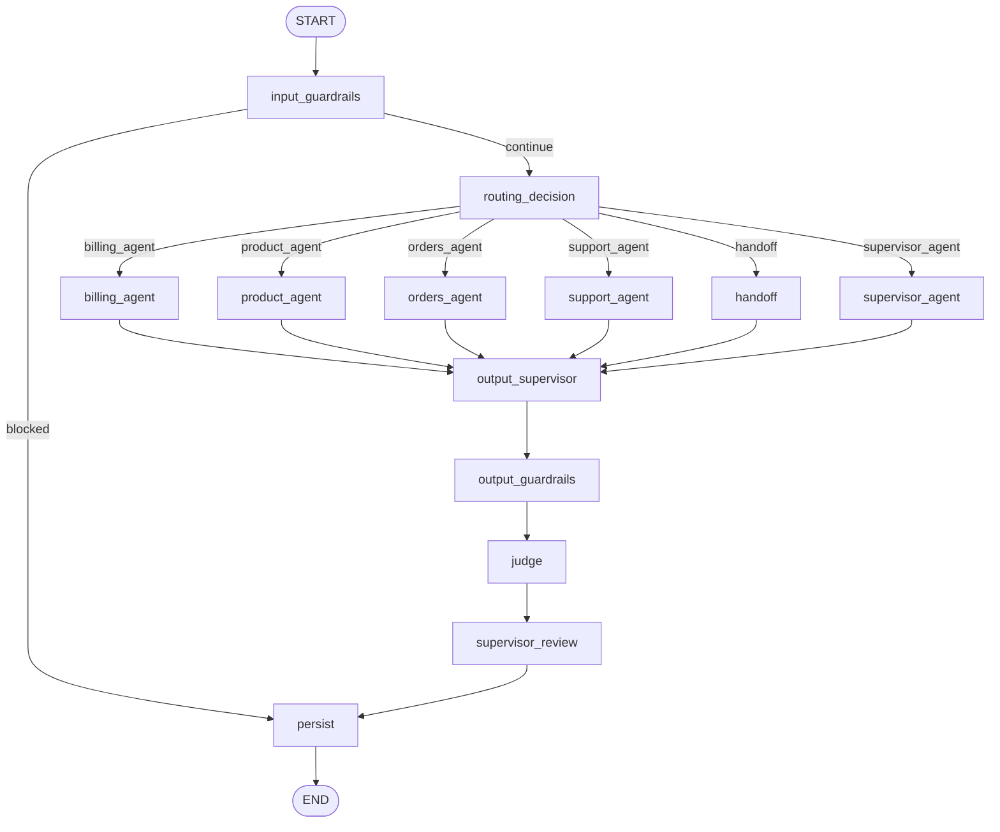

# Tutorial — Implementing an Agent using `agent_template_backend`

This tutorial explains how to implement a new agent from `agent_template_backend`, using the framework as the corporate execution engine.

The central idea is simple:

```text
Framework = reusable engine
Agent = domain-specific business logic
MCP Server = standardized boundary with external systems
YAML Config = behavior that can change without recompiling code
IC/NOC/GRL = business, operational, and governance traceability
```


The goal is for each new agent to implement only its domain logic — prompts, business rules, tools, schemas, and specific nodes — without recreating engines that already belong to the framework.

---

## 1. Architecture overview

The template separates what is generic from what is specific.

```text
agent_template_backend/
├── app/
│   ├── main.py                    # FastAPI API, gateway, session, SSE, and workflow entry point
│   ├── state.py                   # Shared LangGraph state contract
│   ├── workflows/
│   │   └── agent_graph.py          # Corporate workflow with router, guardrails, agents, judges, and persistence
│   ├── agents/
│   │   ├── runtime.py              # Common agent resources: MCP, RAG, cache, IC, LLM
│   │   ├── billing_agent.py        # Example billing agent
│   │   ├── product_agent.py        # Example product agent
│   │   ├── orders_agent.py         # Example orders agent
│   │   └── support_agent.py        # Example support agent
│   └── examples/                  # Examples for IC, NOC, GRL, MCP, and observer
├── config/
│   ├── agents.yaml                # Registry of available agents
│   ├── routing.yaml               # Intents, keywords, fallback, and routing decision
│   ├── tools.yaml                 # Tool catalog available to the backend
│   ├── mcp_servers.yaml           # Local MCP endpoints
│   ├── mcp_servers.docker.yaml    # MCP endpoints in Docker Compose
│   ├── mcp_parameter_mapping.yaml # Mapping between canonical keys and tool parameters
│   ├── identity.yaml              # Business identity resolution
│   ├── guardrails.yaml            # Global guardrails
│   ├── judges.yaml                # Global judges
│   ├── prompt_policy.yaml         # Global prompt policy
│   └── agents/<agent_id>/         # Isolated configuration per agent
├── data/
│   └── agent_framework.db         # Local example database, when applicable
├── Dockerfile
├── requirements.txt
└── .env                           # Local configuration
```

### 1.1. What belongs to the framework

The framework should concentrate reusable engines:

- LangGraph and workflow assembly.
- Checkpointing.
- Memory.
- Session repository.
- Channel gateway.
- Enterprise Router.
- Supervisor.
- Guardrails.
- Output Supervisor.
- Judges.
- Langfuse/OpenTelemetry telemetry.
- IC/NOC/GRL analytics.
- MCP Tool Router.
- Cache.
- Generic RAG.

### 1.2. What belongs to the agent

The agent should contain only domain customizations:

- Specific prompts.
- Business rules.
- Custom schemas.
- Specific tools.
- External-system clients, preferably encapsulated behind MCP.
- Parameter mapping.
- Specialized nodes, when necessary.
- Business ICs for the journey.

When a rule only makes sense for one domain, it belongs to the agent. When a capability should be used by multiple agents, it belongs to the framework.

---

## 2. Template execution flow

The main flow starts in `app/main.py`, at the `/gateway/message` endpoint.

```text
Channel / Frontend / API
  ↓
POST /gateway/message
  ↓
ChannelGateway.normalize()
  ↓
IdentityResolver
  ↓
SessionRepository
  ↓
MemoryRepository
  ↓
AgentWorkflow.ainvoke()
  ↓
LangGraph
  ↓
Input Guardrails
  ↓
Enterprise Router or Supervisor
  ↓
Specialized agent
  ↓
MCP Tool Router / RAG / Cache / LLM
  ↓
Output Supervisor
  ↓
Output Guardrails
  ↓
Judges
  ↓
Supervisor Review
  ↓
Persistence / Checkpoint / Memory
  ↓
Response
```

`AgentWorkflow`, in `app/workflows/agent_graph.py`, normally already contains corporate nodes such as:

```text
input_guardrails
routing_decision
billing_agent
product_agent
orders_agent
support_agent
handoff
supervisor_agent
output_supervisor
output_guardrails
judge
supervisor_review
persist
```

To create a new agent, you normally change:

```text
app/agents/<new_agent>.py
app/workflows/agent_graph.py
app/state.py, if new fields are needed
config/agents.yaml
config/routing.yaml
config/tools.yaml
config/mcp_servers.yaml
config/mcp_parameter_mapping.yaml
config/identity.yaml
config/agents/<agent_id>/prompt_policy.yaml
config/agents/<agent_id>/guardrails.yaml
config/agents/<agent_id>/judges.yaml
.env
```

---

## 3. Prerequisites

### 3.1. Local requirements

- Python 3.12 or 3.13.
- `pip` or `uv`.
- The `agent_framework` project available in the same workspace, if the template uses a local installation.
- MCP servers, if the agent uses tools.
- Redis, Oracle Autonomous Database, MongoDB, and Langfuse are optional depending on configuration.

Recommended structure:

```text
workspace/
├── agent_framework/
└── agent_template_backend/
```

### 3.2. Local installation

Inside the `agent_template_backend` directory:

```bash
python -m venv .venv
source .venv/bin/activate
pip install -r requirements.txt
```

If `agent_framework` is under local development:

```bash
pip install -e ../agent_framework
```

On Windows PowerShell:

```powershell
python -m venv .venv
.\.venv\Scripts\Activate.ps1
pip install -r requirements.txt
pip install -e ..\agent_framework
```

---

## 4. `.env` configuration

The `.env` file defines which engines will be enabled. It is not just a properties file: it changes the agent behavior at runtime.

Safe example for local development:

```env
APP_NAME=ai-agent-template
APP_ENV=local
LOG_LEVEL=INFO
API_HOST=0.0.0.0
API_PORT=8000
CORS_ORIGINS=http://localhost:5173,http://127.0.0.1:5173

LLM_PROVIDER=mock
LLM_TEMPERATURE=0.2
LLM_MAX_TOKENS=2048
LLM_TIMEOUT_SECONDS=120

SESSION_REPOSITORY_PROVIDER=memory
MEMORY_REPOSITORY_PROVIDER=memory
CHECKPOINT_REPOSITORY_PROVIDER=memory
USAGE_REPOSITORY_PROVIDER=memory

ENABLE_REDIS_CACHE=false
REDIS_URL=redis://localhost:6379/0
CACHE_TTL_SECONDS=300

VECTOR_STORE_PROVIDER=memory
GRAPH_STORE_PROVIDER=memory
RAG_TOP_K=5
EMBEDDING_PROVIDER=mock

ENABLE_LANGFUSE=false
LANGFUSE_HOST=http://localhost:3005
ENABLE_OTEL=false
OTEL_SERVICE_NAME=ai-agent-template

ENABLE_ANALYTICS=false
ANALYTICS_PROVIDERS=noop
ENABLE_OCI_STREAMING=false
OCI_STREAM_ENDPOINT=
OCI_STREAM_OCID=
OCI_STREAM_PARTITION_KEY=agent-events

ENABLE_INPUT_GUARDRAILS=true
ENABLE_OUTPUT_GUARDRAILS=true
ENABLE_OUTPUT_SUPERVISOR=true
ENABLE_JUDGES=true
ENABLE_SUPERVISOR=true
ENABLE_PARALLEL_GUARDRAILS=true
GUARDRAILS_FAIL_FAST=true
OUTPUT_SUPERVISOR_MAX_RETRIES=3
GUARDRAILS_CONFIG_PATH=./config/guardrails.yaml
JUDGES_CONFIG_PATH=./config/judges.yaml
PROMPT_POLICY_PATH=./config/prompt_policy.yaml

ROUTING_CONFIG_PATH=./config/routing.yaml
ROUTING_MODE=router
ENABLE_LLM_ROUTER=false

ENABLE_MCP_TOOLS=true
MCP_SERVERS_CONFIG_PATH=./config/mcp_servers.yaml
TOOLS_CONFIG_PATH=./config/tools.yaml
MCP_PARAMETER_MAPPING_PATH=./config/mcp_parameter_mapping.yaml
MCP_TOOL_TIMEOUT_SECONDS=30

IDENTITY_CONFIG_PATH=./config/identity.yaml
```

### 4.1. How to reason about the `.env`

Before testing a new agent, answer:

```text
Will the LLM be mock or real?
Will memory be local or database-backed?
Does the checkpoint need to survive restarts?
Will MCP tools be called for real or simulated?
Will routing be rule/intent-based or supervisor-based?
Should guardrails, judges, and supervisor block, review, or only observe?
Will Langfuse/OTEL/Streaming be used in this environment?
```

For a first test, use `LLM_PROVIDER=mock`, memory persistence, and local/mock MCP. Then evolve to a real LLM, database, Langfuse, and real services.

To use Oracle Autonomous Database, adjust:

```env
SESSION_REPOSITORY_PROVIDER=autonomous
MEMORY_REPOSITORY_PROVIDER=autonomous
CHECKPOINT_REPOSITORY_PROVIDER=autonomous
USAGE_REPOSITORY_PROVIDER=autonomous

ADB_USER=<user>
ADB_PASSWORD=<password>
ADB_DSN=<dsn>
ADB_WALLET_LOCATION=<wallet-path>
ADB_WALLET_PASSWORD=<wallet-password>
ADB_TABLE_PREFIX=AGENTFW
```

To use Langfuse:

```env
ENABLE_LANGFUSE=true
LANGFUSE_PUBLIC_KEY=<public-key>
LANGFUSE_SECRET_KEY=<secret-key>
LANGFUSE_HOST=http://localhost:3005
```

---

## 5. Creating a new agent

In this example, we will create an agent called `financeiro_agent` for generic financial support.

### 5.1. Before the code: what is an agent in this framework?

An agent is a domain class that receives the LangGraph `state`, interprets the intent selected by the router or supervisor, collects evidence, calls tools/RAG/LLM when necessary, and returns a decision so the workflow can continue.

It should not decide by itself everything the framework already decides. For example:

```text
The agent does not create the session.
The agent does not open SSE.
The agent does not compile LangGraph.
The agent does not create checkpoints.
The agent does not run global guardrails.
The agent does not call an external system directly when MCP Tool Router exists.
```

The agent should answer questions such as:

```text
What business problem am I solving?
What data do I need to answer safely?
Which tools can provide that data?
Which domain rules block or authorize an action?
What response should be returned to the user?
Which IC events do I need to emit for journey auditing?
```

### 5.2. Responsibilities of `app/agents/financeiro_agent.py`

This file should contain the specific logic of the financial agent. It should:

1. Receive the `state`.
2. Separate `context`, `session`, `business_context`, and `tool_arguments`.
3. Emit a start IC using `AgentRuntimeMixin`.
4. Collect MCP tool context, if any, through the framework MCP Tool Router.
5. Collect RAG context, if any, using the framework's generic RAG.
6. Build a domain prompt.
7. Call the LLM through the common runtime, with cache and telemetry.
8. Build a standardized response.
9. Emit a completion IC.
10. Return data to the workflow.

### 5.2.1. Understanding `state`, `context`, `session`, `business_context`, and `tool_arguments`

Before copying the agent code, the developer must understand where the data comes from. In a corporate agent, the most common mistake is to read any field directly from `state` without knowing whether that data came from the channel, the gateway, the identity resolver, the router, or the user.

`state` is the complete envelope of the LangGraph execution. Inside it there is usually a `context`, which is the context normalized by the framework.

Inside `context`, when the project uses Agent Gateway / Global Supervisor, there is commonly also a `session` block:

```python
ctx = state.get("context") or {}
session = ctx.get("session") or {}
```

Each block has a different role:

```text
state
  Complete state of the current workflow. It carries text, intent, route, partial
  response, MCP results, guardrail data, checkpoint, and other technical fields.

context
  Normalized context of the current message. It usually comes from the Channel
  Gateway, Identity Resolver, and Agent Gateway.

session
  Session and channel data. It helps identify who is talking, through which
  channel, in which tenant, which global session is active, and which backend/agent
  is serving the conversation.

business_context
  Already-normalized business data. Examples: customer_key, contract_key,
  interaction_key, session_key, protocol_id, invoice_id, order_id.

tool_arguments
  Explicit parameters already prepared for tools/MCP. When present, they should
  take precedence over inferences made by the agent.
```

Recommended trust order:

```text
1. Explicit tool_arguments
2. business_context resolved by the framework
3. normalized context
4. session and session.metadata, when they come from Agent Gateway
5. direct state
6. original user text, only for complementary extraction
```

This order avoids two problems:

```text
Problem 1: ignoring data already resolved by the Gateway/Identity Resolver.
Problem 2: overwriting a canonical parameter with a raw, less reliable value.
```

Example: if `business_context.customer_key` has already been resolved by the framework, the agent should not prefer a generic `user_id` from the session simply because it exists. `user_id` identifies the user in the channel; `customer_key` identifies the customer in the business domain.

Even if a simple agent does not use `session` directly, there is a difference between a technical session and business context.

### 5.2.2. Understanding the `AgentRuntimeMixin` class in `runtime.py`

Before writing a new agent, the developer must understand why almost all examples inherit from:

```python
from app.agents.runtime import AgentRuntimeMixin
```

`AgentRuntimeMixin` is an operational convenience layer for the agent. It is not the agent, it is not the workflow, and it does not contain business rules. It exists to prevent every agent from reimplementing the same technical capabilities differently.

In simple terms:

```text
AgentRuntimeMixin = standardized agent toolbox
FinanceiroAgent  = business rule that uses that toolbox
AgentWorkflow    = LangGraph engine that calls the agent
Framework        = complete corporate infrastructure
```

Without `AgentRuntimeMixin`, each developer would tend to write custom code to:

```text
emit IC/NOC/GRL
call MCP Tool Router
call RAG
build LLM cache
call LLM
build cache keys
handle missing observer, cache, RAG, or tools
```

That would generate inconsistent agents. One agent would emit IC events one way, another would call MCP directly, another would ignore cache, and another would break when observer was disabled. The mixin avoids that problem.

#### 5.2.2.1. What `AgentRuntimeMixin` provides

In the template, `AgentRuntimeMixin` concentrates utility methods such as:

| Method | What it is for | When the agent uses it |
|---|---|---|
| `_emit_ic()` | Emits a business/audit event | start, completion, business decision, context collected |
| `_emit_noc()` | Emits an operational event | technical error, timeout, fallback, unavailability |
| `_emit_grl()` | Emits a custom governance event | domain rule blocked or sanitized something |
| `_retrieve_rag_context()` | Queries the framework's generic RAG | agent needs document context |
| `_collect_mcp_context()` | Calls MCP tools declared in `state.mcp_tools` | agent needs to query external systems |
| `_cache_get()` | Reads generic cache | advanced use, usually indirect |
| `_cache_set()` | Writes generic cache | advanced use, usually indirect |
| `_llm_cache_key()` | Builds a stable LLM cache key | usually used internally |
| `_invoke_llm_cached()` | Calls the LLM with cache and telemetry | agent needs to generate an LLM answer |

The developer should think this way:

```text
I write the business rule in run().
When I need infrastructure, I call a helper from AgentRuntimeMixin.
```

#### 5.2.2.2. What `AgentRuntimeMixin` should not do

The mixin should not contain specific business rules, such as:

```text
calculate bill dispute
query an ANATEL protocol directly
open a Siebel SR directly
classify customer cancellation
calculate a financial slip amount
validate a specific retail product
```

These rules belong to the agent or to the domain MCP Server.

The correct boundary is:

```text
AgentRuntimeMixin
  knows how to call MCP, RAG, cache, LLM, and observer

Specific agent
  knows which evidence it needs, which rules to apply, and how to respond

MCP Server
  knows how to talk to a real system, mock, database, REST, SOAP, or legacy service
```

#### 5.2.2.3. How the mixin receives its resources

`AgentRuntimeMixin` does not create `llm`, `tool_router`, `rag_service`, `cache`, or `observer`. It expects the workflow to inject these objects into the agent constructor.

Therefore, the agent uses this pattern:

```python
class FinanceiroAgent(AgentRuntimeMixin):
    name = "financeiro_agent"

    def __init__(self, llm, telemetry=None, tool_router=None, rag_service=None, cache=None, settings=None, observer=None):
        self.llm = llm
        self.telemetry = telemetry
        self.tool_router = tool_router
        self.rag_service = rag_service
        self.cache = cache
        self.settings = settings
        self.observer = observer
```

This means:

```text
llm          = generation engine configured by the framework
telemetry    = technical spans/events
tool_router  = standardized MCP router
rag_service  = document/graph/vector search
cache        = Redis/memory/etc. cache
settings     = settings loaded from .env/YAML
observer     = IC/NOC/GRL emitter
```

The agent receives these objects ready to use. It should not create a new instance by itself inside `run()`.

#### 5.2.2.4. How `_emit_ic()`, `_emit_noc()`, and `_emit_grl()` help

An agent must be auditable, but it should not break if observability is disabled.

Therefore, the mixin emission methods are **fail-open**: if there is no `observer`, or if an event emission fails, the business journey continues.

Example IC:

```python
await self._emit_ic(
    "IC.FINANCEIRO_AGENT_STARTED",
    state,
    {"business_component": "financeiro"},
    component="agent.financeiro.start",
)
```

The developer does not need to manually build all basic metadata. The mixin already tries to include information such as:

```text
session_id
conversation_key
tenant_id
agent_id
route
intent
message_id
channel_id
```

Practical rule:

```text
Use _emit_ic() for a business milestone.
Use _emit_noc() for an operational issue.
Use _emit_grl() for domain-specific governance.
```

#### 5.2.2.5. How `_collect_mcp_context()` works

`_collect_mcp_context(state)` reads the list of tools already selected by the router:

```python
tools = state.get("mcp_tools") or []
```

It then calls the framework `tool_router` for each tool. The agent does not need to know whether the tool uses HTTP, Docker, mock, or a real service.

Conceptual flow:

```text
routing.yaml chooses intent
  ↓
intent defines mcp_tools
  ↓
state.mcp_tools receives the tool list
  ↓
AgentRuntimeMixin._collect_mcp_context()
  ↓
MCP Tool Router
  ↓
MCP Server
  ↓
normalized result returns to the agent
```

Example inside the agent:

```python
tool_context = await self._collect_mcp_context(state)
```

The developer should use this method when it is enough to call the tools defined by the intent.

If the agent must choose special arguments per tool, skip risky tools, require confirmation, or build additional parameters, it can implement its own method and call the router in a more controlled way.

#### 5.2.2.6. How `_retrieve_rag_context()` works

`_retrieve_rag_context(state)` queries the generic RAG configured in the framework.

It uses this base text:

```text
state.sanitized_input or state.user_text
```

It tries to define a search namespace from:

```text
agent_profile.rag_namespace
agent_id
route
default
```

It may also use information from `business_context`, such as `customer_key` or `contract_key`, to enrich graph search or related context.

Example:

```python
rag_context, rag_metadata = await self._retrieve_rag_context(state)
```

The agent uses `rag_context` in the prompt and may return `rag_metadata` for audit/debug.

Practical rule:

```text
Use RAG when the answer depends on documents, policy, knowledge base, or uncoded content.
Do not use RAG to replace an operational query that should be performed by an MCP tool.
```

#### 5.2.2.7. How `_invoke_llm_cached()` works

`_invoke_llm_cached()` calls the LLM with messages in chat format:

```python
answer = await self._invoke_llm_cached(state, "FinanceiroAgent", messages)
```

Before calling the LLM, it builds a cache key using elements such as:

```text
agent name
tenant_id
agent_id
intent
customer_key
contract_key
interaction_key
user text
prompt content
```

If a response already exists in cache, the method returns the cached value. Otherwise, it calls the LLM, writes the cache, and returns the response.

This avoids each agent implementing cache differently.

The developer should understand that cache is useful for deterministic prompts or repeated queries, but it must be used carefully for sensitive actions. The agent must not confirm an external operation only because an LLM response came from cache. Operational confirmations must depend on a real tool response.

#### 5.2.2.8. When to use `_collect_mcp_context()` and when to create custom logic

Use `_collect_mcp_context()` when:

```text
the intent already defined the correct tools
the canonical parameters are already in business_context
execution may call all tools in the list
no tool represents a sensitive action
```

Create custom logic in the agent when:

```text
a tool may only be called after explicit confirmation
a tool requires additional arguments derived from the message
a tool must be skipped if a mandatory field is missing
a registration/update tool must not run automatically
a tool sequence depends on the previous result
```

Safe rule example:

```python
if tool.startswith("registrar_") and not action_text:
    return {"ok": False, "skipped": True, "reason": "action without explicit confirmation"}
```

This is a domain rule and should remain in the agent, not in the mixin.

#### 5.2.2.9. How a developer should read the `run()` method of an agent that inherits from the mixin

When opening an agent, the developer should look for this mental structure:

```text
1. Does the agent emit a start IC?
2. Does it read context/session/business_context in an organized way?
3. Does it validate mandatory domain data?
4. Does it call MCP through the mixin or through controlled custom logic?
5. Does it call RAG when it needs document knowledge?
6. Does it build a prompt with evidence, not guesses?
7. Does it call the LLM through _invoke_llm_cached()?
8. Does it emit relevant IC/NOC/GRL events?
9. Does it return answer, next_state, mcp_results, and useful metadata?
```

If the agent does this, it is using the framework correctly.

#### 5.2.2.10. Minimal example of correct mixin usage

```python
async def run(self, state):
    await self._emit_ic("IC.FINANCEIRO_STARTED", state, component="agent.financeiro.start")

    ctx = state.get("context") or {}
    business_context = ctx.get("business_context") or state.get("business_context") or {}

    if not business_context.get("customer_key"):
        return {
            "answer": "Please provide the customer identifier to continue.",
            "next_state": "WAITING_CUSTOMER_KEY",
            "mcp_results": [],
        }

    mcp_results = await self._collect_mcp_context(state)
    rag_context, rag_metadata = await self._retrieve_rag_context(state)

    messages = [
        {"role": "system", "content": "You are a corporate financial agent."},
        {"role": "user", "content": f"MCP evidence: {mcp_results}\nRAG context: {rag_context}"},
    ]

    answer = await self._invoke_llm_cached(state, "FinanceiroAgent", messages)

    await self._emit_ic("IC.FINANCEIRO_COMPLETED", state, {"mcp_count": len(mcp_results)}, component="agent.financeiro.completed")

    return {
        "answer": answer,
        "next_state": "FINANCEIRO_ACTIVE",
        "mcp_results": mcp_results,
        "rag_metadata": rag_metadata,
    }
```

This example shows the mixin intent: the developer writes the agent reasoning, but delegates infrastructure to standardized methods.

#### 5.2.2.11. Common mistakes when using `AgentRuntimeMixin`

```text
Inherit from AgentRuntimeMixin but call REST directly inside the agent.
Create a manual cache instead of using _invoke_llm_cached().
Emit events directly in formats different from the observer.
Put domain rules inside runtime.py.
Use _collect_mcp_context() for action tools without confirmation.
Ignore business_context and get loose parameters from the payload.
Treat global session_id and backend_session_id as if they were the same thing.
Override internal mixin methods unnecessarily.
```

The most important rule is:

```text
The mixin standardizes technical capabilities.
The agent decides how to apply those capabilities to the domain.
```

### 5.2.3. Understanding `messages`: the agent conversational architecture

After understanding `state`, `context`, `session`, `business_context`, `tool_arguments`, and `AgentRuntimeMixin`, one central piece remains: `messages`.

In an agent, `messages` is not just a list of texts. It is the **conversational contract** sent to the LLM for that call. In this contract, the agent organizes instructions, the user request, evidence, RAG context, MCP results, summarized memory, and expected response format.

Minimal example:

```python
messages = [
    {
        "role": "system",
        "content": "You are a financial agent. Do not invent data.",
    },
    {
        "role": "user",
        "content": "I want to check my payment.",
    },
]
```

This format is common in modern conversational AI frameworks and providers. It appears, with small variations, in OpenAI Chat Completions/Responses API, OCI Generative AI OpenAI-compatible, LangChain `ChatModel`, LangGraph, Semantic Kernel, LlamaIndex, and tool-calling/MCP architectures.

The idea is simple:

```text
The agent builds a canonical conversation.
AgentRuntimeMixin calls the standardized LLM provider.
The provider adapts that conversation to the real backend.
```

This lets the agent continue writing `messages` predictably, even if the project uses OCI Generative AI, an OpenAI-compatible endpoint, LangChain, local Llama, mock, or another provider underneath.

#### 5.2.3.1. Main message roles

Each item in `messages` has at least a `role` and a `content`.

| Role | What it is for |
|---|---|
| `system` | Defines identity, limits, policies, rules, and agent behavior. |
| `user` | Represents the current user request or a framework-contextualized instruction. |
| `assistant` | Represents previous model responses when history is explicitly included. |
| `tool` | Represents tool results in structured tool-calling flows. |
| `developer` | In some providers, represents intermediate developer/application instructions. |

In the template, the simplest pattern mainly uses:

```text
system → who the agent is, what it can do, and what it must not do
user   → current message + evidence + business context + MCP + RAG
```

This pattern is intentionally simple to preserve compatibility with several runtimes.

#### 5.2.3.2. What should go into `system`

`system` should contain stable, higher-priority rules. It answers:

```text
Who is this agent?
Which domain does it serve?
Which limits must it respect?
What must it never invent?
When should it ask for more data?
When should it refuse an action?
Which tone and response format should it use?
```

Example:

```python
system_content = apply_agent_profile_prompt(
    state,
    """
    You are a corporate financial agent.
    Use only data provided by MCP, RAG, or business_context.
    Do not confirm payment, write-off, agreement, or dispute without tool evidence.
    If a mandatory identifier is missing, ask only for that data.
    Respond in a short, operational, and auditable way.
    """.strip(),
)
```

Critical rules should stay in `system`, not hidden in the middle of `user`.

#### 5.2.3.3. What should go into `user`

`user` should carry the current request and the context needed to answer. In a corporate agent, it usually contains:

```text
current user message
intent chosen by the router
active route/agent
normalized business_context
MCP results
RAG context
relevant session metadata
response format instruction
```

Example:

```python
messages = [
    {
        "role": "system",
        "content": system_content,
    },
    {
        "role": "user",
        "content": (
            "User message:\n"
            f"{user_text}\n\n"
            "Intent and route chosen by the framework:\n"
            f"intent={state.get('intent')} route={state.get('route')}\n\n"
            "Normalized business context:\n"
            f"customer_key={business_context.get('customer_key')}\n"
            f"contract_key={business_context.get('contract_key')}\n"
            f"interaction_key={business_context.get('interaction_key')}\n\n"
            "MCP results:\n"
            f"{tool_context}\n\n"
            "RAG context:\n"
            f"{rag_context or '[no RAG context]'}\n\n"
            "Response instruction:\n"
            "Answer only based on the evidence above. "
            "If mandatory evidence is missing, say it was not found."
        ),
    },
]
```

The example does not dump the entire `state` into the prompt. It selects relevant fields.

#### 5.2.3.4. Relationship between `messages`, memory, and history

`messages` is not the agent persistent memory.

```text
Persistent memory
  Lives in the framework repository/memory.
  May survive multiple interactions.
  May be summarized, compacted, or queried.

messages
  Is the payload sent to the LLM in one specific call.
  May include a memory summary.
  May include part of the history.
  Should not become a full dump of the conversation.
```

If the framework has already loaded history or a conversation summary, the agent should use only the necessary portion. Manually duplicating history increases cost, latency, and inconsistency risk.

#### 5.2.3.5. Relationship between `messages`, MCP, and RAG

MCP and RAG produce evidence. The LLM uses that evidence to draft the response.

```text
MCP Tool Router
  queries systems, mocks, services, or external actions
  returns structured data

RAG
  searches document context
  returns relevant passages and metadata

messages
  organize this evidence into a conversation for the LLM
```

A good agent makes clear to the LLM what is evidence and what is instruction.

Avoid mixing everything in an unstructured text. Prefer blocks:

```text
Instructions:
- Do not invent data.

User message:
...

MCP evidence:
...

RAG context:
...

Expected format:
...
```

This organization improves traceability and reduces hallucination.

#### 5.2.3.6. Compatibility with market frameworks

The `messages` pattern is conceptually compatible with most conversational AI ecosystems, but providers differ.

| Framework/provider | Conceptual compatibility | Attention point |
|---|---|---|
| OpenAI Chat/Responses | High | Roles, tool calls, and multimodal formats may vary by API. |
| OCI Generative AI OpenAI-compatible | High | Usually accepts a format similar to OpenAI-compatible. |
| LangChain `ChatModel` | High | May convert dicts into `SystemMessage`, `HumanMessage`, `AIMessage`. |
| LangGraph | High | The state may carry `messages`, or the agent may build messages per call. |
| Semantic Kernel | High | Uses equivalent concepts of chat history and roles. |
| LlamaIndex | High | Can adapt to chat engine or completion engine. |
| Anthropic Messages API | Medium/High | May require adaptations of system prompt and roles. |
| Local models | Variable | Some expect a specific chat template. |

Therefore, the agent should not call provider-specific SDKs directly. It builds `messages` and delegates the call to:

```python
answer = await self._invoke_llm_cached(state, "FinanceiroAgent", messages)
```

This keeps provider adaptation centralized in the runtime/framework.

#### 5.2.3.7. Common pitfalls when building `messages`

**Pitfall 1 — Sending the entire `state` to the LLM**

Bad:

```python
{"role": "user", "content": f"Full state: {state}"}
```

Better:

```python
{"role": "user", "content": f"customer_key={business_context.get('customer_key')}"}
```

The `state` may contain technical data, sensitive fields, history, checkpoint, and unnecessary information.

**Pitfall 2 — Sending huge objects without curation**

Bad:

```python
f"Full results: {mcp_results}"
```

Better:

```python
tool_summary = [
    {
        "tool": r.get("tool_name") or r.get("tool"),
        "ok": r.get("ok"),
        "status": r.get("status"),
        "evidence": r.get("evidence") or r.get("summary"),
    }
    for r in mcp_results
]
```

Then send only the necessary summary.

**Pitfall 3 — Passing sensitive data unnecessarily**

Bad:

```python
f"Full CPF: {cpf}"
```

Better:

```python
f"Customer identified: {'yes' if customer_key else 'no'}"
```

When you need to send an identifier, prefer a canonical key, hash, or masked value according to the project policy.

**Pitfall 4 — Letting the LLM invent when a tool failed**

Bad:

```text
Answer about the customer's payment.
```

Better:

```text
The consultar_pagamentos_financeiro tool returned an error or no data.
Do not confirm payment. Inform that the evidence was not found.
```

**Pitfall 5 — Confusing instruction with evidence**

Bad:

```text
The customer paid and you must answer that everything is fine.
```

Better:

```text
MCP evidence:
- consultar_pagamentos_financeiro: status=COMPENSATED

Instruction:
- Explain the status objectively.
```

**Pitfall 6 — Putting critical rules only in `user`**

Permanent behavior rules should go into `system`. `user` should carry the request and context for that interaction.

**Pitfall 7 — Duplicating history**

If the framework has already included a memory summary, do not manually resend the whole conversation.

**Pitfall 8 — Not asking for a response format**

In a corporate context, request a short, operational, traceable, evidence-based response.

#### 5.2.3.8. Recommended `messages` model for corporate agents

Use this pattern as a reference:

```python
system_content = apply_agent_profile_prompt(
    state,
    """
    You are a corporate agent specialized in the financial domain.
    Use only evidence from business_context, MCP, and RAG.
    Do not invent protocol, customer, contract, status, payment, or operational action.
    If mandatory data is missing, ask only for that data.
    Respond in a short, operational, and auditable way.
    """.strip(),
)

messages = [
    {
        "role": "system",
        "content": system_content,
    },
    {
        "role": "user",
        "content": (
            "User message:\n"
            f"{user_text}\n\n"
            "Summarized session context:\n"
            f"channel={session.get('channel')} tenant_id={session.get('tenant_id')}\n"
            f"global_session_id={session.get('global_session_id')}\n\n"
            "Business context:\n"
            f"customer_key={business_context.get('customer_key')}\n"
            f"contract_key={business_context.get('contract_key')}\n"
            f"interaction_key={business_context.get('interaction_key')}\n\n"
            "Intent and route:\n"
            f"intent={state.get('intent')} route={state.get('route')}\n\n"
            "MCP evidence:\n"
            f"{mcp_evidence}\n\n"
            "RAG context:\n"
            f"{rag_context or '[no RAG context]'}\n\n"
            "Expected format:\n"
            "1. Direct response to the user.\n"
            "2. Do not cite internal architecture details.\n"
            "3. If evidence was missing, clearly state what was missing."
        ),
    },
]
```

This pattern helps separate:

```text
Permanent rules        → system
Current request/context → user
Tool evidence          → MCP block
Document knowledge     → RAG block
Session/channel        → summarized context
Output format          → final instruction
```

#### 5.2.3.9. How to review `messages` during development

During development, before blaming the LLM, review the payload sent to it.

Useful questions:

```text
Does the system prompt contain the most important rules?
Does the user prompt contain the actual user question?
Was the correct business_context included?
Do MCP results appear as evidence, not as invented instruction?
Did RAG bring useful context or only noise?
Is there unnecessary sensitive data?
Is the prompt too large?
Is the expected response format clear?
```

A good practice is to emit a debug IC in non-production environments or log a sanitized version of the prompt, never the raw prompt with sensitive data.

### 5.2.4. Advanced resources now standardized by the framework

The first examples in this tutorial use simple methods such as `_collect_mcp_context()` and `_invoke_llm_cached()`. This is enough for simple agents. However, in real agents migrated to the framework, additional needs appear:

```text
normalize tools by intent;
read context/session/business_context/tool_arguments consistently;
build MCP arguments with aliases;
block action tools when mandatory payload is missing;
execute tools one by one with observability events;
build messages without dumping the entire state into the prompt;
generate a controlled fallback when the LLM fails.
```

Therefore, from this version onward, they become **reusable framework capabilities**, not code that each agent should copy.

#### 5.2.4.1. `RuntimeContext`: canonical state reading

The framework now offers a conceptual object called `RuntimeContext`, obtained by the agent with:

```python
runtime = self.get_runtime_context(state)
```

This object organizes:

```text
runtime.state              → complete LangGraph state
runtime.context            → normalized context
runtime.session            → session/channel data from the Gateway
runtime.session_metadata   → session metadata
runtime.business_context   → canonical business identity
runtime.tool_arguments     → explicit tool parameters
runtime.sanitized_input    → text sanitized by guardrails
runtime.original_text      → original text, when needed for controlled extraction
```

The developer no longer needs to repeat:

```python
ctx = state.get("context") or {}
session = ctx.get("session") or {}
business_context = ctx.get("business_context") or state.get("business_context") or {}
```

They can use:

```python
runtime = self.get_runtime_context(state)
customer_key = runtime.pick("customer_key", "cpf", "cnpj", "msisdn")
```

The trust order remains standardized:

```text
1. tool_arguments
2. business_context
3. context
4. session
5. session.metadata
6. state
```

#### 5.2.4.2. `normalize_tools_by_intent()`: tool fallback without taking power away from the router

In an ideal agent, `EnterpriseRouter` chooses the intent and injects `mcp_tools` into the `state`. But in tests, direct calls, or migrations, the agent may run without that injection.

For this, the framework offers:

```python
normalized_state = self.normalize_tools_by_intent(
    state,
    default_tools_by_intent=DEFAULT_TOOLS_BY_INTENT,
    default_intent="financeiro_pagamentos",
    route=self.name,
)
```

The rule is:

```text
If state['mcp_tools'] came from the router, use those tools.
If it did not, use the fallback declared by the agent.
Remove duplicates.
Preserve stable order.
Set intent, route, and active_agent when absent.
```

This prevents each agent from implementing its own `_normalize_state_tools()`.

#### 5.2.4.3. `build_tool_arguments()`: canonical MCP arguments

The agent can build MCP arguments without knowing all mapper details:

```python
args = self.build_tool_arguments(
    state,
    tool_name="consultar_titulo_financeiro",
    intent=state.get("intent"),
    aliases={
        "customer_key": ["customer_id", "cpf", "cnpj"],
        "contract_key": ["contract_id", "invoice_id"],
    },
)
```

This method builds arguments such as:

```text
query
operator_instructions
customer_key
contract_key
interaction_key
session_key
explicit parameters from tool_arguments
domain-configured aliases
```

After that, `MCPToolRouter` still applies `mcp_parameter_mapping.yaml`. In other words:

```text
build_tool_arguments() builds the canonical contract.
mcp_parameter_mapping.yaml translates it to the name expected by each MCP Server.
```

#### 5.2.4.4. Sensitive tool execution policy

Not every tool is just a query. Some tools execute actions, such as registering an opinion, opening a request, canceling a service, or creating a protocol.

These tools should be declared with policy in `config/tools.yaml`:

```yaml
tools:
  registrar_acao_backoffice:
    description: Registers an operational action in backoffice.
    mcp_server: backoffice
    enabled: true
    tool_type: action
    requires: [protocol_id, action_text, operator_session]
    confirmation_required: false
    args_schema:
      protocol_id: string
      action_text: string
      operator_session: string
```

With this, the framework can block the call before it reaches MCP when a mandatory field is missing:

```text
Tool registrar_acao_backoffice selected.
Framework builds arguments.
Framework checks requires.
If action_text is missing, returns skipped=true.
Agent emits domain IC/NOC, if necessary.
```

This avoids each agent manually writing:

```python
if tool.startswith("registrar_") and not arguments.get("action_text"):
    ...
```

#### 5.2.4.5. `execute_tools_for_intent()`: standardized tool execution

The agent can execute tools selected by the intent with:

```python
mcp_results = await self.execute_tools_for_intent(
    state,
    tools=state.get("mcp_tools") or [],
    aliases=TOOL_ALIASES,
)
```

This method handles:

```text
building arguments;
applying execution policy;
calling _call_mcp_tool();
normalizing the result;
emitting IC.MCP_TOOL_CALLED;
emitting IC.TOOL_CALLED;
emitting NOC.MCP_TOOL_FAILED on failure;
returning skipped=true when policy blocks execution.
```

The agent may still emit specific business ICs after that. Example: `AGA.010` for Speech Analytics, `AGA.011` for Customer/IMDB, `AGA.020` for TAIS/templates.

#### 5.2.4.6. `build_messages()`: standardized messages

To avoid each agent building prompts differently, the framework provides:

```python
messages = self.build_messages(
    state,
    system_prompt=system_prompt,
    mcp_results=mcp_results,
    rag_context=rag_context,
    rag_metadata=rag_metadata,
)
```

This builder separates:

```text
system prompt;
user message;
intent and route;
business_context;
MCP results;
RAG context;
RAG metadata;
extra sections.
```

The goal is to reduce these errors:

```text
sending the entire state to the LLM;
mixing permanent rule with evidence;
including sensitive data unnecessarily;
forgetting to report that a tool failed;
duplicating history already loaded by the framework.
```

#### 5.2.4.7. When to customize and when to use the framework

Use the framework to:

```text
read context;
normalize tools;
build MCP arguments;
apply execution policy;
call MCP;
build messages;
call the LLM with cache;
emit generic technical events.
```

Use the agent to:

```text
define business rules;
define domain-specific aliases;
define domain prompts;
define journey-specific ICs;
define conversational states such as WAITING_*;
handle migration compatibility;
decide domain-specific textual fallback.
```

This separation allows a real agent to have strong customizations without becoming a parallel framework engine.

### 5.3. Create the agent file

Create:

```text
app/agents/financeiro_agent.py
```

Commented base code:

```python
from app.agents.prompting import apply_agent_profile_prompt
from app.agents.runtime import AgentRuntimeMixin


class FinanceiroAgent(AgentRuntimeMixin):
    # This name must match the name used in the workflow and configuration.
    name = "financeiro_agent"

    def __init__(self, llm, telemetry=None, tool_router=None, rag_service=None, cache=None, settings=None, observer=None):
        # These objects are injected by the workflow/framework.
        # The agent uses them, but does not create these engines.
        self.llm = llm
        self.telemetry = telemetry
        self.tool_router = tool_router
        self.rag_service = rag_service
        self.cache = cache
        self.settings = settings
        self.observer = observer

    async def run(self, state):
        # 1. Marks the start of this agent's business journey.
        await self._emit_ic(
            "IC.FINANCEIRO_AGENT_STARTED",
            state,
            {"business_component": "financeiro"},
            component="agent.financeiro.start",
        )

        # 2. Separates the framework contract blocks.
        # The agent reads these blocks, but the framework creates/normalizes them.
        ctx = state.get("context") or {}
        session = ctx.get("session") or {}
        session_metadata = session.get("metadata") or {}
        business_context = ctx.get("business_context") or state.get("business_context") or {}
        tool_arguments = ctx.get("tool_arguments") or state.get("tool_arguments") or {}

        # 3. Interprets the current message using the text already sanitized by guardrails,
        # while preserving the original text only when identifiers must be extracted.
        user_text = state.get("sanitized_input") or state.get("user_text") or ""
        original_text = (
            ctx.get("message")
            or ctx.get("text")
            or ctx.get("query")
            or session.get("last_user_message")
            or state.get("user_text")
            or user_text
        )

        # 4. Calls MCP tools selected by routing, when configured.
        # The agent does not need to know whether the tool uses REST, SOAP, DB, or mock.
        tool_context = await self._collect_tool_context(state)

        if tool_context:
            await self._emit_ic(
                "IC.FINANCEIRO_MCP_CONTEXT_COLLECTED",
                state,
                {"tool_result_count": len(tool_context)},
                component="agent.financeiro.mcp",
            )

        # 5. Retrieves document context, if RAG is enabled.
        rag_context, rag_metadata = await self._retrieve_rag_context(state)

        # 6. Builds the message for the LLM.
        # The system prompt defines the agent behavior and limits.
        # The user prompt carries data, evidence, and context.
        messages = [
            {
                "role": "system",
                "content": apply_agent_profile_prompt(
                    state,
                    "You are a financial agent. Respond clearly, using tool data when available. Do not confirm financial actions without evidence and explicit confirmation."
                ),
            },
            {
                "role": "user",
                "content": (
                    f"Message: {state.get('sanitized_input') or state['user_text']}\n"
                    f"Session: {session}\n"
                    f"Intent: {state.get('intent')}\n"
                    f"MCP data: {tool_context}\n"
                    f"RAG context: {rag_context}"
                ),
            },
        ]

        # 7. Calls the LLM using the common runtime, with cache and telemetry.
        answer = await self._invoke_llm_cached(state, "FinanceiroAgent", messages)

        # 8. Returns the contract expected by the workflow.
        result = {
            "answer": f"[FinanceiroAgent] {answer}",
            "next_state": "FINANCEIRO_ACTIVE",
            "mcp_results": tool_context,
            "rag": rag_metadata,
        }

        # 9. Marks the end of the business journey.
        await self._emit_ic(
            "IC.FINANCEIRO_AGENT_COMPLETED",
            state,
            {
                "answer_chars": len(result.get("answer") or ""),
                "has_mcp_results": bool(tool_context),
                "rag_enabled": bool(rag_metadata.get("enabled")),
            },
            component="agent.financeiro.completed",
        )

        return result

    async def _collect_tool_context(self, state):
        # This method delegates to the framework MCP Tool Router.
        # The called tools depend on the intent defined in routing.yaml.
        return await self._collect_mcp_context(state)
```

### 5.3.1. How to adapt this example to a real agent

In the example above, `session`, `business_context`, and `tool_arguments` appear in the prompt for educational purposes. In production, the developer should avoid dumping huge objects directly into the prompt. Ideally, select only the necessary fields.

Example reasoning for a financial agent:

```text
session.channel       → useful to adjust language or understand conversation origin.
session.tenant_id     → useful for multi-tenant isolation.
business_context.customer_key → useful to query customer/title/payment.
business_context.contract_key → useful to query contract, invoice, or order.
business_context.interaction_key → useful to trace protocol/ticket/interaction.
tool_arguments        → useful when Gateway or Identity Resolver already prepared exact parameters.
```

A common utility function inside the agent is a `pick()` with explicit precedence:

```python
def pick(name: str, *, tool_arguments, business_context, ctx, session, session_metadata, state):
    if name in tool_arguments:
        return tool_arguments.get(name)
    if isinstance(business_context, dict) and name in business_context:
        return business_context.get(name)
    if name in ctx:
        return ctx.get(name)
    if name in session:
        return session.get(name)
    if name in session_metadata:
        return session_metadata.get(name)
    return state.get(name)
```

This function makes it clear that the agent is not guessing where the data comes from. It follows a trust policy.

### 5.3.2. Where does Agent Gateway fit into this code?

When Agent Gateway / Global Supervisor exists, it may enrich the message before sending it to the agent backend. Examples of data that may arrive in `context.session`:

```json
{
  "session": {
    "global_session_id": "s1",
    "backend_session_id": "default:financeiro_agent:s1",
    "active_backend": "financeiro",
    "channel": "web",
    "tenant_id": "default",
    "metadata": {
      "selected_backend": "financeiro",
      "last_reason": "Backend selected by rules: matches=['payment']"
    }
  }
}
```

The agent should not use this block to make the final business decision. It should use it for technical context, traceability, and conversation continuity. The business decision must still be based on `business_context`, MCP tools, RAG, and domain rules.

### 5.4. How to know whether the agent is well implemented

An agent is well implemented when:

```text
It knows business rules, but not infrastructure details.
It uses the common runtime for LLM, RAG, cache, MCP, and IC.
It returns a simple contract to the workflow.
It does not duplicate guardrail, checkpoint, session, memory, or telemetry.
It can be tested in isolation with a simulated state.
```

---

## 6. Registering the agent in the workflow

### 6.1. Before the code: what is the workflow?

The workflow is the path controlled by LangGraph. It defines the execution order:

```text
entry → guardrails → routing → agent → review → persistence → response
```

Creating the agent class is not enough. LangGraph only executes nodes registered in the graph.

Workflow registration answers three questions:

```text
Which class implements the agent?
Which node name represents this agent in the graph?
Where does the flow go after the agent responds?
```

### 6.2. Import the agent

Edit:

```text
app/workflows/agent_graph.py
```

Add:

```python
from app.agents.financeiro_agent import FinanceiroAgent
```

### 6.3. Instantiate the agent

In the `AgentWorkflow` class `__init__`, after creating `agent_kwargs`:

```python
self.financeiro = FinanceiroAgent(llm, **agent_kwargs)
```

This line injects into the agent the same shared engines used by the other agents: LLM, telemetry, MCP Tool Router, RAG, cache, settings, and observer.

### 6.4. Create the LangGraph node

In `_build_graph()`:

```python
builder.add_node("financeiro_agent", self._node("financeiro_agent", self.financeiro_agent))
```

The first `financeiro_agent` is the graph node name. The second `self.financeiro_agent` is the wrapper method called when the flow reaches this node.

### 6.5. Add the conditional route

In the `builder.add_conditional_edges("routing_decision", ...)` dictionary, include:

```python
"financeiro_agent": "financeiro_agent",
```

Example:

```python
builder.add_conditional_edges(
    "routing_decision",
    lambda s: s.get("route", "billing_agent"),
    {
        "billing_agent": "billing_agent",
        "product_agent": "product_agent",
        "orders_agent": "orders_agent",
        "support_agent": "support_agent",
        "financeiro_agent": "financeiro_agent",
        "handoff": "handoff",
        "supervisor_agent": "supervisor_agent",
    },
)
```

This table connects the router decision to the real graph node.

Another example:


```python
    def _build_graph(self):
        builder = StateGraph(AgentState)
        builder.add_node("input_guardrails", self._node("input_guardrails", self.input_guardrails))
        builder.add_node("routing_decision", self._node("routing_decision", self.routing_decision))
        builder.add_node("billing_agent", self._node("billing_agent", self.billing_agent))
        builder.add_node("product_agent", self._node("product_agent", self.product_agent))
        builder.add_node("orders_agent", self._node("orders_agent", self.orders_agent))
        builder.add_node("support_agent", self._node("support_agent", self.support_agent))
        builder.add_node("handoff", self._node("handoff", self.handoff))
        builder.add_node("supervisor_agent", self._node("supervisor_agent", self.supervisor_agent))
        builder.add_node("output_supervisor", self._node("output_supervisor", self.output_supervisor))
        builder.add_node("output_guardrails", self._node("output_guardrails", self.output_guardrails))
        builder.add_node("judge", self._node("judge", self.judge))
        builder.add_node("supervisor_review", self._node("supervisor_review", self.supervisor_review))
        builder.add_node("persist", self._node("persist", self.persist))

        builder.add_edge(START, "input_guardrails")
        builder.add_conditional_edges(
            "input_guardrails",
            self._after_input_guardrails,
            {"blocked": "persist", "continue": "routing_decision"},
        )
        builder.add_conditional_edges(
            "routing_decision",
            lambda s: s.get("route", "billing_agent"),
            {
                "billing_agent": "billing_agent",
                "product_agent": "product_agent",
                "orders_agent": "orders_agent",
                "support_agent": "support_agent",
                "handoff": "handoff",
                "supervisor_agent": "supervisor_agent",
            },
        )
        builder.add_edge("billing_agent", "output_supervisor")
        builder.add_edge("product_agent", "output_supervisor")
        builder.add_edge("orders_agent", "output_supervisor")
        builder.add_edge("support_agent", "output_supervisor")
        builder.add_edge("handoff", "output_supervisor")
        builder.add_edge("supervisor_agent", "output_supervisor")
        builder.add_edge("output_supervisor", "output_guardrails")
        builder.add_edge("output_guardrails", "judge")
        builder.add_edge("judge", "supervisor_review")
        builder.add_edge("supervisor_review", "persist")
        builder.add_edge("persist", END)

        return builder.compile(checkpointer=create_langgraph_checkpointer(self.settings))
```




### 6.6. Connect the node to Output Supervisor

```python
builder.add_edge("financeiro_agent", "output_supervisor")
```

This line is important because the agent response should not go directly to the user. It first passes through output supervisor, output guardrails, judges, supervisor review, and persistence.

### 6.7. Create the wrapper method

#### What is a Wrapper

LangGraph requires nodes in the following format:

```python
def node(state):
    return {}

In the `AgentWorkflow` class:

```python
async def financeiro_agent(self, state):
    async with self.langgraph_telemetry.node("financeiro_agent", state):
        async with self.telemetry.span(
            "workflow.agent.financeiro",
            session_id=state.get("conversation_key") or state.get("session_id"),
            input={"intent": state.get("intent")},
        ):
            return await self.financeiro.run(state)
```

But real agents usually have:

```python
agent.execute(...)
```

The wrapper performs the adaptation.

```python
def billing_wrapper(state):

    response = billing_agent.execute(
        state["messages"]
    )

    return {
        "messages": [response]
    }
```

#### Internal Wrapper Flow

```text
LangGraph
    │
    ▼
BillingWrapper
    │
    ▼
BillingAgent.execute()
    │
    ▼
MCP Router
    │
    ▼
MCP Server
    │
    ▼
OCI GenAI
```

On `AgentWorkflow` class:

```python
async def financeiro_agent(self, state):
    async with self.langgraph_telemetry.node("financeiro_agent", state):
        async with self.telemetry.span(
            "workflow.agent.financeiro",
            session_id=state.get("conversation_key") or state.get("session_id"),
            input={"intent": state.get("intent")},
        ):
            return await self.financeiro.run(state)
```

The wrapper adds telemetry around the agent. Business logic remains inside `FinanceiroAgent.run()`.

### 6.8. Add it to supervisor mode

#### What is the Supervisor

The supervisor is usually a LangGraph node.

It can be:

- LLM
- Rule-based router
- YAML router
- Hybrid router

Example:

```python
def supervisor(state):

    return {
        "next": "billing_agent"
    }
```

It does not execute the BillingAgent.

It only decides which agent should be executed.


In the `supervisor_agent()` method, adjust the handler map:

```python
handlers = {
    "billing_agent": self.billing.run,
    "product_agent": self.product.run,
    "orders_agent": self.orders.run,
    "support_agent": self.support.run,
    "financeiro_agent": self.financeiro.run,
}
```

This lets the supervisor call the new agent when `ROUTING_MODE=supervisor` or when a supervised handoff occurs.

### 6.9. Common mistakes in this chapter

```text
Create the agent class but forget add_node.
Add add_node but forget add_conditional_edges.
Add the route but forget add_edge to output_supervisor.
Use different names in routing.yaml, workflow, and class.
Call self.financeiro.run directly without a telemetry wrapper.
```

---

## 7. Adjusting the agent state

### 7.1. Before the code: what is state?

`state` is the object that travels between LangGraph nodes. It works as short-term memory for the current execution.

It is not the database, not the full conversational memory, and should not become a giant information repository.

Use `state` for data that must circulate between nodes, for example:

```text
user text
chosen intent
chosen route
partial response
tool result
next conversation state
decision flags
```

Do not use `state` for:

```text
long conversation history
large files
full external-system responses when unnecessary
raw document content
extensive logs
```

### 7.2. When to change `app/state.py`

Edit:

```text
app/state.py
```

Only add new fields if the agent must share specific information with other nodes.

Example:

```python
class AgentState(TypedDict, total=False):
    # existing fields...
    financial_context: dict[str, Any]
    financial_decision: dict[str, Any]
```

### 7.3. Decision criteria

Before creating a new field, ask:

```text
Does another node need to read this data?
Does this data need to survive the next workflow step?
Is this data small and structured?
Does this data help with auditing or decision-making?
```

If the answer is no, keep the data local to the agent or write it to the appropriate repository.

---

## 8. Registering the agent in `config/agents.yaml`

### 8.1. Before the YAML: what is `agents.yaml` for?

`agents.yaml` is the official registry of available agents. It does not execute the agent by itself, but tells the framework which agents exist, which isolated settings they use, and which metadata describes the domain.

It answers:

```text
What is the agent_id?
What friendly name appears in listings and debug?
Where are the specific prompt, guardrails, and judges?
Which domain does this agent serve?
Which metadata helps routing, audit, and operations?
```

### 8.2. Registration example

Edit:

```text
config/agents.yaml
```

Add:

```yaml
agents:
  - agent_id: financeiro_agent
    name: Financeiro Agent
    description: Agent for financial questions, payments, balances, agreements, and duplicate slips.
    prompt_policy_path: ./config/agents/financeiro_agent/prompt_policy.yaml
    routing_config_path: ./config/routing.yaml
    guardrails_config_path: ./config/agents/financeiro_agent/guardrails.yaml
    judges_config_path: ./config/agents/financeiro_agent/judges.yaml
    mcp_servers_config_path: ./config/mcp_servers.yaml
    tools_config_path: ./config/tools.yaml
    metadata:
      domain: financeiro
      system_prefix: |
        You are running financeiro_agent.
        Use only policies, memory, checkpoints, guardrails, and judges for this agent_id.
        Do not mix history or decisions from other agents.
```

### 8.3. Care points

The `agent_id` must be consistent with:

```text
node name in the workflow
name used in routing.yaml
canonical session_id
config/agents/<agent_id>/ folder
observability metadata
```

Avoid renaming `agent_id` after the agent is in production, because it may break history, memory, checkpoint, and metrics.

---

## 9. Creating isolated agent configurations

### 9.1. Before the YAML: why isolate configuration per agent?

Each agent may have its own prompt policy, guardrails, and judges. A financial agent may require explicit confirmation before an action. A support agent may allow more open responses. A legal agent may require document evidence.

Therefore, avoid putting everything in the global file. Use global configuration for corporate rules and local configuration for domain rules.

Create:

```text
config/agents/financeiro_agent/
```

### 9.2. `prompt_policy.yaml`

This file defines the base posture of the agent.

```yaml
id: financeiro_agent_prompt_policy
version: 1
description: Isolated base prompt for the financial agent.
system_prefix: |
  You are a corporate agent specialized in financial support.
  Be clear, objective, auditable, and do not invent data.
  When you need to execute an action, use configured tools.
  When mandatory information is missing, ask only for the required data.
```

Use this file for persistent behavior rules, not temporary test rules.

### 9.3. `guardrails.yaml`

This file complements the global guardrails.

```yaml
input:
  - code: MSK
    enabled: true
  - code: VLOOP
    enabled: true
  - code: PINJ
    enabled: true
output:
  - code: REVPREC
    enabled: true
  - code: CMP
    enabled: true
```

Use guardrails when the response must be blocked, sanitized, or reviewed by rule.

### 9.4. `judges.yaml`

Judges evaluate quality, adherence, groundedness, and other criteria after the response is produced.

```yaml
judges:
  - name: response_quality
    enabled: true
    threshold: 0.7
  - name: groundedness
    enabled: true
    threshold: 0.6
```

Use a judge to evaluate the response. Use a guardrail to block or protect. Use a prompt to guide behavior.

---

## 10. Configuring routing in `config/routing.yaml`

### 10.1. Before the YAML: what is routing?

Routing is the decision about which agent should handle the message.

In a multi-agent system, the user should not need to know which agent to call. They write a message, and the framework decides the route.

The router normally considers:

```text
user text
current conversation state
keywords
examples
priority
requested agent_id
state policies
LLM router, if enabled
```

### 10.2. When to create a new intent

Create an intent when there is a clear category of request that should go to a specific agent.

Financial intent example:

```yaml
intents:
  - name: financeiro_pagamentos
    domain: financeiro
    agent: financeiro_agent
    description: Questions about payment, balance, bill, bank slip, agreement, dispute, and duplicate copy.
    priority: 15
    mcp_tools:
      - consultar_titulo_financeiro
      - consultar_pagamentos_financeiro
    keywords:
      - payment
      - bank slip
      - balance
      - agreement
      - financial
      - duplicate copy
      - due date
      - collection
      - dispute
    examples:
      - I want to check my payment.
      - I need a duplicate copy of the bank slip.
      - My payment has not been posted yet.
```

### 10.3. What `mcp_tools` means in the intent

`mcp_tools` indicates which tools should be made available/collected when that intent is chosen. This way, the agent does not need to manually decide every call in simple cases.

The flow becomes:

```text
routing.yaml chooses intent
intent points to agent
intent declares mcp_tools
AgentRuntimeMixin collects MCP context
agent uses the data in the response
```

### 10.4. State policies

If the conversation is already in a specific state, the next message may need to go back to the same agent, even if the text is short.

Example:

```yaml
state_policies:
  - state: WAITING_FINANCEIRO_CONFIRMATION
    agent: financeiro_agent
    description: Keeps short confirmations in the financial flow.
```

This prevents a response like “yes” from being routed to the wrong agent.

### 10.5. Router versus supervisor

In router mode:

```env
ROUTING_MODE=router
```

The framework chooses a route more directly, usually by rules, keywords, examples, and score.

In supervisor mode:

```env
ROUTING_MODE=supervisor
```

A supervisor may decide the sequence of agents, handoff, or response combination.

Use router when the domain is well mapped. Use supervisor when the conversation requires decomposition, multiple agents, or a more flexible decision.

---

## 11. Configuring tools in `config/tools.yaml`

### 11.1. Before the YAML: what is a tool?

A tool is an external capability that the agent can use to obtain data or execute an action.

Examples:

```text
query bill
query payment
open protocol
search order
cancel service
query knowledge base
```

The tool is not necessarily the real system. It is the contract known by the backend. The real system stays behind the MCP Server.

### 11.2. Declaring tools

Edit:

```text
config/tools.yaml
```

Add:

```yaml
tools:
  consultar_titulo_financeiro:
    description: Queries a financial title by customer and contract.
    mcp_server: financeiro
    enabled: true
    args_schema:
      customer_id: string
      contract_id: string

  consultar_pagamentos_financeiro:
    description: Queries financial payments by customer.
    mcp_server: financeiro
    enabled: true
    args_schema:
      customer_id: string
```

### 11.3. How to think about a tool

Before declaring a tool, define:

```text
Which business question does it answer?
Does it only query data or execute an action?
Which parameters are mandatory?
Which parameters come from canonical identity?
Which MCP Server implements the tool?
Which timeout and fallback are acceptable?
Does the result contain sensitive data that must be masked?
```

The backend should not directly call HTTP/SOAP/DB business systems when that call can be standardized through MCP Tool Router.

---

## 12. Configuring MCP servers

### 12.1. Before the YAML: what is the MCP Server?

The MCP Server is the adapter between the agent world and real systems. It allows the backend to communicate with tools in a standardized way, without knowing REST, SOAP, database, queue, or mock details.

The design is:

```text
Agent
  ↓
Framework MCP Tool Router
  ↓
Domain MCP Server
  ↓
Real system, mock, database, REST, SOAP, or internal service
```

### 12.2. Local configuration

Edit:

```text
config/mcp_servers.yaml
```

Example:

```yaml
servers:
  financeiro:
    transport: http
    endpoint: http://localhost:8300/mcp
    enabled: true
    description: Local Financial MCP Server.
```

### 12.3. Docker Compose configuration

Edit:

```text
config/mcp_servers.docker.yaml
```

Example:

```yaml
servers:
  financeiro:
    transport: http
    endpoint: http://financeiro-mcp:8300/mcp
    enabled: true
    description: Financial MCP Server in Docker.
```

### 12.4. How to avoid a common endpoint error

Locally, `localhost` works because the backend and MCP run on the same machine.

Inside Docker Compose, `localhost` inside the backend container points to the backend container itself, not to the MCP container. Therefore, in Docker, use the service name:

```text
http://financeiro-mcp:8300/mcp
```

---

## 13. Configuring MCP parameter mapping

### 13.1. Before the YAML: why mapping exists

The framework works with canonical keys so it does not depend on the specific names used by each system.

Example:

```text
customer_key = canonical customer in the framework
contract_key = canonical contract/bill/order/title
interaction_key = external interaction
session_key = technical session
```

But each tool may expect different names:

```text
customer_id
cpf
msisdn
clientCode
contract_id
invoice_id
order_id
```

`mcp_parameter_mapping.yaml` performs this translation without forcing the agent to know the internal names of each MCP.

### 13.2. Example

Edit:

```text
config/mcp_parameter_mapping.yaml
```

```yaml
mcp_parameter_mapping:
  defaults:
    use_mock: true
  tools:
    consultar_titulo_financeiro:
      map:
        customer_key: customer_id
        contract_key: contract_id
        interaction_key: interaction_id
        session_key: session_id
    consultar_pagamentos_financeiro:
      map:
        customer_key: customer_id
        session_key: session_id
```

Interpretation:

```text
customer_key  -> canonical key in the framework
customer_id   -> parameter expected by the MCP tool
```

### 13.3. How to validate the mapping

If the tool receives the wrong parameter, investigate in this order:

```text
payload sent to /gateway/message
config/identity.yaml
resolved business_context
config/mcp_parameter_mapping.yaml
tool args_schema
real signature in the MCP Server
```

---

## 14. Configuring business identity

### 14.1. Before the YAML: what is business identity?

Business identity is the normalization of the keys that represent the customer, contract, order, protocol, session, or interaction.

Without this layer, each channel sends a different name and each tool expects another name. The result is parameter error, missing mandatory data, or querying the wrong customer.

`identity.yaml` answers:

```text
Where can I extract customer_key from?
Where can I extract contract_key from?
Where can I extract interaction_key from?
Where can I extract session_key from?
Which keys are mandatory?
```

### 14.2. Example

Edit:

```text
config/identity.yaml
```

```yaml
identity:
  version: "2"
  required:
    - session_key
  keys:
    customer_key:
      description: Canonical customer.
      sources:
        - business_context.customer_key
        - context.business_context.customer_key
        - context.session.metadata.customer_key
        - customer_key
        - customer_id
        - cpf
        - cnpj
        - user_id
    contract_key:
      description: Main contract, order, bill, or title.
      sources:
        - business_context.contract_key
        - context.business_context.contract_key
        - context.session.metadata.contract_key
        - contract_key
        - contract_id
        - invoice_id
        - order_id
    interaction_key:
      description: External interaction key.
      sources:
        - business_context.interaction_key
        - context.business_context.interaction_key
        - context.session.metadata.interaction_key
        - interaction_key
        - call_id
        - message_id
        - protocol_id
    session_key:
      description: Stable technical session.
      sources:
        - business_context.session_key
        - context.business_context.session_key
        - context.session.backend_session_id
        - context.session.global_session_id
        - context.session.metadata.session_key
        - session_key
        - conversation_key
        - session_id
```

### 14.3. How to think about identity

Use the minimum required. Do not make everything mandatory. For a generic question, perhaps only `session_key` is enough. To query a financial title, maybe `customer_key` and `contract_key` are mandatory.

The resolved identity appears in `business_context` inside the `state` and is used by the `MCP Tool Router`.

### 14.4. Relationship between SessionContext and BusinessContext

When Agent Gateway is present, it may create or transport session data. This data is important, but it does not replace business identity.

```text
SessionContext answers:
  Who is speaking?
  Through which channel?
  Which global session is active?
  Which backend is serving?
  What was the reason for the last route decision?

BusinessContext answers:
  Which customer should be queried?
  Which contract/bill/order is being discussed?
  Which protocol/ticket/interaction identifies the case?
  Which key should be sent to the MCP tool?
```

Practical rule:

```text
Use session for continuity, traceability, and channel.
Use business_context to query systems, call MCP, and make business decisions.
Use tool_arguments when parameters already arrive explicitly prepared.
```

Common error example:

```text
Using session.user_id as customer_key without validating identity.yaml.
```

The correct approach is to let `IdentityResolver` transform `user_id`, `cpf`, `msisdn`, `customer_id`, or another identifier into a canonical key such as `customer_key`.

---

## 15. Implementing or connecting an MCP Server

### 15.1. Before the code: what is the MCP Server role?

The MCP Server is where integration with external systems or domain mocks lives. It allows the agent to use a tool without knowing the technical implementation.

The backend knows how to call:

```text
consultar_titulo_financeiro(customer_id, contract_id)
```

But it does not know, and should not know, whether that query uses:

```text
REST
SOAP
Oracle database
mock file
legacy service
queue
internal system
```

### 15.2. Conceptual tool contract

Conceptual example:

```python
async def consultar_titulo_financeiro(customer_id: str, contract_id: str, session_id: str | None = None):
    return {
        "customer_id": customer_id,
        "contract_id": contract_id,
        "status": "OPEN",
        "amount": 129.90,
        "due_date": "2026-06-20",
    }


async def consultar_pagamentos_financeiro(customer_id: str, session_id: str | None = None):
    return {
        "customer_id": customer_id,
        "payments": [
            {"date": "2026-06-01", "amount": 129.90, "status": "COMPENSATED"}
        ],
    }
```

### 15.3. Criteria for mock versus real

Use mock when:

```text
the real system is not available
you are testing routing and contract
you want to validate frontend/backend without VPN dependency
you want to build deterministic automated tests
```

Use real integration when:

```text
the contract has already been validated
the parameters are correct
timeout and fallback have been defined
there is observability for success and failure
there is safe test data
```

For development, you can use `use_mock: true` in `mcp_parameter_mapping.yaml` or implement a local MCP Server with simulated responses.

---

## 16. IC, NOC, and GRL in the new agent

### 16.1. Before events: why they exist

IC, NOC, and GRL are not ordinary logs. They exist to trace execution in a corporate way.

```text
IC  = business event or agent journey event
NOC = operational event, error, unavailability, timeout, or degradation
GRL = governance event, guardrail, block, review, or sanitization
```

Use `logger.info()` for simple diagnostics. Use IC/NOC/GRL when the event must appear in audit, observability, or operational analysis.

### 16.2. IC — business events

Use ICs inside the agent to register relevant steps in the journey.

Example:

```python
await self._emit_ic(
    "IC.FINANCEIRO_AGENT_STARTED",
    state,
    {"business_component": "financeiro"},
    component="agent.financeiro.start",
)
```

Minimum suggestion per agent:

```text
IC.<AGENT>_AGENT_STARTED
IC.<AGENT>_MCP_CONTEXT_COLLECTED
IC.<AGENT>_RAG_CONTEXT_RETRIEVED
IC.<AGENT>_AGENT_COMPLETED
IC.<AGENT>_BUSINESS_DECISION
IC.<AGENT>_ACTION_REQUESTED
IC.<AGENT>_ACTION_COMPLETED
```

### 16.3. NOC — operational events

NOC should be used for technical health, unavailability, error, timeout, fallback, and degradation.

Example:

```python
await self.observer.emit_noc(
    "NOC.FINANCEIRO_TOOL_TIMEOUT",
    {
        "session_id": state.get("conversation_key") or state.get("session_id"),
        "tenant_id": state.get("tenant_id"),
        "agent_id": state.get("agent_id"),
        "tool": "consultar_titulo_financeiro",
    },
    component="agent.financeiro.tool",
)
```

### 16.4. GRL — guardrails

Most GRLs are already emitted by the workflow in:

```text
input_guardrails
output_supervisor
output_guardrails
```

Only implement GRL inside the agent when there is a domain-specific validation that does not fit global guardrails.

### 16.5. When not to create a new event

Do not create IC/NOC/GRL for every line of code. Create events for important decisions:

```text
validated entry
MCP context collected
business decision made
external action requested
external action completed
technical fallback triggered
response blocked or reviewed
workflow completed
```

---

## 17. Local build and execution

At the project root:

```bash
cd agent_framework_oci
python -m venv .venv
```

### 17.1. Before the commands: what does starting the backend mean?

Starting the backend means starting the API that receives messages, normalizes the channel, resolves identity, opens the session, runs the workflow, and returns a response.

It can start even without real MCP, as long as the configuration is mock-based or the tools are not mandatory for the test.

### 17.2. Run the local backend

Inside `agent_template_backend`:

```bash
source .venv/bin/activate
pip install -e ../agent_framework
pip install -r requirements.txt
uvicorn app.main:app --host 0.0.0.0 --port 8000 --reload
```

Windows PowerShell:

```powershell
.\.venv\Scripts\Activate.ps1
uvicorn app.main:app --host 0.0.0.0 --port 8000 --reload
```

### 17.3. Immediate validations

Check health:

```bash
curl http://localhost:8000/health
```

List agents:

```bash
curl http://localhost:8000/agents
```

List known MCP tools:

```bash
curl http://localhost:8000/debug/mcp/tools
```

### 17.4. How to interpret the result

```text
/health ok         → API started.
/agents lists data → agents.yaml was loaded.
/debug/mcp/tools   → tools.yaml and mcp_servers.yaml were loaded.
```

If `/health` works but `/agents` does not list the agent, the problem is probably in `config/agents.yaml`. If `/debug/mcp/tools` does not show the tool, the problem is probably in `tools.yaml` or `mcp_servers.yaml`.

---

## 18. Starting MCP Servers

### 18.1. Before the commands: when do I need MCP?

You need MCP when the selected intent uses `mcp_tools` and the agent depends on those tools to answer.

You do not need MCP to test only:

```text
health check
agent registry
basic routing
mock LLM without tools
simple conversational flow without external query
```

### 18.2. Start a local MCP Server

If MCP Servers are separate Python processes, start each one on a distinct port.

Example:

```bash
cd ../mcp_servers/financeiro_mcp_server
source .venv/bin/activate
uvicorn main:app --host 0.0.0.0 --port 8300 --reload
```

Then confirm that the endpoint configured in `config/mcp_servers.yaml` is correct:

```yaml
servers:
  financeiro:
    endpoint: http://localhost:8300/mcp
```

> **Note:** The **/scripts/** folder contains automated scripts for starting the MCP server for educational purposes.
> The **/agent_template_backend** folder has 2 configured MCP servers, one on port 8100 and another on port 8200. These services are ready and configured to run if you want to test the circuit.
> You can customize it to start all your MCP servers.
> Run: **bash ./scripts/run_mcp_servers.sh**

### 18.3. Test the tool through the backend

Example:

```bash
curl -X POST http://localhost:8000/debug/mcp/call \
  -H 'content-type: application/json' \
  -d '{
    "tool": "consultar_pagamentos_financeiro",
    "arguments": {
      "customer_key": "123",
      "session_key": "s1"
    }
  }'
```

If the tool returns data, the backend, MCP Tool Router, parameter mapping, and MCP Server are aligned.

### 18.4. Start the Frontend for Testing

```bash
cd agent_framework_oci
cd agent_frontend
python -m http.server 5173
```

Open http://localhost:5173.

>**Note:** The frontend is prepared for work with the **Agent Gateway**. In the project, see the chapter 28 and 28.10 to try it. Just remember to change **Backend URL** to **http://localhost:8010** because 8010 is the port where the **Agent Gateway** will be listening.

### 18.5. How to interpret MCP errors

```text
Tool not found       → tools.yaml or routing.yaml references a wrong name.
Server disabled      → mcp_servers.yaml has enabled=false.
Connection refused   → MCP Server is not running or endpoint/port is wrong.
Missing parameter    → identity.yaml or mcp_parameter_mapping.yaml is incomplete.
Timeout              → tool took too long or MCP timeout is too low.
```

---

## 19. Docker build

Example backend image:

```dockerfile
FROM python:3.12-slim
WORKDIR /app
COPY agent_framework /agent_framework
COPY agent_template_backend /app
RUN pip install --no-cache-dir -e /agent_framework -r requirements.txt
CMD ["uvicorn", "app.main:app", "--host", "0.0.0.0", "--port", "8000"]
```

Build:

```bash
docker build -t agent-template-backend:local -f agent_template_backend/Dockerfile .
```

Run:

```bash
docker run --rm -p 8000:8000 \
  --env-file agent_template_backend/.env \
  agent-template-backend:local
```

---

## 20. Suggested Docker Compose

```yaml
services:
  agent-backend:
    image: agent-template-backend:local
    ports:
      - "8000:8000"
    env_file:
      - ./agent_template_backend/.env
    depends_on:
      - financeiro-mcp
      - redis

  financeiro-mcp:
    build: ./mcp_servers/financeiro_mcp_server
    ports:
      - "8300:8300"

  redis:
    image: redis:7
    ports:
      - "6379:6379"
```

When using Compose, remember to change MCP endpoints to container service names, for example:

```text
http://financeiro-mcp:8300/mcp
```

---

## 21. Testing the agent through the Gateway

### 21.1. Simple test

```bash
curl -X POST http://localhost:8000/gateway/message \
  -H 'content-type: application/json' \
  -d '{
    "channel": "web",
    "payload": {
      "text": "I want to check my payment",
      "session_id": "s1",
      "customer_key": "123",
      "contract_key": "456"
    }
  }'
```

Expected result:

```text
The response should come from financeiro_agent.
The metadata should contain route/intent.
If MCP is enabled, tool results should appear in metadata/debug.
The answer should not invent payment data when the tool does not return evidence.
```

### 21.2. Routing test without fixing `agent_id`

```bash
curl -X POST http://localhost:8000/gateway/message \
  -H 'content-type: application/json' \
  -d '{
    "channel": "web",
    "payload": {
      "text": "My payment has not been posted yet",
      "session_id": "s1"
    }
  }'
```

Validate that `routing.yaml` chose `financeiro_agent` based on keywords/examples.

### 21.3. SSE test

Open the event stream:

```bash
curl -N http://localhost:8000/gateway/events/s1
```

Then send a message in another terminal:

```bash
curl -X POST http://localhost:8000/gateway/message \
  -H 'content-type: application/json' \
  -d '{"channel":"web","payload":{"text":"I need a duplicate slip","session_id":"s1"}}'
```

The SSE stream should return events such as:

```text
event: connected
event: workflow.started
event: message.responded
event: workflow.completed
```

---

## 22. Testing debug endpoints

### 22.1. Routing

```bash
curl -X POST http://localhost:8000/debug/route \
  -H 'content-type: application/json' \
  -d '{"text":"I need a second copy of the payment slip"}'
```

### 22.2. Identity

```bash
curl -X POST http://localhost:8000/debug/identity \
  -H 'content-type: application/json' \
  -d '{"customer_id":"123","contract_id":"456","session_id":"s1"}'
```

### 22.3. Session messages

```bash
curl http://localhost:8000/debug/sessions/s1/messages
```

### 22.4. Checkpoint

```bash
curl http://localhost:8000/debug/checkpoints/s1
```

### 22.5. Usage/cost

```bash
curl http://localhost:8000/debug/usage/s1
```

---

## 23. Functional validation checklist

### 23.1. Configuration

```text
[ ] .env points to the correct configs.
[ ] agents.yaml registers the new agent.
[ ] routing.yaml has the intent and route.
[ ] tools.yaml contains the necessary tools.
[ ] mcp_servers.yaml points to the correct endpoints.
[ ] mcp_parameter_mapping.yaml translates canonical keys correctly.
[ ] identity.yaml resolves required keys.
```

### 23.2. Agent

```text
[ ] Agent class exists.
[ ] Agent inherits from AgentRuntimeMixin.
[ ] Agent emits start and completion IC.
[ ] Agent does not recreate framework engines.
[ ] Agent does not call external systems directly when MCP exists.
[ ] Agent uses business_context/tool_arguments correctly.
[ ] Agent builds messages without dumping the full state.
[ ] Agent handles missing evidence safely.
```

### 23.3. Workflow

```text
[ ] Agent is imported.
[ ] Agent is instantiated.
[ ] LangGraph node was added.
[ ] Conditional route points to the node.
[ ] Node connects to output_supervisor.
[ ] Supervisor mode can call the agent.
```

### 23.4. Routing

```text
[ ] Obvious examples route to the correct agent.
[ ] Ambiguous messages use fallback or supervisor.
[ ] Short confirmations preserve state policy.
[ ] /debug/route explains the decision.
```

### 23.5. MCP

```text
[ ] MCP Server is running.
[ ] /debug/mcp/tools lists the tool.
[ ] /debug/mcp/call works with canonical parameters.
[ ] Tool failures generate NOC.
[ ] Sensitive action tools require policy/confirmation.
```

### 23.6. Observability

```text
[ ] IC events appear in the expected sink.
[ ] NOC events appear on real failures.
[ ] GRL events appear on guardrail blocks/reviews.
[ ] Langfuse/OTEL traces show workflow nodes.
```

### 23.7. Tests

```text
[ ] /health works.
[ ] /agents lists the agent.
[ ] /gateway/message returns a response.
[ ] /gateway/events returns text/event-stream.
[ ] Automated tests cover happy path, missing parameters, MCP failure, and routing error.
```

---

## 24. Customization best practices

### Do

```text
Keep infrastructure in the framework.
Keep domain rules in the agent.
Use YAML to configure behavior.
Use MCP for external-system boundaries.
Use business_context for canonical identity.
Use IC/NOC/GRL for relevant traceability.
Create automated tests for routing and tools.
Document every new intent and tool.
```

### Avoid

```text
Copying framework code into the agent.
Putting business rules in the Gateway.
Calling REST/SOAP/DB directly from the agent when MCP exists.
Dumping the whole state into prompts.
Making all identity keys mandatory.
Creating too many IC/NOC/GRL events.
Using localhost inside Docker containers to call another container.
Changing agent_id after production.
```

---

## 25. Troubleshooting

### 25.1. `/gateway/message` returns the wrong route

Check:

```text
routing.yaml keywords and examples
intent priority
state_policies
ROUTING_MODE
ENABLE_LLM_ROUTER
agent_id explicitly sent in payload
```

Use:

```bash
curl -X POST http://localhost:8000/debug/route \
  -H 'content-type: application/json' \
  -d '{"text":"example message"}'
```

### 25.2. MCP tool is not called

Check:

```text
intent has mcp_tools
ENABLE_MCP_TOOLS=true
tool exists in tools.yaml
MCP server is enabled
agent calls _collect_mcp_context() or execute_tools_for_intent()
```

### 25.3. Tool receives the wrong parameter

Check, in order:

```text
input payload
identity.yaml
resolved business_context
mcp_parameter_mapping.yaml
tool args_schema
actual MCP signature
```

### 25.4. SSE returns incorrect MIME type

Expected header:

```text
content-type: text/event-stream
```

If it returns `application/json`, the route may not exist, the session path may be wrong, or the backend may be returning an error JSON instead of an SSE stream.

### 25.5. Langfuse does not show traces

Check:

```text
ENABLE_LANGFUSE=true
LANGFUSE_PUBLIC_KEY
LANGFUSE_SECRET_KEY
LANGFUSE_HOST
network access to Langfuse
trace flush at shutdown
```

### 25.6. Autonomous Database does not connect

Check:

```text
ADB_USER
ADB_PASSWORD
ADB_DSN
ADB_WALLET_LOCATION
ADB_WALLET_PASSWORD
network/VPN access
oracledb thin/thick mode
```

### 25.7. LLM responds by inventing or ignoring evidence

Check:

```text
system prompt too weak
MCP evidence missing or noisy
RAG context irrelevant
agent sent full state instead of curated evidence
output guardrails not enabled
judges threshold too low
prompt does not say what to do when evidence is missing
```

---

## 26. Minimum delivery model for a new agent

A new agent delivery should contain at least:

```text
[ ] agent implementation in app/agents/<agent>.py
[ ] workflow registration
[ ] state fields, if needed
[ ] agents.yaml entry
[ ] routing.yaml intent
[ ] tools.yaml entries
[ ] mcp_servers.yaml endpoint
[ ] mcp_parameter_mapping.yaml mappings
[ ] identity.yaml rules
[ ] isolated prompt_policy.yaml
[ ] isolated guardrails.yaml
[ ] isolated judges.yaml
[ ] local .env example
[ ] curl tests
[ ] evidence of MCP call
[ ] evidence of IC/NOC/GRL emission
```

---

## 27. Complete test example

```bash
# 1. Health
curl http://localhost:8000/health

# 2. Agents
curl http://localhost:8000/agents

# 3. MCP tools
curl http://localhost:8000/debug/mcp/tools

# 4. Routing
curl -X POST http://localhost:8000/debug/route \
  -H 'content-type: application/json' \
  -d '{"text":"I need a duplicate payment slip"}'

# 5. Identity
curl -X POST http://localhost:8000/debug/identity \
  -H 'content-type: application/json' \
  -d '{"customer_key":"123","contract_key":"456","session_key":"s1"}'

# 6. Real message
curl -X POST http://localhost:8000/gateway/message \
  -H 'content-type: application/json' \
  -d '{
    "channel":"web",
    "payload":{
      "text":"I need a duplicate payment slip",
      "session_id":"s1",
      "customer_key":"123",
      "contract_key":"456"
    }
  }'

# 7. History
curl http://localhost:8000/debug/sessions/s1/messages

# 8. Checkpoint
curl http://localhost:8000/debug/checkpoints/s1
```

---

## 28. Agent Gateway / Global Supervisor

The `agent_template_backend` solves the problem of implementing one specialized agent backend. However, in a real corporate environment, there may be several specialized backends: billing, offers, support, backoffice, collections, retail, and others.

In this scenario, a global entry point is required.

### 28.1. Before the code: what problem does Agent Gateway solve?

Agent Gateway centralizes channel entry and chooses which backend should handle each conversation or message.

Without Gateway, the frontend would need to know every backend:

```text
if billing → call billing backend
if offers → call offers backend
if support → call support backend
```

That creates coupling and makes it difficult to add new agents.

With Gateway:

```text
Frontend
  ↓
Agent Gateway
  ↓
Global Supervisor / Router
  ↓
Selected agent backend
```

The frontend calls only the Gateway. The Gateway decides which backend to use.

Agent Gateway solves:

```text
single entry point for multiple agents;
global routing between backends;
session continuity across backends;
handoff between domains;
global observability;
centralized channel integration;
reduced frontend coupling.
```

It does not replace the internal workflow of each backend. Each backend continues to run its own LangGraph workflow, guardrails, judges, MCP tools, and memory.

### 28.2. Difference between agent Supervisor and Global Supervisor

There are two supervision levels:

```text
Backend Supervisor
  Runs inside one agent backend.
  Decides between agents/nodes in that backend.
  Example: billing_agent, support_agent, product_agent.

Global Supervisor
  Runs in Agent Gateway.
  Decides which backend should receive the message.
  Example: contas_backend, ofertas_backend, backoffice_backend.
```

The Backend Supervisor answers:

```text
Inside this backend, which specialized agent should handle the message?
```

The Global Supervisor answers:

```text
Among all registered backends, which backend should handle the message?
```

Do not mix these responsibilities.

### 28.3. What belongs to Agent Gateway

Agent Gateway should contain:

```text
channel entry normalization;
global session creation;
backend registry;
global routing rules;
global supervisor;
backend health check;
backend proxy for /gateway/message;
SSE proxy;
global handoff between backends;
global IC/NOC events;
metadata with selected_backend and route reason.
```

Agent Gateway can know that there is a backend called `contas`, `ofertas`, or `suporte`, but it should not contain specific billing, offer, or support rules.

For example, it may know:

```text
messages containing "bill", "payment", or "duplicate copy" usually go to contas.
```

But it should not know:

```text
how to calculate pro rata;
how to cancel VAS;
how to interpret a specific billing line item;
how to open a backoffice protocol;
how to call a billing MCP tool.
```

These rules belong to the selected backend.

### 28.4. What does not belong to Agent Gateway

Do not put in the Gateway:

```text
domain-specific prompts;
billing rules;
offer eligibility rules;
MCP tools from each agent;
internal workflow nodes;
backend-specific guardrails;
customer-specific business decisions;
long domain memory.
```

The Gateway is the router/orchestrator between backends, not the domain agent.

### 28.5. `agent_gateway` project structure

A recommended structure:

```text
agent_gateway/
├── app/
│   ├── main.py                 # FastAPI app and endpoints
│   ├── router.py               # GlobalSupervisorRouter or hybrid routing
│   ├── backend_client.py       # HTTP client for agent backends
│   ├── session.py              # Global session repository
│   ├── sse_proxy.py            # Event proxy to active backend
│   └── schemas.py              # Gateway request/response contracts
├── config/
│   └── backends.yaml           # Registered backend list
├── Dockerfile
├── requirements.txt
└── .env
```

### 28.6. How the developer should think before configuring the Gateway

Before registering a new backend, answer:

```text
What is the backend_id?
What domain does it serve?
Which keywords/examples clearly identify the domain?
What is the backend URL?
Does it expose /health?
Does it expose /gateway/message?
Does it expose /gateway/events/{session_id}?
Can it receive session/context from the Gateway?
When should handoff to this backend occur?
```

A backend that cannot respond to `/health` or `/gateway/message` should not be registered as ready.

### 28.7. Configuring backends in `config/backends.yaml`

Example:

```yaml
backends:
  - backend_id: contas
    name: Contas Backend
    base_url: http://localhost:8001
    health_path: /health
    message_path: /gateway/message
    events_path: /gateway/events/{session_id}
    enabled: true
    priority: 20
    domains:
      - contas
      - billmento
    keywords:
      - bill
      - payment slip
      - payment
      - duplicate copy
      - collection
    examples:
      - My bill is high
      - I want a duplicate copy of the payment slip
      - My payment was not posted

  - backend_id: ofertas
    name: Ofertas Backend
    base_url: http://localhost:8002
    health_path: /health
    message_path: /gateway/message
    events_path: /gateway/events/{session_id}
    enabled: true
    priority: 10
    domains:
      - offers
      - produtos
    keywords:
      - offer
      - plan
      - promotion
      - package
    examples:
      - I want to change my plan
      - Is there any available offer?
```

The Gateway uses this file to choose the backend and to know where to forward the message.

### 28.8. Choosing the global routing mode

In `.env`:

```env
GLOBAL_ROUTING_MODE=router
GLOBAL_ENABLE_LLM_ROUTER=false
GLOBAL_MIN_ROUTER_CONFIDENCE=0.6
GLOBAL_DEFAULT_BACKEND=contas
```

Typical modes:

```text
router
  Uses deterministic rules, keywords, examples, and score.
  Best for predictable domains.

hybrid
  Uses rules first and LLM when confidence is low.
  Best when domains overlap.

supervisor
  Uses a global supervisor as the main decision-maker.
  Best for complex handoff and multi-domain conversations.
```

Start with `router`. Evolve to `hybrid` or `supervisor` only when the ambiguity justifies it.

### 28.9. Understanding global session and backend session

The Gateway must maintain a global session and let each backend maintain its own session.

```text
global_session_id
  Stable session at the Gateway level.
  Represents the user conversation across all backends.

backend_session_id
  Session used by the selected backend.
  May be equal to the global ID or generated with tenant/backend prefix.
```

Example:

```text
global_session_id  = s1
backend_id         = contas
backend_session_id = default:contas:s1
```

This separation allows the conversation to move from one backend to another without losing global traceability.

### 28.9.1. How Gateway should deliver session to the backend

When forwarding the message, the Gateway should enrich the payload:

```json
{
  "channel": "web",
  "payload": {
    "text": "My bill is high",
    "session_id": "default:contas:s1",
    "context": {
      "session": {
        "global_session_id": "s1",
        "backend_session_id": "default:contas:s1",
        "active_backend": "contas",
        "channel": "web",
        "tenant_id": "default",
        "metadata": {
          "selected_backend": "contas",
          "last_reason": "Backend selected by rules: matches=['bill']"
        }
      }
    }
  }
}
```

The backend should use `backend_session_id` as its local session key, but preserve `global_session_id` in metadata for end-to-end traceability.

### 28.10. Starting Agent Gateway locally

Inside `agent_gateway`:

```bash
python -m venv .venv
source .venv/bin/activate
pip install -e ../agent_framework
pip install -r requirements.txt
```

Create `.env`:

```env
APP_NAME=agent-gateway
APP_ENV=local
API_HOST=0.0.0.0
API_PORT=8010
LOG_LEVEL=INFO

BACKENDS_CONFIG_PATH=./config/backends.yaml
GLOBAL_ROUTING_MODE=router
GLOBAL_ENABLE_LLM_ROUTER=false
GLOBAL_MIN_ROUTER_CONFIDENCE=0.6
GLOBAL_DEFAULT_BACKEND=contas

ENABLE_LANGFUSE=false
ENABLE_OTEL=false
```

Run:

```bash
uvicorn app.main:app --host 0.0.0.0 --port 8010 --reload
```

Validate:

```bash
curl http://localhost:8010/health
curl http://localhost:8010/backends
curl http://localhost:8010/backends/health
```

### 28.11. Starting agent backends

Each backend continues to start independently.

Example:

```bash
# Contas backend
cd agent_contas_backend
uvicorn app.main:app --host 0.0.0.0 --port 8001 --reload

# Offers backend
cd agent_ofertas_backend
uvicorn app.main:app --host 0.0.0.0 --port 8002 --reload
```

Then update `agent_gateway/config/backends.yaml` with the corresponding ports.

### 28.12. Testing only the route decision

Before executing a real backend, test the route:

```bash
curl -X POST http://localhost:8010/debug/route \
  -H 'content-type: application/json' \
  -d '{
    "channel": "web",
    "payload": {
      "text": "My bill is high",
      "session_id": "s1"
    }
  }'
```

Expected response:

```json
{
  "selected_backend": "contas",
  "confidence": 0.82,
  "reason": "Backend selected by rules: matches=['bill']"
}
```

If the selected backend is wrong, adjust `keywords`, `examples`, `priority`, or routing mode before testing the real call.

### 28.13. Sending a real message through the Gateway

```bash
curl -X POST http://localhost:8010/gateway/message \
  -H 'content-type: application/json' \
  -d '{
    "channel": "web",
    "payload": {
      "text": "My bill is high",
      "session_id": "s1",
      "customer_key": "11999999999"
    }
  }'
```

The Gateway should:

```text
receive the message;
resolve or create the global session;
choose the backend;
build backend_session_id;
forward the message to the backend;
return the backend response;
include selected_backend in metadata.
```

Expected metadata example:

```json
{
  "metadata": {
    "selected_backend": "contas",
    "backend_session_id": "default:contas:s1",
    "global_route_decision": {
      "confidence": 0.82,
      "reason": "Backend selected by rules: matches=['bill']"
    }
  }
}
```

### 28.14. Handoff between backends

A backend may indicate that the conversation should move to another backend. Example: the user started with billing but now wants an offer.

The backend can return metadata such as:

```json
{
  "metadata": {
    "handoff_backend": "ofertas",
    "handoff_reason": "User requested plan change"
  }
}
```

The Gateway should:

```text
record handoff in the global session;
change active_backend;
emit IC.GLOBAL_BACKEND_HANDOVER;
use the new backend for the next message;
preserve global_session_id.
```

Handoff should not erase the previous backend history. It should only change the active backend for continuity.

### 28.15. SSE proxy through the Gateway

The frontend should open SSE against the Gateway:

```text
GET http://localhost:8010/gateway/events/s1
```

The Gateway should:

```text
open an event-stream response;
identify active_backend from the global session;
connect to the backend event endpoint;
proxy events to the frontend;
optionally emit global gateway events.
```

Before any backend is selected, the Gateway can return only a connection event:

```text
event: connected
data: {"session_id":"s1","component":"agent_gateway"}
```

After a message is sent to `/gateway/message`, the Gateway should emit something like:

```text
event: backend.selected
data: {"session_id":"s1","backend_id":"contas","backend_session_id":"s1"}
```

If a MIME type error appears, the active backend is probably not returning `text/event-stream` in `/gateway/events/{session_id}`.

### 28.16. IC and NOC from Agent Gateway

The Gateway should emit its own events, different from the agents' internal events.

Events found in the project:

| Event | Meaning |
|---|---|
| `IC.GLOBAL_GATEWAY_RECEIVED` | Gateway received a channel message |
| `IC.GLOBAL_BACKEND_SELECTED` | Gateway selected a backend |
| `IC.GLOBAL_BACKEND_HANDOVER` | Backend changed during the conversation |
| `IC.GLOBAL_GATEWAY_COMPLETED` | Gateway completed forwarding |
| `NOC.005` | Operational failure in the Gateway or backend call |
| `NOC.006` | HTTP completion observed by middleware |

These events do not replace the backend IC/NOC/GRL. They complement the end-to-end view.

In complete traceability, you should be able to see:

```text
IC.GLOBAL_GATEWAY_RECEIVED
IC.GLOBAL_BACKEND_SELECTED
IC.BACKEND_WORKFLOW_STARTED
IC.TOOL_CALLED
GRL.INPUT_STARTED
GRL.OUTPUT_COMPLETED
IC.BACKEND_WORKFLOW_COMPLETED
IC.GLOBAL_GATEWAY_COMPLETED
```

### 28.17. How to integrate the frontend with Agent Gateway

The frontend should not call each agent backend directly.

Instead, it should point to:

```text
POST http://localhost:8010/gateway/message
GET  http://localhost:8010/gateway/events/{session_id}
```

The frontend continues to send a normalized message:

```json
{
  "channel": "web",
  "payload": {
    "text": "My bill is high",
    "session_id": "s1"
  }
}
```

The frontend does not need to know whether the message went to Billing, Offers, or Support. This information may appear in `metadata.selected_backend`, but it should not become business logic in the frontend.

### 28.18. Gateway Docker build

The Gateway Dockerfile uses:

```dockerfile
FROM python:3.12-slim
WORKDIR /app
COPY agent_framework /agent_framework
COPY agent_gateway /app
RUN pip install --no-cache-dir -e /agent_framework -r requirements.txt
CMD ["uvicorn", "app.main:app", "--host", "0.0.0.0", "--port", "8010"]
```

This assumes the build context contains these directories:

```text
agent_framework/
agent_gateway/
```

Build:

```bash
docker build -t agent-gateway:local -f agent_gateway/Dockerfile .
```

Run:

```bash
docker run --rm -p 8010:8010 \
  --env-file agent_gateway/.env \
  agent-gateway:local
```

### 28.19. Agent Gateway implementation checklist

Before considering the Gateway ready, validate:

```text
[ ] /health responds.
[ ] /backends lists all expected backends.
[ ] /backends/health can call each backend.
[ ] /debug/route chooses the correct backend for obvious messages.
[ ] /debug/route explains the reason for the decision.
[ ] /gateway/message forwards to the selected backend.
[ ] response.metadata.selected_backend appears in the response.
[ ] response.metadata.global_route_decision appears in the response.
[ ] /debug/sessions shows active_backend after the first message.
[ ] /gateway/events/{session_id} returns text/event-stream.
[ ] handoff_backend works when a backend requests a switch.
[ ] IC.GLOBAL_* appears in observability.
[ ] NOC.005 appears on real backend failures.
```

### 28.20. Common Agent Gateway errors

#### Error 1: Gateway chooses the wrong backend

Common causes:

```text
too-generic keywords
badly defined priority
insufficient examples
GLOBAL_MIN_ROUTER_CONFIDENCE too low
router mode used for an ambiguous domain
```

Correction:

```text
1. Test /debug/route.
2. Read the reason field.
3. Adjust domains, keywords, and examples.
4. If it remains ambiguous, use hybrid or supervisor.
```

#### Error 2: Gateway chooses correctly, but returns 502

This usually means that the selected backend is down or does not expose `/gateway/message`.

Test:

```bash
curl http://localhost:8001/health
curl -X POST http://localhost:8001/gateway/message \
  -H 'content-type: application/json' \
  -d '{"channel":"web","payload":{"text":"test","session_id":"s1"}}'
```

#### Error 3: SSE returns `application/json` instead of `text/event-stream`

The active backend must expose SSE correctly.

Test directly against the backend:

```bash
curl -i -N http://localhost:8001/gateway/events/s1
```

Expected header:

```text
content-type: text/event-stream
```

#### Error 4: Global session exists, but active backend does not appear

Check:

```bash
curl http://localhost:8010/debug/sessions
```

Then send a message through `/gateway/message`. `active_backend` is defined only after the Gateway successfully routes a message.

### 28.21. How to explain this architecture to a new developer

A simple way to teach it is:

```text
The agent backend knows how to solve one type of problem.
The Gateway knows which backend should solve the problem.
The framework provides reusable engines for both.
```

Therefore, when implementing a new agent, the developer must perform two integrations:

```text
1. Create the specialized backend using agent_template_backend.
2. Register that backend in agent_gateway/config/backends.yaml.
```

They should not change the frontend for each new agent. They also should not put new-agent business logic inside the Gateway.

---


## 29. Context compression with `ConversationSummaryMemory`

This chapter explains the theory, architecture, and implementation steps for conversational context compression using `ConversationSummaryMemory`.

The motivation is simple: long corporate conversations accumulate many messages, tool results, MCP evidence, RAG context, routing decisions, operational errors, and user confirmations. If the entire history is sent to the LLM at every turn, the agent becomes more expensive, slower, and more likely to exceed the context window.

`ConversationSummaryMemory` solves this by maintaining two memory levels:

```text
Raw memory
  Full history stored in the message repository.
  Used for audit, replay, debugging, and traceability.

Summarized memory
  Incremental summary of the older part of the conversation.
  Used to build the prompt without loading the full history.

Recent messages
  Latest interactions kept in full.
  Used to preserve immediate details, confirmations, and local continuity.
```

The goal is not to delete history. The goal is to separate **complete persistence** from **useful inference context**.

### 29.1. Problem solved by compression

Without compression, the agent usually follows one of these strategies:

```text
Strategy 1: send the full history to the LLM
  Problem: high cost, higher latency, and context-limit risk.

Strategy 2: send only the last N messages
  Problem: the agent forgets important earlier decisions.

Strategy 3: each agent implements its own memory logic
  Problem: loss of standardization, inconsistent behavior, and difficult maintenance.
```

With `ConversationSummaryMemory`, the framework follows a standardized strategy:

```text
Older history → incremental summary
Recent history → full recent messages
Agent prompt → summary + recent messages + current message + MCP + RAG + business_context
```

This keeps continuity in long conversations without turning the prompt into a full session dump.

### 29.2. Difference between memory, checkpoint, and state

It is important not to mix three different concepts.

| Concept | Purpose | Example | Should it go into the prompt? |
|---|---|---|---|
| `state` | Transient data for the current LangGraph flow | intent, route, partial answer, tool results | Only curated fields |
| checkpoint | Technical workflow recovery | persisted LangGraph state | Not directly |
| conversational memory | Semantic continuity of the conversation | summary, history, recent messages | Yes, in summarized form |

The checkpoint lets the system recover technical execution. Conversational memory helps the LLM understand what has already been discussed.

Practical rule:

```text
Checkpoint answers: where was the workflow?
State answers: what is happening in this turn?
ConversationSummaryMemory answers: what matters from the previous conversation?
```

### 29.3. Where `ConversationSummaryMemory` enters the flow

Compression should happen before the agent prompt is built.

Recommended flow:

```text
Channel / Frontend / API
  ↓
POST /gateway/message
  ↓
ChannelGateway.normalize()
  ↓
IdentityResolver
  ↓
SessionRepository
  ↓
MemoryRepository loads raw history
  ↓
ConversationSummaryMemory prepares context
  ↓
AgentWorkflow.ainvoke()
  ↓
Specialized agent
  ↓
AgentRuntimeMixin.build_messages()
  ↓
LLM
  ↓
Response
  ↓
Turn persistence and summary update
```

In other words, the agent should not know how to summarize the conversation. The agent should only receive the context prepared by the framework.

### 29.4. When compression is triggered

Compression is usually triggered by a message threshold or context limit.

Example by message count:

```env
MEMORY_SUMMARY_TRIGGER_MESSAGES=20
MEMORY_RECENT_MESSAGES_LIMIT=8
```

With this configuration:

```text
When the session exceeds 20 messages:
  older messages → summary
  latest 8 messages → kept in full in the prompt
```

Conceptual example:

```text
M1 to M12  → included in the summary
M13 to M20 → kept in full in the prompt
M21        → current user message
```

In future turns, the framework can perform incremental summarization:

```text
Previous summary + newly old messages → updated summary
Recent messages → kept in full
```

### 29.5. What should be preserved in the summary

A good summary is not a generic paraphrase of the conversation. It must preserve information that is useful for operational continuity.

For corporate agents, preserve:

```text
current user objective
relevant channel and session
active agent/backend
routing decisions
current intent and relevant previous intents
resolved business_context
canonical identifiers, preferably masked when sensitive
explicit user confirmations
actions already performed
MCP tools called and main evidence
relevant operational errors
pending items and next steps
domain restrictions already explained
```

Avoid preserving:

```text
huge logs
full stack traces
unnecessary raw payloads
full tool responses when a structured summary is enough
sensitive data without need
redundant or outdated content
```

### 29.6. Recommended framework architecture

The recommended implementation separates raw storage, summary storage, and context assembly.

```text
agent_framework/memory/
├── message_history.py      # current raw memory: append/list
├── summary_store.py        # summary persistence by session_id
├── summary_memory.py       # compression rule and context preparation
└── __init__.py
```

Responsibilities:

```text
ConversationMemory
  Stores and lists raw messages.

ConversationSummaryStore
  Stores and retrieves the incremental session summary.

ConversationSummaryMemory
  Decides when to compress, calls the summarizer LLM when enabled,
  preserves recent messages, and returns MemoryContext.

AgentRuntimeMixin.build_messages()
  Injects memory_summary and recent_messages into the final prompt.
```

### 29.7. `.env` configuration

Add these properties to the backend `.env`:

```env
ENABLE_CONVERSATION_SUMMARY_MEMORY=true
MEMORY_CONTEXT_STRATEGY=summary
MEMORY_HISTORY_LIMIT=80
MEMORY_RECENT_MESSAGES_LIMIT=8
MEMORY_SUMMARY_TRIGGER_MESSAGES=20
MEMORY_MAX_SUMMARY_CHARS=6000
MEMORY_SUMMARY_USE_LLM=true
MEMORY_INJECT_RECENT_MESSAGES=true
MEMORY_INJECT_SUMMARY=true
```

Main options:

| Configuration | Purpose |
|---|---|
| `ENABLE_CONVERSATION_SUMMARY_MEMORY` | Enables or disables summarized memory |
| `MEMORY_CONTEXT_STRATEGY` | Defines the strategy: `none`, `window`, or `summary` |
| `MEMORY_HISTORY_LIMIT` | Maximum number of raw history messages loaded |
| `MEMORY_RECENT_MESSAGES_LIMIT` | Number of recent messages preserved in full |
| `MEMORY_SUMMARY_TRIGGER_MESSAGES` | Number of messages that triggers compression |
| `MEMORY_MAX_SUMMARY_CHARS` | Approximate maximum summary size |
| `MEMORY_SUMMARY_USE_LLM` | Uses an LLM to summarize; if false, uses deterministic fallback |
| `MEMORY_INJECT_RECENT_MESSAGES` | Injects recent messages into the prompt |
| `MEMORY_INJECT_SUMMARY` | Injects the accumulated summary into the prompt |

For local development, a safe configuration is:

```env
ENABLE_CONVERSATION_SUMMARY_MEMORY=true
MEMORY_CONTEXT_STRATEGY=summary
MEMORY_REPOSITORY_PROVIDER=memory
LLM_PROVIDER=mock
```

For persistent environments:

```env
ENABLE_CONVERSATION_SUMMARY_MEMORY=true
MEMORY_CONTEXT_STRATEGY=summary
MEMORY_REPOSITORY_PROVIDER=autonomous
ADB_TABLE_PREFIX=AGENTFW
```

### 29.8. Summary persistence

The summary should not be recomputed from scratch at every turn. It should be persisted by session.

Logical model:

```text
session_id
summary
last_message_id_summarized
message_count_summarized
metadata_json
created_at
updated_at
```

Possible targets:

```text
SQLite  → agent_memory_summaries
Oracle  → <ADB_TABLE_PREFIX>_MEMORY_SUMMARY
MongoDB → memory_summaries
Memory  → InMemoryConversationSummaryStore
```

This separation enables:

```text
full replay using raw history
light prompts using the summary
audit/debug using both
future migration to corporate storage
```

### 29.9. Updating backend `main.py`

The backend must initialize raw memory and summarized memory.

Example:

```python
from agent_framework.memory.message_history import create_memory
from agent_framework.memory.summary_memory import create_conversation_summary_memory

memory = create_memory(settings)
summary_memory = create_conversation_summary_memory(
    settings=settings,
    message_history=memory,
    llm=llm,
    telemetry=telemetry,
)

workflow = AgentWorkflow(
    llm,
    memory,
    telemetry,
    analytics,
    settings,
    observer=observer,
    tool_router=tool_router,
    summary_memory=summary_memory,
)
```

The key point is that `summary_memory` must be created at the same level as the other shared backend engines.

### 29.10. Updating the workflow

The workflow must receive `summary_memory` and pass this capability to the agents.

Example:

```python
class AgentWorkflow:
    def __init__(
        self,
        llm,
        memory,
        telemetry,
        analytics,
        settings,
        observer=None,
        tool_router=None,
        summary_memory=None,
    ):
        self.llm = llm
        self.memory = memory
        self.summary_memory = summary_memory
```

When building `agent_kwargs`:

```python
agent_kwargs = {
    "telemetry": telemetry,
    "tool_router": tool_router,
    "rag_service": rag_service,
    "cache": cache,
    "settings": settings,
    "observer": observer,
    "summary_memory": summary_memory,
}
```

This gives all agents the same summarized-memory capability.

### 29.11. Updating agents

Agents that already use `build_messages()` only need to prepare memory context before building the prompt:

```python
await self.prepare_memory_context(state)

messages = self.build_messages(
    state,
    system_prompt=system_prompt,
    mcp_results=mcp_results,
    rag_context=rag_context,
    rag_metadata=rag_metadata,
)
```

Agents that manually build `messages` should be adjusted to use `build_messages()` whenever possible.

Before:

```python
messages = [
    {"role": "system", "content": system_prompt},
    {"role": "user", "content": f"Message: {user_text}\nMCP: {tool_context}"},
]
```

After:

```python
await self.prepare_memory_context(state)

messages = self.build_messages(
    state,
    system_prompt=system_prompt,
    mcp_results=tool_context,
    rag_context=rag_context,
    rag_metadata=rag_metadata,
)
```

Architectural rule:

```text
The agent does not compress memory.
The agent does not duplicate history.
The agent calls prepare_memory_context().
The agent uses build_messages().
The framework injects summary, recent messages, MCP, RAG, and business_context.
```

### 29.12. How the summary appears in the prompt

The final prompt now follows a structure similar to this:

```text
System:
  You are a specialized corporate agent...

User:
  Conversation summary so far:
  The user is testing the billing agent on the web channel. The session has already
  routed to billing_agent, performed an MCP bill query, and had a previous SSE failure.

  Recent messages:
  User: My bill is high.
  Agent: I checked the available data...
  User: Can you explain the additional services?

  Current user message:
  I want to dispute this item.

  Intent and route chosen by the framework:
  intent=invoice_dispute route=billing_agent

  Business context:
  customer_key=***9999
  contract_key=***1180

  MCP evidence:
  ...

  RAG context:
  ...
```

This preserves continuity without sending the full raw history.

### 29.13. Recommended IC/NOC/GRL events

For traceability, emit memory-specific events.

| Event | When to emit |
|---|---|
| `IC.MEMORY_CONTEXT_LOADED` | History and summary were loaded |
| `IC.MEMORY_COMPRESSION_TRIGGERED` | The configured limit was reached |
| `IC.MEMORY_SUMMARY_UPDATED` | The incremental summary was updated |
| `IC.MEMORY_CONTEXT_INJECTED` | The prompt received summary/recent messages |
| `NOC.MEMORY_SUMMARY_FAILED` | Compression failed and the framework used fallback |

Example payload:

```json
{
  "session_id": "default:billing:s1",
  "messages_total": 42,
  "messages_summarized": 30,
  "recent_messages_kept": 8,
  "summary_chars": 3840,
  "strategy": "summary"
}
```

These events help prove that summarized memory is really working.

### 29.14. Minimum functional test

After starting the backend, execute a long conversation using the same `session_id`.

Example:

```bash
SESSION_ID="summary-test-001"

for i in $(seq 1 25); do
  curl -s -X POST http://localhost:8000/gateway/message \
    -H 'content-type: application/json' \
    -d "{\"channel\":\"web\",\"payload\":{\"text\":\"Test message $i about my high bill\",\"session_id\":\"$SESSION_ID\",\"customer_key\":\"11999999999\",\"contract_key\":\"3000131180\"}}" \
    | jq '.metadata.memory // .memory // .'
done
```

Verify:

```text
The same session_id was used in all turns.
The raw history is still being saved.
After the configured threshold, the summary was created or updated.
The prompt does not contain the full history.
Recent messages are still complete.
IC.MEMORY_* events appear in observability when enabled.
```

### 29.15. Troubleshooting

| Symptom | Probable cause | Fix |
|---|---|---|
| Summary never appears | `ENABLE_CONVERSATION_SUMMARY_MEMORY=false` | Enable it in `.env` |
| Summary is not injected | `MEMORY_INJECT_SUMMARY=false` or agent does not use `build_messages()` | Enable config and refactor the agent |
| Recent messages do not appear | `MEMORY_INJECT_RECENT_MESSAGES=false` | Enable config |
| Agent forgets older decisions | Trigger too high or poor summary | Lower `MEMORY_SUMMARY_TRIGGER_MESSAGES` and improve the summary prompt |
| Prompt is duplicated | Agent still injects history manually | Remove manual history and use `build_messages()` |
| Latency increased | LLM summary runs every turn | Use incremental summary and compress only when threshold is reached |
| Sensitive data appears in summary | Missing masking policy | Mask identifiers before saving/injecting |

### 29.16. Acceptance criteria

Consider the implementation correct when:

```text
[ ] The backend initializes summary_memory in main.py.
[ ] The workflow receives and passes summary_memory to agents.
[ ] Agents call prepare_memory_context(state).
[ ] Agents use build_messages() instead of manually duplicating prompts/history.
[ ] Raw history remains persisted.
[ ] Incremental summary is persisted by session_id.
[ ] The prompt contains summary + recent messages, but not the full history.
[ ] Compression only runs when the configured threshold is reached.
[ ] There is fallback when summarization fails.
[ ] Memory IC/NOC events appear in observability when enabled.
```

`ConversationSummaryMemory` should be treated as a framework capability, not as a rule of a specific agent. This way, every new agent inherits conversational continuity, cost control, lower latency, and better standardization.

---
## 30. Conclusion

`agent_template_backend` provides the corporate backbone for new agents. The implementation of a new agent should be limited to the domain: prompts, rules, tools, clients, schemas, and specific decisions.

The correct pattern is:

```text
Framework = reusable engine
Agent = business customization
MCP = standardized boundary with external systems
YAML Config = behavior changeable without modifying the engine
IC/NOC/GRL = corporate traceability
```

A developer should not just copy files. They must understand that each change represents an architectural decision:

```text
Create agent       → defines domain logic.
Register workflow  → makes the agent executable by LangGraph.
Adjust state       → shares data between nodes.
Configure agents   → declares the agent to the framework.
Configure routing  → teaches the framework when to call the agent.
Configure tools    → declares external capabilities.
Configure MCP      → connects tools to systems or mocks.
Configure identity → normalizes business keys.
Emit IC/NOC/GRL    → makes execution auditable.
Test gateway       → validates the real end-to-end flow.
```

Following this model, new agents can be created with standardization, scalability, traceability, and simpler maintenance.

---

## 31. Final delivery with Agent Gateway

At the end of implementation, the recommended delivery should contain four clearly separated projects or directories:

```text
agent_framework/
  reusable library with workflow, routing, guardrails, judges, supervisor,
  memory, checkpoint, observability, and MCP tool router engines

agent_template_backend/
  specialized backend for one agent, with domain, prompts, tools,
  state, workflow, and its own configurations

agent_gateway/
  global supervisor that routes conversations between multiple agent backends

agent_frontend/
  Web, WhatsApp, or Voice interface that talks to Agent Gateway
```

The correct relationship is:

```text
Frontend
  calls Agent Gateway

Agent Gateway
  chooses the backend

Agent backend
  executes the specialized workflow

MCP Server
  executes or simulates business tools

Framework
  provides reusable engines for gateway and backends
```

### 31.1. Final local startup sequence

A complete local sequence may be:

```bash
# 1. Start the agent MCP, if it exists
cd mcp_servers/meu_agente_mcp
uvicorn app.main:app --host 0.0.0.0 --port 9001 --reload

# 2. Start the Contas agent backend
cd agent_template_backend
cp .env.example .env
uvicorn app.main:app --host 0.0.0.0 --port 8001 --reload

# 3. Start Agent Gateway
cd agent_gateway
cp .env.example .env
export PYTHONPATH=../agent_framework/src:.
uvicorn app.main:app --host 0.0.0.0 --port 8010 --reload

# 4. Start frontend
cd agent_frontend
npm install
npm run dev
```

### 31.2. Final test sequence

```bash
# Gateway alive
curl http://localhost:8010/health

# Registered backends
curl http://localhost:8010/backends

# Backend health
curl http://localhost:8010/backends/health

# Route decision
curl -X POST http://localhost:8010/debug/route \
  -H 'content-type: application/json' \
  -d '{"channel":"web","payload":{"text":"My bill is high","session_id":"s1"}}'

# Real end-to-end message
curl -X POST http://localhost:8010/gateway/message \
  -H 'content-type: application/json' \
  -d '{"channel":"web","payload":{"text":"My bill is high","session_id":"s1","msisdn":"11999999999"}}'

# Global sessions
curl http://localhost:8010/debug/sessions

# SSE through Gateway
curl -N http://localhost:8010/gateway/events/s1
```

### 31.3. Architectural acceptance criteria

The implementation is architecturally correct when:

```text
[ ] the frontend does not know individual URLs of agent backends;
[ ] the Gateway does not contain specific business rules for billing, offers, or support;
[ ] each backend remains independent;
[ ] each backend uses the framework engines;
[ ] the Gateway uses the framework GlobalSupervisorRouter;
[ ] global routing is observable;
[ ] each backend switch generates metadata and a handoff event;
[ ] MCP servers remain pluggable by backend/agent;
[ ] global session and backend session are preserved in metadata;
[ ] the developer can test route before testing real execution.
```

With this design, adding a new agent does not require rewriting the frontend or copying logic between backends. The developer creates the specialized backend, registers it in Agent Gateway, and lets the framework handle cross-cutting engines.
